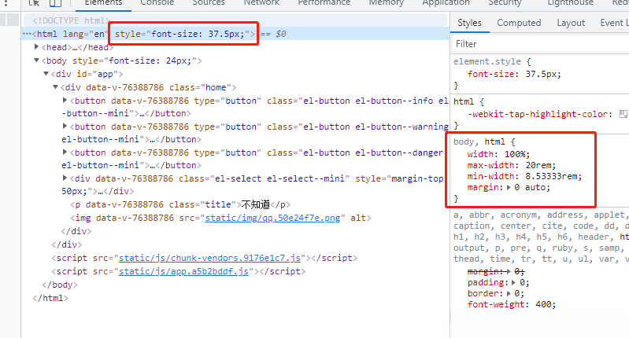

## 项目场景：

Vue项目H5页面，只要求适配移动端<font color=red>（vue 2.6 + @vue/cli 4.5.13）</font>
<hr/>

## 问题描述：

以前做的<font color=red> vue-cli 2.x </font>移动端适配我是用 <font color=red> lib-flexible + px2rem-loader </font>，然后这次<font color=red> @vue/cli 4 </font>用了它就不灵了，发现刷新页面样式缩小了，我擦。。。

<hr/>

## 原因分析：

后来翻阅了一些文档，由于viewport单位得到众多浏览器的兼容，lib-flexible这个过渡方案已经可以放弃使用，不管是现在的版本还是以前的版本，都存有一定的问题。建议大家开始使用viewport来替代此方案。

<hr/>

## 解决方案：

使用<font color=red> amfe-flexible + postcss-pxtorem</font>
amfe-flexible 是配置可伸缩布局方案，主要是将1rem设为viewWidth/10
postcss-pxtorem 是postcss的插件，用于将像素单元生成rem单位。

 1. 安装 amfe-flexible 和 postcss-pxtorem
```javascript
npm install amfe-flexible -S
npm install postcss-pxtorem -D
```
 2. 在入口文件<font color=red> main.js  </font>中引入
 ```javascript
 import 'amfe-flexible' // 引入适配包
```
 3. 在<font color=red> index.html  </font>添加
 ```javascript
 <meta name="viewport" content="width=device-width, initial-scale=1, maximum-scale=1, minimum-scale=1, user-scalable=no">
```
 4. 在<font color=red> vue.config.js </font>配置如下
 
```javascript
module.exports = {
  css: {
    loaderOptions: {
      postcss: {
        plugins: [
          require('postcss-pxtorem')({
            rootValue: 37.5,
            propList: ["*"], //哪些属性需要转换成rem
            minPixelValue: 3, // 最小转换单位
          })
        ]
      }
    }
  },
}
```
 5. 重启项目，如果报错 <font color=red> Error: PostCSS plugin postcss-pxtorem requires PostCSS 8  </font>，降低  postcss-pxtorem 版本就行了
```javascript
npm i postcss-pxtorem@5.1.1
```
