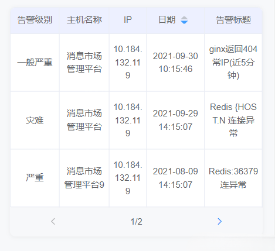

实现效果🤢：


## 定义data
```javascript
cur: 1,             // 当前页
totalPage: '',      // 总页数
pageSize: 3,        // 每页要展示数据条数
showPage: [],       // 每页展示的数据
tableData: [],      // 接收后台的总数据
```
## 接收后台数据
```javascript
methods: {
    // 页面初始化
    getInit () {
      getDetail(params).then(res => {    //  后端接口
        this.tableData = res.tableData
        if (!this.tableData) {
          this.showPage = []
        } else {
          this.totalPage = Math.ceil(this.tableData.length / this.pageSize); //求总页数
          this.page(this.cur)
        }
      }).catch(error => {
        console.log(error)
      })
    },
  },
  created () {
    this.getInit()
  },
```
## 定义methods
```javascript
    // 获取分页
    page (num) {
      this.cur = num;  //当前页
      var list = (this.cur - 1) * this.pageSize;  //每去一组数据的第一个索引
      this.showPage = this.tableData.slice(list, list + this.pageSize); //从总数据中取出每页的数据
    },
    
    // 上一页
    prev () {
      if (this.cur != 1) {
        this.page( --this.cur )
      }
    },
    
    // 下一页
    next () {
      if (this.cur < this.totalPage) {
        this.page(  ++this.cur )
      }
    },
```
这样就大功告成啦😛  当然这里只写了分页的实现方法，css的话就自己写啦，相信你们都精通css