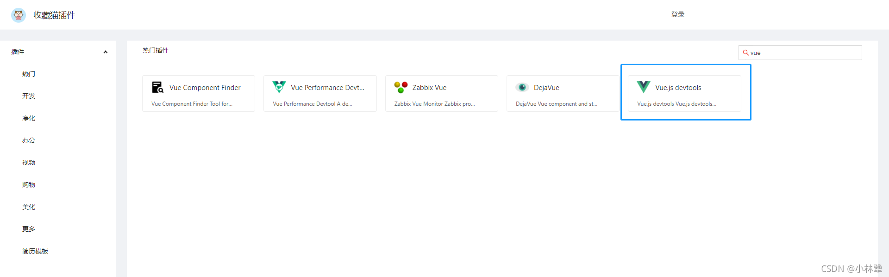
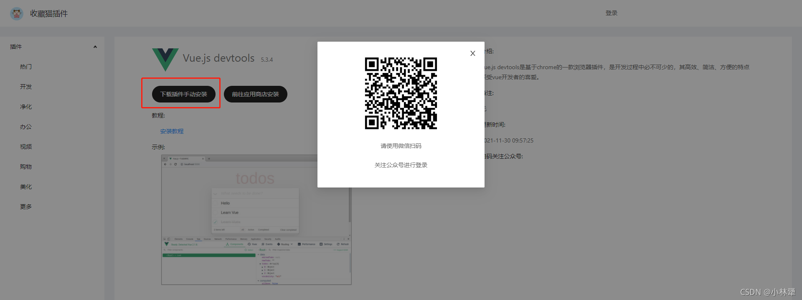
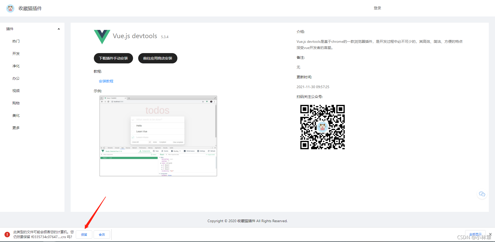
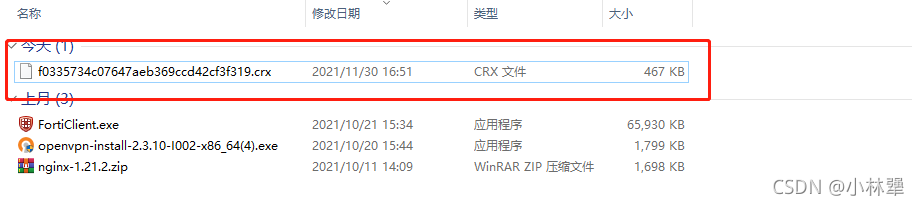
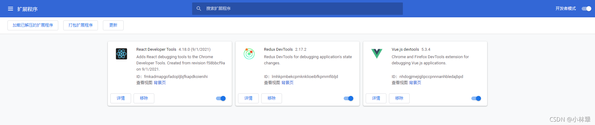
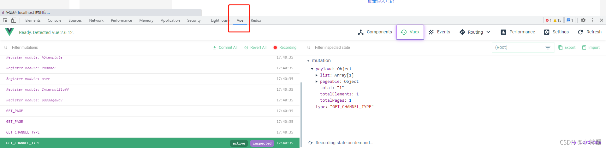

## 一、下载
这里我推荐一个自己常用的插件 [收藏猫插件](https://chrome.pictureknow.com/) 👍 👍 👍

访问谷歌商店可以安装这个 [访问助手](https://ikuuu.eu/user/tutorial)

点击下载插件手动安装，扫码并关注公众号就行🤣😂😁😎

下载插件，并在浏览器提示中选择【保留】

## 二、打开浏览器扩展安装页面
点击浏览器右上角  ⋮  >   更多工具 > 点击   扩展程序

## 三、安装插件
在扩展中心打开右上角的 【开发者模式】 按钮，然后 【刷新】 页面，把下载好的 .crx 文件拖入扩展中心

然后在自己的 vue 项目中 F12看控制台，菜单栏就会多了一个 vue（多刷新一下或关闭浏览器重启）

