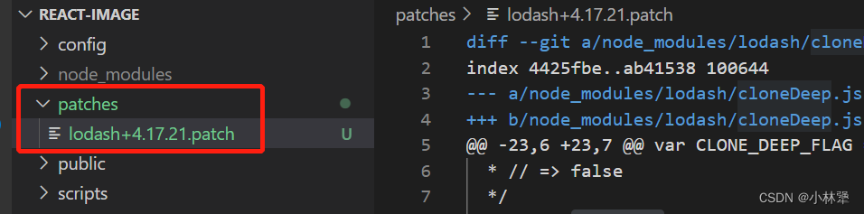
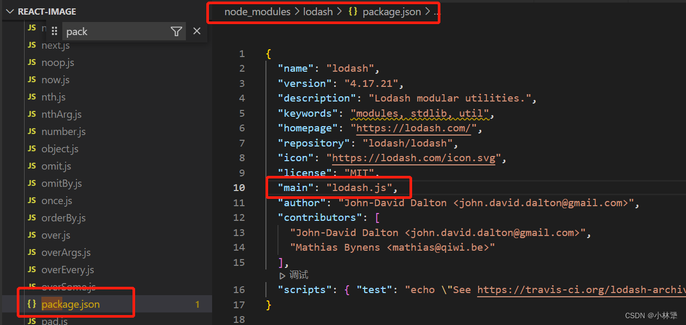

## 为什么要改node_modules？
在平常的开发中，其实是很少需要改<font color=red> node_modules </font>里的代码的。但是如果npm包有点小问题或者不符合我们的场景。

那我应该怎么改才能是最好的呢？
## 方法一：直接改
这种很好懂，就是直接进<font color=red> node_modules </font>中，找到那个包的代码，并修改对应的地方的代码，然后重启项目，就能达到我想要的效果。

弊端：

1、只能是你自己本地用你修改的代码，你同事用不了
2、下次npm i之后那个包的代码又恢复原状

## 方法二：patch-package
<font color=red> patch-package </font>可以立即修改并保留对 npm 依赖项的修改
###### 1、安装patch-package
```javascript
npm i patch-package --save-dev
```
###### 2、修改node_modules
修改完依赖后，运行 patch-package 会自动创建 patch 文件
```javascript
// 例： npx patch-package element-ui
npx patch-package 依赖名称
```
根目录下会多一个patches补丁目录


>注意：记得要把patches这个目录提交到git
###### 3、测试补丁是否有效
删除<font color=red> node_modules </font>目录，然后重新运行npm install，安装完成后，查看你修改的node_modules里面的代码是否还在。如果在，就说明补丁生效了。
###### 4、修改脚本 package.json
其实这个时候你本地已经使用到了你修改后的代码了，但问题是怎么让你的同事也同步到你的修改后的代码😵

在<font color=red> package.json </font>的<font color=red> script </font>中增加
```javascript
"postinstall": "patch-package"
```
作用：当同事执行<font color=red> npm i </font>的时候，会自动执行<font color=red> npm run postinstall </font>这个命令，也就是执行<font color=red> patch-package </font>，这时候就会去读取<font color=red> patches </font>目录，并将那些补丁打到对应的<font color=red> node_modules </font>包里，从而达到同步修改代码的效果
###### 5、注意事项
1. patch是锁定版本号的，如果升级了版本，patch内容将会失效，最好在package.json能够锁定版本号。
2. patch能支持多少文件修改，没有仔细测过，或许只能支持少量修改
###### 6、问题: 没有效果，console 打印不出来
多半是没有找对文件，例如 我们修改的是<font color=red> lodash</font>里面的某个API，一般我们先找个<font color=red> lodash</font>里的<font color=red> package.json </font>文件，然后看<font color=red> main（入口文件） </font>的指向，如果没有<font color=red> package.json </font>文件，那应该就是默认的<font color=red> index </font>



