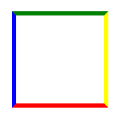
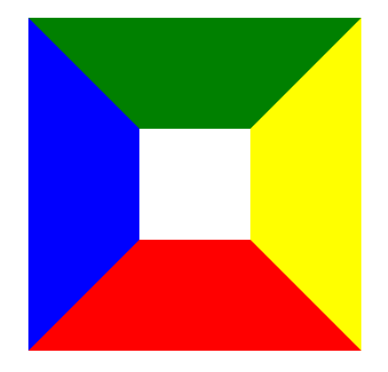
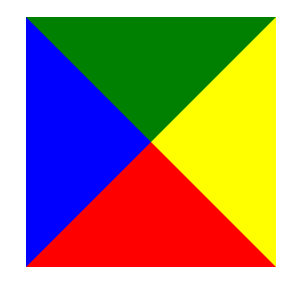
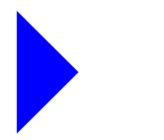

## 1、水平垂直居中布局
**1. 已知元素宽高: 绝对定位 + margin: auto**
```css
    div{
      width: 500px;
      height: 500px;
      background: green;
      
      position:absolute;
      left:0;
      top: 0;
      bottom: 0;
      right: 0;
      margin: auto;
  	}
```
**2. 已知元素宽高: 绝对定位 + margin: 负值**
```css
    div{
      width: 500px;
      height: 500px;
      background: green;

      position:absolute;
      left: 50%;
      top: 50%;
      margin-left: -250px;
      margin-top: -250px;
    }
```
**3. absolute + transform**
```css
  div{
    width: 500px;
    height: 500px;
    background: green;
    		        
    position: absolute;
    left: 50%;    /* 定位父级的50% */
    top: 50%;
    transform: translate(-50%,-50%); /*自己的50% */
  }
```
**4. flex 弹性布局**
```css
	display:flex;
	justify-content:center;  //子元素水平居中
	align-items:center;      //子元素垂直居中
```
## 2、用css3实现0.5px的线条
```css
  div{
    width: 500px;
    height: 500px;
    background-color: #000000;
    -webkit-transform: scaleY(0.5);
    transform: scaleY(0.5);
  }
```
## 3、让Chrome支持小于12px 的文字
```css
  .span{
    font-size: 12px;
    display: inline-block;
    -webkit-transform: scale(0.8);
    transform: scale(0.8);
  }
```
## 4、CSS画一个三角形，原理是什么？
1.首先画一个正方形
```css
.box {
    width: 100px;
    height: 100px;
    border: 5px solid;
    border-color: green yellow red blue;
}
```

2. 将border设置100px，发现border渲染并不是正方形, 而是梯形
```css
.box {
    width: 100px;
    height: 100px;
    border: 100px solid;
    border-color: green yellow red blue;
}
```

3. 白色区域则为width、height，这时候把白色区域部分宽高逐渐变小，最终变为0
```css
.box {
    width: 0px;
    height: 0px;
    border: 100px solid;
    border-color: green yellow red blue;
}
```

4. 设置透明, 隐藏其中三个三角形
```css
.box {
    width: 0px;
    height: 0px;
    border: 100px solid;
    border-color: transparent transparent transparent blue;
}
```

## 5、对盒子模型的理解？
### 1、是什么
一个盒子由四个部分组成：内容(`content`)、内边距(`padding`)、边框(`border`)、外边距(`margin`)
>- 有两种， `IE` 盒子模型、`W3C` 盒子模型
>- 区 别： `IE` 的 `content`部分把 `border` 和 `padding`计算进去
### 2、区别
- `IE8`及其以下版本浏览器，未声明 `DOCTYPE`，内容宽高会包含内边距（`padding`）和边框（`border`），称为怪异盒模型(`IE`盒模型)
- 标准(`W3C`)盒模型：盒子总宽度 = `width + padding + border + margin`
- 怪异(`IE`)盒模型：盒子总宽度 = `width + margin`
- 标准浏览器通过设置 `css3` 的 `box-sizing: border-box` 属性，触发`“怪异模式”`解析计算宽高

### 3、box-sizing 常用的属性有哪些？分别有什么作用

- `box-sizing: content-box`; 默认的标准(`W3C`)盒模型元素效果
- `box-sizing: border-box`; 触发怪异(`IE`)盒模型元素的效果
- `box-sizing: inherit`; 继承父元素 `box-sizing` 属性的值

