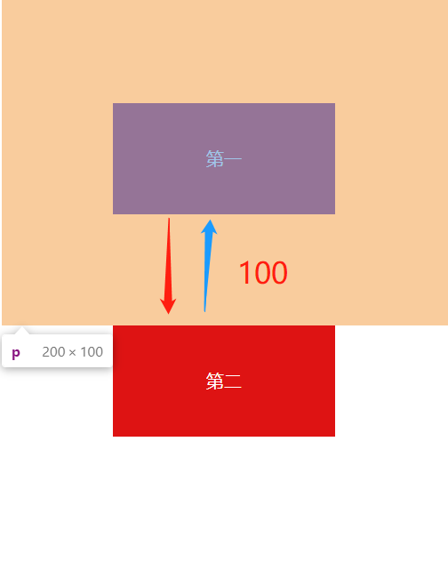
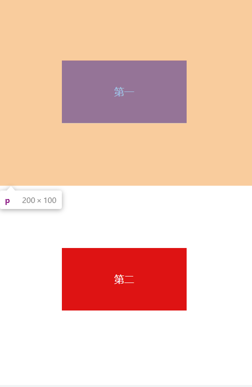
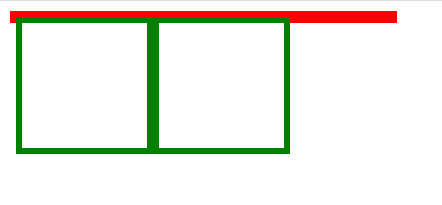
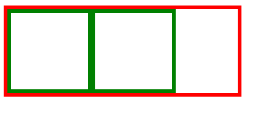
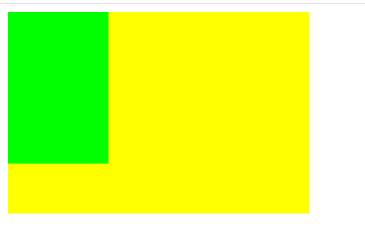
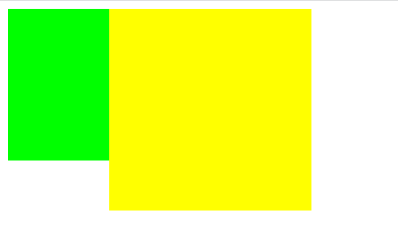

## 1、谈谈你对BFC的理解？
### 1、BFC是什么
>BFC ( Block Formatting Context)，块级格式化上下文，是一个独立的渲染区域，让处于 BFC 内部的元素与外部的元素相互隔离，使内外元素的定位不会相互影响

 - BFC布局与普通文档流布局区别
 1. 普通文档流布局: 浮动的元素是不会被父级计算高度
 2. 非浮动元素会覆盖浮动元素的位置 
 3. margin会传递给父级元素
 4. 两个相邻元素上下的margin会重叠
 - BFC布局规则: 
 1. 浮动的元素会被父级计算高度(父级元素触发了BFC)
 2. 非浮动元素不会覆盖浮动元素的位置(非浮动元素触发了BFC)
 3. margin不会传递给父级(父级触发BFC)
 4. 属于同一个BFC的两个相邻元素上下margin会重叠
### 2、触发条件
 - 浮动元素：float值为 left、right
 - overflow值不为 visible，为 auto、scroll、hidden
 - display的值为 inline-block、inltable-cell、table-caption、flex、inline-grid 等
 - position的值为 absolute 或 fixed
### 3、应用场景
>1、避免 margin 重叠 (上下外边距重叠)
2、清除浮动 （高度坍塌）
3、自适应多栏布局

##### 1、避免 margin 重叠 (上下外边距重叠)
```css
<style>
  p {
      color: #fff;
      background: rgb(222, 19, 19);
      width: 200px;
      height: 100px;
      text-align:center;
      line-height: 100px;
      margin: 100px;
  }
</style>
<body>
  <p>第一</p>
  <p>第二</p>
</body>
```
效果如下


两个 p 元素之间的距离为100px，发生了margin重叠（塌陷），以最大的为准，如果第一个p 的margin为80的话，两个p之间的距离还是100，以最大的为准。

解决方法：
>1、外层元素 overflow:hidden;
2、内层元素绝对定位 postion: absolute:
3、内层元素 加 float: left; 或 display: inline-block;

这里讲第一种：在p外面包裹一层容器，并触发这个容器生成一个BFC，那么两个p就不属于同一个BFC，则不会出现margin重叠
```css
<style>
  .box{ overflow: hidden; } /*触发BFC */
  p {
      color: #fff;
      background: rgb(222, 19, 19);
      width: 200px;
      height: 100px;
      text-align:center;
      line-height: 100px;
      margin: 100px;
  }
</style>
<body>
  <p>第一</p>
  <div class="box">
    <p>第二</p>
  </div>
</body>
```
这时候，边距则不会重叠：

##### 2、清除浮动 （高度坍塌）
```css
<style>
  .father {
      border: 5px solid red;
      width: 300px;
  }
  .son {
      border: 5px solid green;
      width:100px;
      height: 100px;
      float: left;
  }
</style>
<body>
  <div class="father">
      <div class="son"></div>
      <div class="son"></div>
  </div>
</body>
```
效果如下

解决方法：
>1、给父元素添加overflow：hidden (常用)
2、在浮动元素下方添加空div，并给元素声明 clear：both
3、使用 : after 伪类选择器清除浮动 （常用）
4、父元素添加浮动
5、给父元素设定高度

这里讲第一种

BFC在计算高度时，浮动元素也会参与，所以我们可以触发 .father 元素生成BFC，则内部浮动元素计算高度时候也会计算
```css
.father {
      overflow: hidden;
  }
```
这时候的效果

##### 3、自适应多栏布局
这里举个两栏的布局
```css
<style>
  body {
      width: 300px;
      position: relative;
  }
  .aside {
      width: 100px;
      height: 150px;
      float: left;
      background: green;
  }
  .main {
      height: 200px;
      background: yellow;
  }
</style>
<body>
  <div class="aside"></div>
  <div class="main"></div>
</body>
```
效果如下图

前面讲到，每个元素的左外边距与包含块的左边界相接触

因此，虽然.aslide为浮动元素，但是main的左边依然会与包含块的左边相接触

而BFC的区域不会与浮动盒子重叠

所以我们可以通过触发main生成BFC，以此适应两栏布局
```css
.main {
    overflow: hidden;
}
```
这时候，新的BFC不会与浮动的.aside元素重叠。因此会根据包含块的宽度，和.aside的宽度，自动变窄

效果如下

### 4、总结：
>可以看到上面几个案例，都体现了BFC实际就是页面一个独立的容器，里面的子元素不影响外面的元素
## 2、回流和重绘？
### 1、是什么
在讨论回流与重绘之前，我们要知道：

1. 浏览器使用 **流式布局模型** (Flow Based Layout)。
2. 浏览器会把 **HTML** 解析成 **DOM**，把 **CSS** 解析成 **CSSOM**，DOM 和 CSSOM 合并就产生了 **渲染树（Render Tree）**。
3. 有了 **RenderTree**，我们就知道了所有节点的样式，然后计算他们在页面上的大小和位置，最后把节点绘制到页面上。
4. 由于浏览器使用流式布局，对 **Render Tree** 的计算通常只需要遍历一次就可以完成，但 **table** 及其内部元素除外，他们可能需要多次计算，通常要花3倍于同等元素的时间，这也是为什么要避免使用 **table** 布局的原因之一。

>**一句话：回流必将引起重绘，重绘不一定会引起回流。**

- 回流：当 **DOM** 的变化影响了元素的几何信息 (**`位置、尺寸大小`**)，浏览器需要重新计算元素的几何属性，重新渲染部分或全部文档的过程称为回流。

- 重绘：当页面中元素样式的改变并不影响它在文档流中的位置时（例如：`color`、`background-color`、`visibility`等），浏览器会将新样式赋予给元素并重新绘制它，这个过程称为重绘。
### 2、如何触发
##### 1、回流触发条件
- 页面首次渲染
- 浏览器窗口大小发生改变
- 元素尺寸或位置发生改变
- 元素内容变化（文字数量或图片大小等等）
- 元素字体大小变化
- 添加或者删除 **可见的DOM** 元素
- 激活 `CSS` 伪类（例如：`:hover`）
- 查询某些属性或调用某些方法

一些常用且会导致回流的属性和方法：

- `clientWidth`、`clientHeight`、`clientTop`、`clientLeft`
- `offsetWidth`、`offsetHeight`、`offsetTop`、`offsetLeft`
- `scrollWidth`、`scrollHeight`、`scrollTop`、`scrollLeft`
- `scrollIntoView()`、`scrollIntoViewIfNeeded()`
- `getComputedStyle()`
- `getBoundingClientRect()`
- `scrollTo()`
##### 2、重绘触发条件
- 触发回流一定会触发重绘
- 颜色的修改
- 文本方向的修改
- 阴影的修改
### 3、浏览器优化机制
现代浏览器会对频繁的回流或重绘操作进行优化：

浏览器会维护一个队列，把所有引起回流和重绘的操作放入队列中，如果队列中的任务数量或者时间间隔达到一个阈值的，浏览器就会将队列清空，进行一次批处理，这样可以把多次回流和重绘变成一次。

当你访问以下属性或方法时，浏览器会立刻清空队列：


- `clientWidth、clientHeight、clientTop、clientLeft`
- `offsetWidth、offsetHeight、offsetTop、offsetLeft`
- `scrollWidth、scrollHeight、scrollTop、scrollLeft`
- `width、height`
- `getComputedStyle()`
- `getBoundingClientRect()`

因为队列中可能会有影响到这些属性或方法返回值的操作，即使你希望获取的信息与队列中操作引发的改变无关，浏览器也会强行清空队列，确保你拿到的值是最精确的。
### 4、如何减少
##### CSS
- 避免使用 `table` 布局。
- 尽可能在 `DOM` 树的最末端改变 `class`。
- 避免设置多层内联样式。
- 将动画效果应用到 `position` 属性为 `absolute` 或 `fixed`的元素上。
- 避免使用 `CSS` 表达式（例如：`calc()`）。

##### JavaScript

- 避免频繁操作样式，最好一次性重写 `style` 属性，或者将样式列表定义为`class`并一次性更改`class`属性。
- 避免频繁操作`DOM`，创建一个`documentFragment`，在它上面应用所有`DOM`操作，最后再把它添加到文档中。
- 也可以先为元素设置`display: none`，操作结束后再把它显示出来。因为在`display`属性为`none`的元素上进行的`DOM操作`不会引发回流和重绘。
- 避免频繁读取会引发回流/重绘的属性，如果确实需要多次使用，就用一个`变量缓存`起来。
- 对具有复杂动画的元素使用`绝对定位`，使它`脱离文档流`，否则会引起父元素及后续元素频繁回流。

