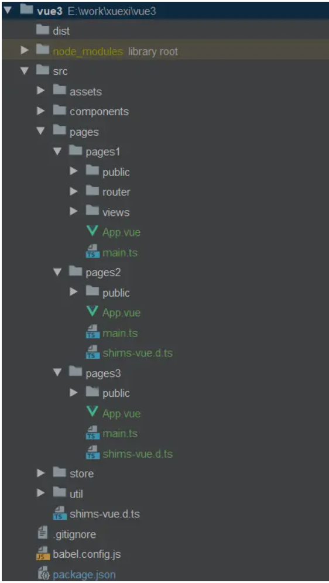

## 一、基本配置
### 1、创建一个公共的配置文件 `webpack.base.js`
```javascript
const path = require('path')
const resolve = dir => path.resolve(__dirname, dir);

const webpackBase = {
    entry: './src/main.js',
    output: {
        path: resolve('./dist')
        filename: '[name]_[hash:4].js',
        chunkFilename: 'chunks/[name]_[hash:4].js',
    },
    resolve: {
        extensions: ['.js', '.json', '.less'],
        // 设置别名
        alias: {
            '@': resolve('src'),  // 这样配置后 @ 可以指向 src 目录
            '@styles': resolve('./src/styles'),
        },
    },
    module: {
        rules: [],
    },
    plugins: []
}

module.exports = webpackBase
```
### 2、开发环境 `webpack.dev.js` 通过 `webpack-merge` 合并
>开发环境、测试环境（`webpack.test.js`）、生产环境（`webpack.prod.js`）
```javascript
const merge = require('webpack-merge')

const webpackDev = {}

module.exports = merge(webpackBase, webpackDev)
```
## 二、常用功能
### 1、添加别名 `alias`
上面公共的配置文件里 已经写了
### 2、配置 `proxy` 代理解决跨域问题
```javascript
devServer: {
    contentBase: resolve('src'), // //指定服务器目录
    hot: false,
    host: 'localhost',
    stats: 'errors-only',
    port: '8080',
    proxy: {
      "/api": {
        target: "http://xxx",   //目标代理接口地址
        changeOrigin: true,
        pathRewrite: {
          "^/api": ""
        },
      },
    }
  },
```
### 3、添加打包分析
```javascript
const { BundleAnalyzerPlugin } = require('webpack-bundle-analyzer')

plugins: [
    // 分析代码
    new BundleAnalyzerPlugin({ analyzerMode: 'static' }),
],
```
### 4、优化 `moment` 语言包
webpack 打包 moment.js 时会把所有语言包都打包，使用 `ContextReplacementPlugin` 插件来舍弃中文以外的其余语言文件，体积大致能缩减为原来的四分之一
参考：[https://github.com/jmblog/how-to-optimize-momentjs-with-webpack](https://github.com/jmblog/how-to-optimize-momentjs-with-webpack)
```javascript
const webpack = require('webpack')

plugins: [
    // 只加载 locale zh-cn文件
    new webpack.ContextReplacementPlugin(/moment[/\\]locale$/, /zh-cn/)
],

// 在组件里使用方式
import moment from 'moment';
moment.locale('zh-cn');
```
### 5、多进程并行压缩`JS`代码，并去掉 `console.log`
方式一：
```javascript
const ParallelUglifyPlugin = require('webpack-parallel-uglify-plugin');

plugins: [
	new ParallelUglifyPlugin({
    	cacheDir: '.cache/', // 设置缓存路径，提升二次构建速度
        uglifyJS:{
        	output: {
            	comments: false // 删除所有的注释
            },
            compress: {
            	drop_console: true, //注释console
                drop_debugger: true,  //注释debugger
      			pure_funcs: ['console.log']	// 移除console
            }
       }
	}),
],
```
方式二：`webpack4.x`（推荐）
```javascript
const TerserPlugin = require('terser-webpack-plugin');

module.exports = {
	optimization: {
		minimizer: [
			new TerserPlugin({
				cache: true, // 设置缓存路径，提升二次构建速度
				parallel: true, // 开启多进程
				terserOptions: {
          			compress: {
            			drop_console: true, //注释console
          			},
        		},
			})
		],
	},
};
```
### 6、DLL分包：预编译资源模块
使用 `DLLPlugin` 将react、react-dom、redux、react-redux基础包和业务基础包打包成一个文件，`DIIReferencePlugin` 对 `manifest.json` 引用

1. 创建 `dll` 配置文件 `webpack.dll.js`
```javascript
const webpack = require('webpack')
const path = require('path')

module.exports = {
  entry: {
    library: [
      'react', 
      'react-dom', 
    ]
  },
  output: {
    filename: '[name].dll.js',
    path: path.join(__dirname, './src/dll'),
    library: '[name]_[hash]', 
  },
  plugins: [
    // 使用插件 DllPlugin
    new webpack.DllPlugin({
      path: path.join(__dirname, './src/dll/[name].manifest.json'),
      name: '[name]_[hash]',
    }),
  ]
};
```
2. 在公共的配置文件 `webpack.base.js` 引入
```javascript
	// 关联dll拆分出去的依赖
	new webpack.DllReferencePlugin({
    	manifest: require('./src/dll/library.manifest.json'),
	}),
```
3. 配置 npm 脚本
```javascript
	"dll": "webpack --config webpack.dll.js"
```
4. 注入到 `html` 文件内
```javascript
const HtmlWebpackPlugin = require('html-webpack-plugin')

new HtmlWebpackPlugin({
	template: resolve('./src/index.html'),
	// 这里列出要加入html中的js文件
    dlls: [
    	'./dll/library.dll.js',
	],
    favicon: './src/images/favicon.ico' //favicon.ico文件路径
})

// html里面
<body>
  <div class="root" id="root"></div>
  <% for(var i = 0; i < htmlWebpackPlugin.options.dlls.length;i++){%>
    <script src="<%=htmlWebpackPlugin.options.dlls[i] %>"></script>
  <%}%>
</body>
```
5. 下面这步骤（`除开发环境外`）,`测试环境、生产环境`都需要添加
>**`copy-webpack-plugin`**：将 文件 或者 文件夹 拷贝 到 构建的输出目录
>我们在 `src/dll` 中约定了静态资源，但是打包的时候 `webpack` 并不会帮我们复制到 `dist` 目录
```javascript
const CopyPlugin = require('copy-webpack-plugin');

module.exports = {
  plugins: [
    new CopyPlugin([
      { from: './src/dll', to: './dist/dll' },
    ]),
  ],
};
```
### 7、多进程/多实例构建
原理：每次 `webapck` 解析一个模块，`HappyPack` 会将它及它的依赖分配给` worker` 线程中
```javascript
const HappyPack = require('happypack')
const os = require('os')
const happyThreadPool = HappyPack.ThreadPool({size: os.cpus().length})
const path = require('path')

const webpackBase = {
    module: {
        rules: [
	    	{
                test: /\.js[x]?$/,
                exclude: /node_modules/,
                include: path.resolve('src'),
                //把对.js 的文件处理交给id为 happyBabel 的 HappyPack 的实例执行
                loader: 'happypack/loader?id=happyBabel',
            },
		],
    },
    plugins: [
		new HappyPack({
            id: 'happyBabel', //用id来标识 happypack处理那里类文件
            // 配置 babel-loader，并设置缓存路径，提升二次构建速度
            loaders: ['babel-loader?cacheDirectory=true'],
            //共享进程池，即多个 HappyPack 实例都使用同一个共享进程池中的子进程去处理任务，以防止资源占用过多。
            threadPool: happyThreadPool,
            verbose: true, //允许 HappyPack 输出日志
        }),
	]
}

module.exports = webpackBase
```
### 8、利用缓存提升二次构建速度
1. `babel-loader` 开启缓存  （在7、多进程/多实例构建）
2. `terser-webpack-plugin` 开启缓存  （在5、多进程并行压缩代码）
3. 使用 `cache-loader` 或者 `hard-source-webpack-plugin`

`webpack4.x`（推荐）使用`hard-source-webpack-plugin`
```javascript
const HardSourceWebpackPlugin = require('hard-source-webpack-plugin')

plugins: [
    new HardSourceWebpackPlugin()
],
```
>`webpack5.x` 把 `hard-source-webpack-plugin` 内置成一个配置
### 9、抽离css
`webpack`本来只能能打包处理`.js`文件，但是通过`loader`，可以打包处理各种类型的文件。比如：.css文件等

问题：我们的`css`的内容都被打包到`bundle.js`里面了，只要修改部分`js`代码，`css`模块也会被重新打包，或者只修改`css`模块，`js`模块是没有变化的，但是他们在一个`bundle`中，也会被重新打包。

解决方案：把`css`代码从`js`文件中抽离出来，单独出一个模块。

方式一：`webpack3.x`（`extract-text-webpack-plugin`）
```javascript
const ExtractTextPlugin = require('extract-text-webpack-plugin')

module.exports = {
  module: {
    rules: [
      {
        test: /\.css$/,
        include: [
        	resolve('./src/styles'),
            resolve('./src/components'),
            resolve('./node_modules/antd'),
		],
        use: ExtractTextPlugin.extract({
          fallback: "style-loader",
          use: "css-loader"
        })
      }
    ]
  },
  plugins: [
    new ExtractTextPlugin("style_[contenthash:4].css"),
  ]
}
```

方式二：`webpack4.x`（`mini-css-extract-plugin`）
```javascript
const MiniCssExtractPlugin = require('mini-css-extract-plugin');

module.exports = {
  module: {
    rules: [
      {
        test: /\.css$/,
        use: [ MiniCssExtractPlugin.loader, 'css-loader','postcss-loader' ], // postcss-loader 可选
      },
      {
        test: /\.less$/,
        use: [ MiniCssExtractPlugin.loader, 'css-loader','postcss-loader','less-loader' ], // postcss-loader 可选
      }
    ],
  },
  plugins: [
  	new MiniCssExtractPlugin({
      filename: '[name]_[contenthash:4].css'
    }),
  ],
};
```
### 10、压缩`css`样式
>`webpack5.x` 可能会内置 CSS 压缩器，`webpack4.x` 需要自己使用压缩器，可以使用 `optimize-css-assets-webpack-plugin` 插件，设置 `optimization.minimizer` 覆盖 webpack 默认提供的，
```javascript
const OptimizeCSSAssetsPlugin = require("optimize-css-assets-webpack-plugin") // 压缩css代码

plugins: [
	new OptimizeCSSAssetsPlugin({
		assetNameRegExp: /\.css$/g,
		cssProcessor: require("cssnano"), // 如果报错 安装 npm i cssnano -D
	}),
  ]
```
### 11、清理构建目录
`clean-webpack-plugin`：它会根据 `output.path` 自动清理文件夹
```javascript
const CleanWebpackPlugin = require('clean-webpack-plugin')

plugins: [
    // 删除 dll 目录
    new CleanWebpackPlugin(['dll'])
    // 删除 dist 目录
    new CleanWebpackPlugin(['dist'])
],
```
### 12、开启 gzip 压缩
1. 为何要使用gzip压缩？
>打包的时候开启 `gzip` 可以很大程度减少包的大小，页面大小可以变为原来的 `30%` 甚至更小，非常适合于上线部署。
更小的体积对于用户体验来说就意味着更快的加载速度以及更好的用户体验
2. 为什么gzip压缩后页面加载速度提升
>浏览器向服务器发出请求，并且在`请求头`中声明可以使用`gzip`的编码格式，服务器接受到请求之后，读取压缩后的文件，服务器直接返回给浏览器`gzip`格式的文件，浏览器进行解压缩，这样以来就节省了服务器压缩的时间
```javascript
const CompressionPlugin = require('compression-webpack-plugin')

plugins: [
  new CompressionPlugin({
  	filename: "[path].gz[query]", // 压缩后的文件名 版本3.x的话asset改为filename
  	algorithm: "gzip",  // 使用gzip压缩
    test: /\.(js|css|json|txt|html|ico|svg)(\?.*)?$/i, // 匹配文件格式
    threshold: 10240, // 对超过10kb的数据进行压缩
	minRatio: 0.8 // 压缩率小于这个值的资源才会被处理。默认值是 0.8。
  }),
]
```
>当然，这个方法还需要服务端 `Nginx` 开启 `gzip_static` 功能
### 13、优化构建时命令行的显示日志（开发环境）
```javascript
const FriendlyErrorsWebpackPlugin = require('friendly-errors-webpack-plugin');
devServer: {
	stats: 'errors-only',
},

plugins: [
	new FriendlyErrorsWebpackPlugin(),
]
```
### 14、利用 splitChunks 提取公共代码
1. 首先要明白`splitChunks` 和 `dll` 的区别

- `splitChunks` 是在构建时拆包，`dll` 是提前构建好基础库，打包的时候就不需要打基础库了
- `dll` 需要多配置一个 `webpack.dll.js` ，而且一旦 `dll` 中的依赖有更新，得走两遍打包
- 推荐使用 `splitChunks` 去提取页面间的公共 `js` 文件。`DllPlugin` 用于基础包（框架包、业务包）的分离。
>`webpack4.x` 中使用 `splitChunks` 取代了 `CommonsChunkPlugin` 插件。
```javascript
module.exports = {
  //...
  optimization: {
    splitChunks: {
      cacheGroups: {
        common: {
          name: 'chunk-common',
          chunks: 'all', // 所有引入的库进行分离
          minSize: 0, // 抽离公共包最小的大小 单位：字节
          minChunks: 2, // 最小引用次数
        },
      }
    }
  }
};
```
### 15、多页面打包通用方案


整体大概是上面那样，但我是按照`下面目录结构`编写的
```javascript
├── pagess
│   ├── mobile
│   │   ├── components
│   │   ├── router
│   │   ├── views
│   │   ├── APP.VUE
│   │   ├── main.js
│   │   ├── index.html
│   ├── admin
│   │   ├── components
│   │   ├── router
│   │   ├── views
│   │   ├── APP.VUE
│   │   ├── main.js
│   │   ├── index.html

```
```javascript
npm i glob -D
```
```javascript
const path = require('path');
const glob = require('glob');
 
const setMPA = () => {
    const entry = {};
    const htmlWebpackPlugin = [];
    const entryFiles = glob.sync('./pages/*/main.js');  // 获取到的entryFiles是一个数组
 
    Object.keys(entryFiles).map((index)=>{
    	//根据获取到的路劲生成多入口entry对象
        const entryfile = entryFiles[index]  // 获取到数组中的每一项
        const file = entryfile.match(/pages\/(.*)\/main\.js/)
        const pageName = file && file[1]
        // console.log('pageName', pageName)
        entry[pageName] = entryfile;
        
        //生成每个入口的html模板
        htmlWebpackPlugin.push(
            new HtmlWebpackPlugin({
                template: path.join(__dirname, `pages/${pageName}/index.html`),
                filename:`${pageName}.html`,
                chunks: [pageName], //只打入指定的chunks，不然webpack会将所有bundle都引入
                inject: true,
                minify:{
                	//压缩配置
                    html5: true,
                    collapseWhitespace: true,
                    preserveLineBreaks: false,
                    minifyCSS: true,
                    minifyJS: true,
                    removeComments: false
                }
            }),
        )
    })
    return { entry, htmlWebpackPlugin}
}
 
const {entry, htmlWebpackPlugin} = setMPA()
```
内容替换
```javascript
entry: entry,

plugins:[
	new CleanWebpackPlugin(),
].concat(htmlWebpackPlugin),  // 接在数组上
```