nvm：全称node.js version management ，一个nodejs的版本管理工具，通过它可以安装和切换不同版本的node.js

**注意：如果电脑已经下载了node需要先卸载node，再安装nvm，以避免冲突**

### 一、安装nvm
链接: [nvm](https://github.com/coreybutler/nvm-windows/releases)

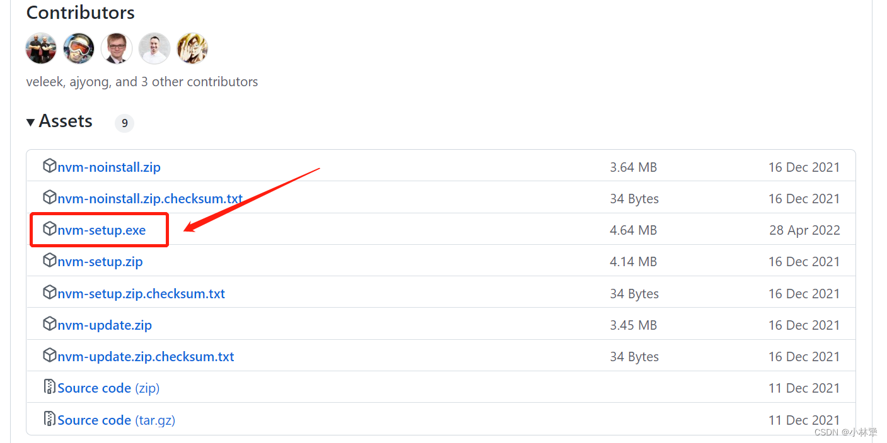
然后安装时点 <font color=red> 同意 </font>
在E盘新建一个nvm文件夹，后面注意安装路径，我这里填
nvm：<font color=red> E:\nvm\nvm</font>
nodejs：<font color=red> E:\nvm\nodejs</font>
### 二、检查nvm是否安装成功
nvm -v
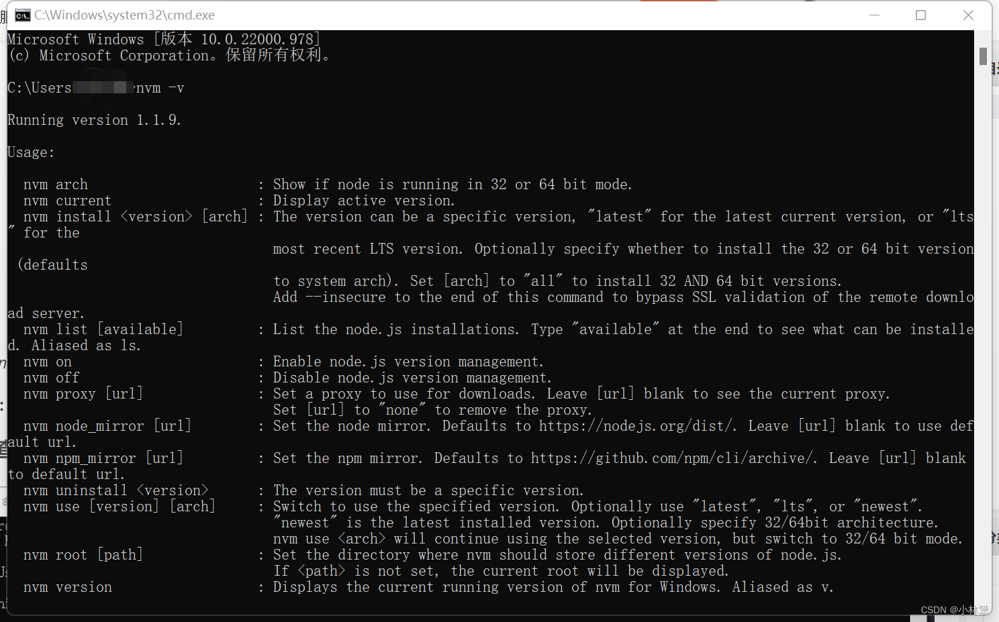

打开电脑的环境变量，会发现多了这两个变量，而且路径和我们刚刚安装时设置的一样

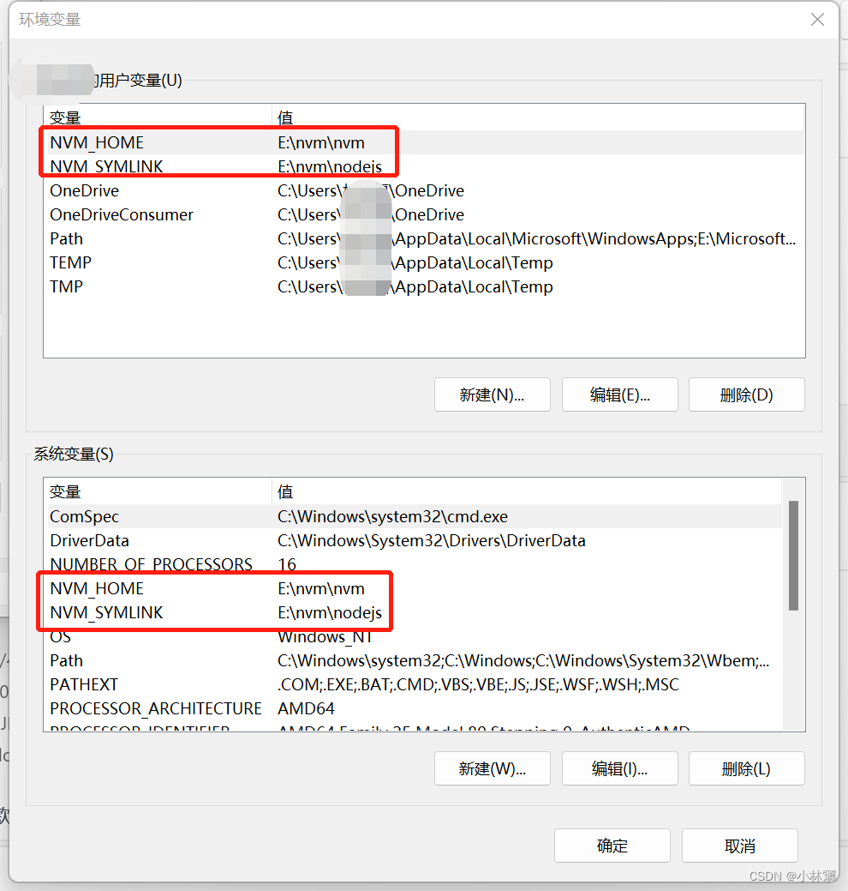

现在的文件夹打开是这样的

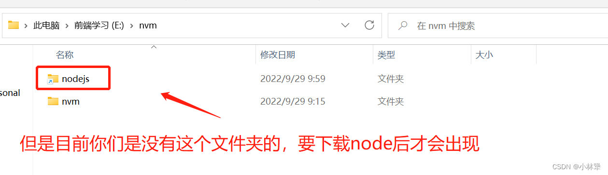
### 三、下载node
重点来了，要先设置镜像，不然nvm下载node会很卡
在 <font color=red> E:\nvm\nvm </font>找到配置文件<font color=red> settings.txt </font>复制过去
```javascript
node_mirror: http://npm.taobao.org/mirrors/node/
npm_mirror: https://npm.taobao.org/mirrors/npm/
```
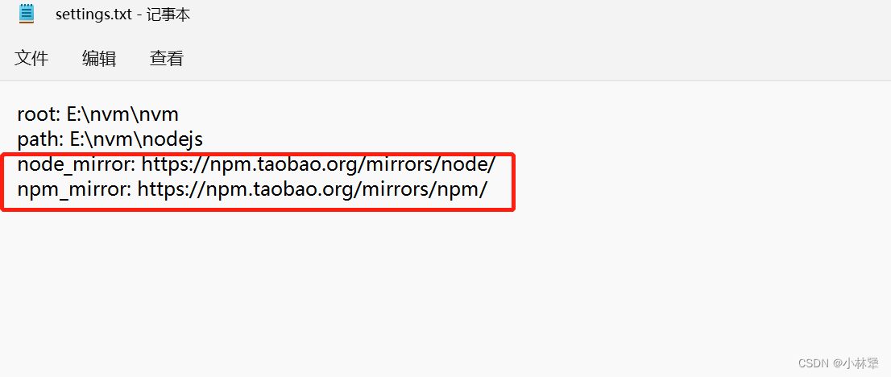

nvm list available  查看nodejs 官方的所有版本

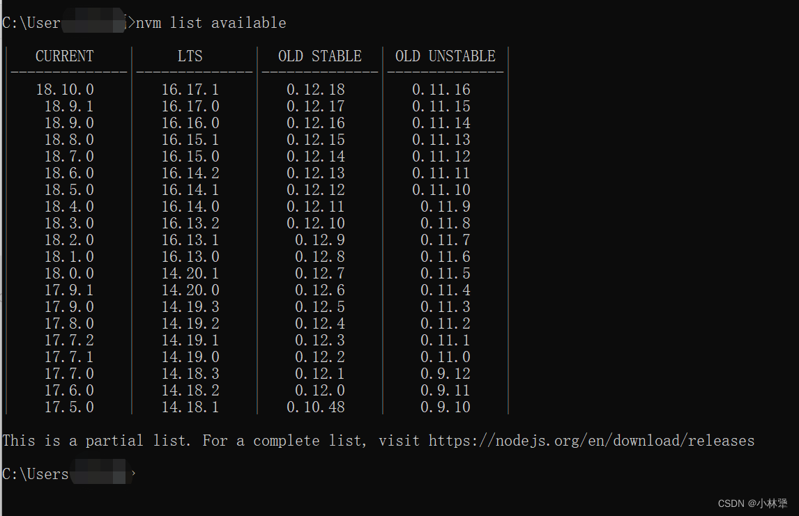

注意：切换node版本记得用<font color=red> 管理员 </font>身份打开 cmd
```javascript
//下载对应的node版本号
nvm install 16.14.2
//切换node版本
nvm use 16.14.2
```
切换成功验证一下

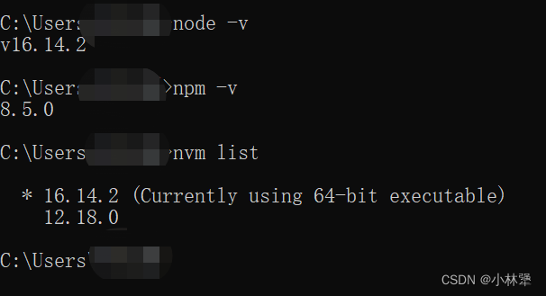
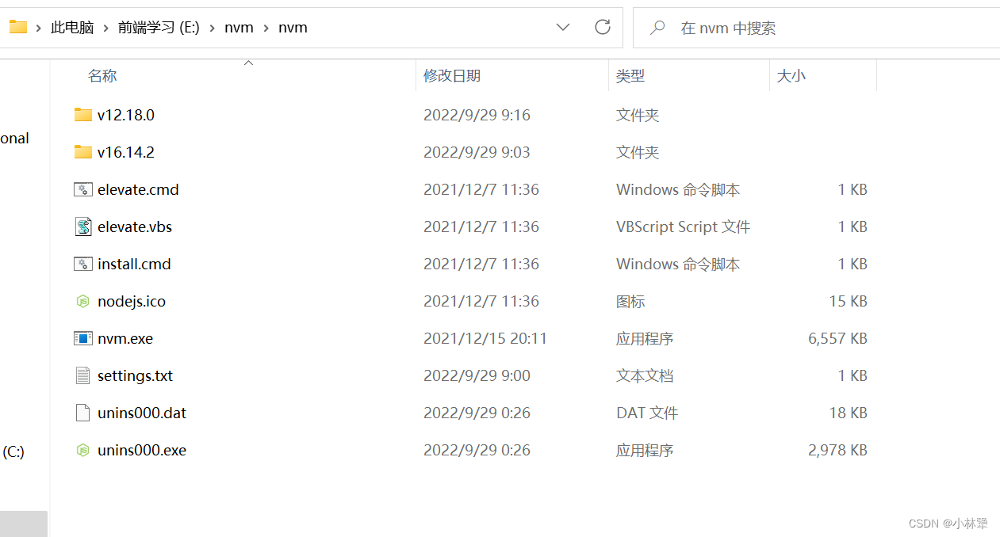

这里的nodejs实际上是一个快捷键，他指向的真正文件是nvm文件夹里面node的某个版本  也就是我们 （nvm use 16.14.2） use的那个node版本
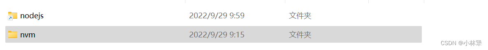
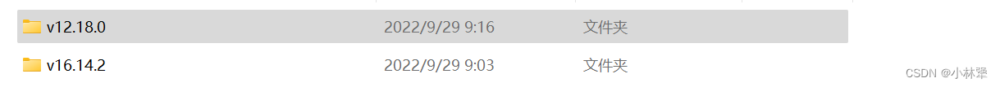
### 四、配置全局环境变量
问题：由于我们在nvm下载了多个版本的node全局安装的包，每次切换node时导致npm会出现一些命令找不到的情况。

例：nodeA安装了yarn，切换到nodeB执行yarn时，发现找不到命令了

解决方法：
1. 新建一个全局安装的文件夹
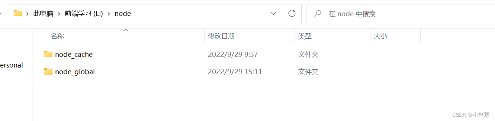
2. 对npm的config进行配置
```javascript
npm config set prefix "E:\node\node_global"
npm config set cache "E:\node\node_cache"
//设置npm镜像源为淘宝镜像
npm config set registry http://registry.npmmirror.com
```
设置完打开 C盘用户下的.npmrc，是这样的

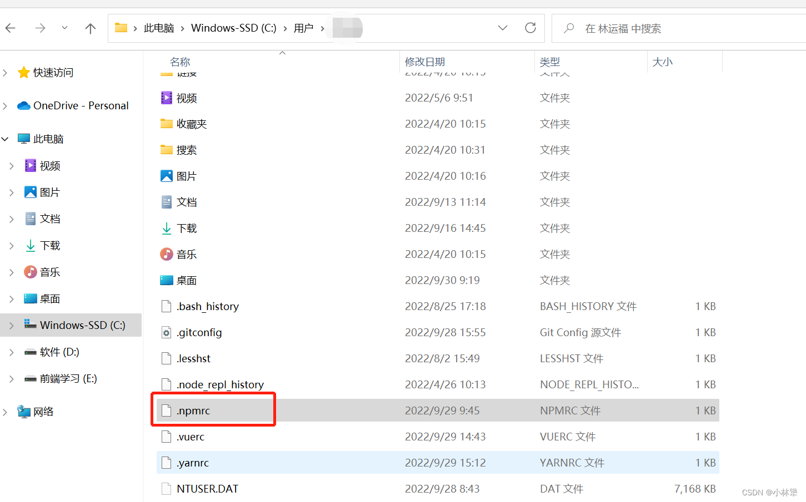
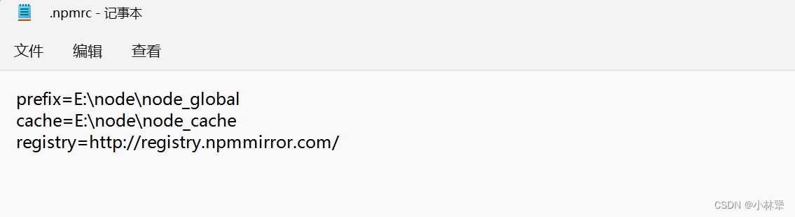

3. 设置环境变量
此电脑 -> 属性 -> 高级系统设置 -> 环境变量 -> 系统变量 -> path ->编辑 - > 新增路径 -"E:\node\node_global"
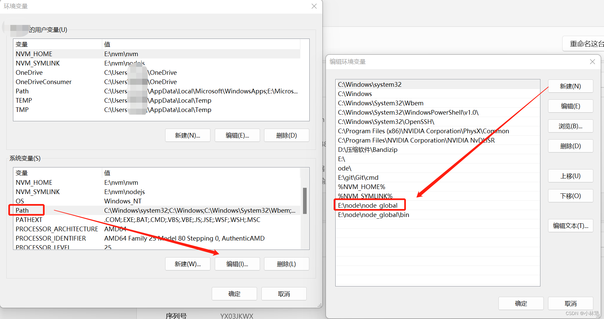
4. 配置相关命令

| 命令 | 作用      |
|:--------| :-------|
|  npm config ls | 查看配置列表，加 -l 显示全部配置 |
|  npm prefix -g | 查看当前npm包的全局安装路径 |
|  npm config get cache | 查看当前npm包的全局cache路径 |
|  npm ls -g | 查看全局已安装（-g 的意思是 global 全局的意思） |
|  npm ls -g --depth 0 | 加上层级控制显示--depth 0 |

5. 验证是否都下载到 E:\node\node_global\node_modules
```javascript
npm install -g yarn
npm install @vue/cli -g
npm install -g nrm
npm install -g create-react-app
```
果然都在这里

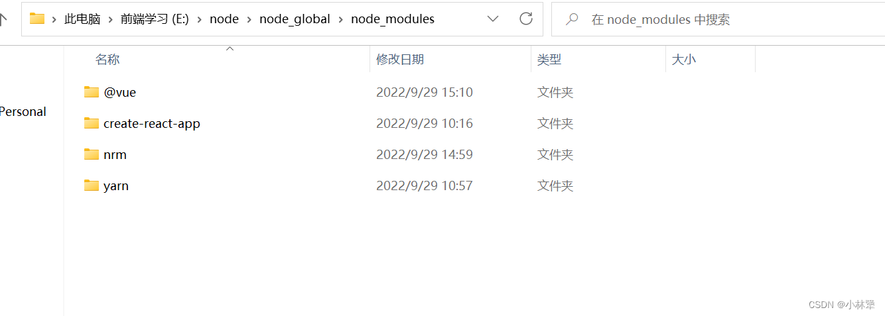
### 五、nrm介绍
安装 nrm：npm install -g nrm
nrm 是一个 npm 源管理器，允许你快速地在 npm源间切换。
| 命令 | 作用      |
|:--------| :-------|
|  nrm ls | 查看可选源 |
|  nrm use （源） | 切换源 |
|  nrm add （名称）（源） | 添加源 |
|  nrm test npm | 测试网络延迟 |

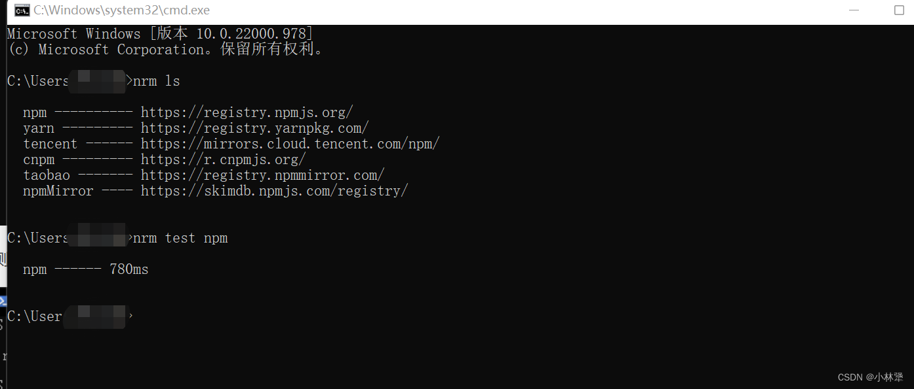
### 六、yarn全局安装
```
npm install -g yarn
yarn -v
```
问题：前面我们已经全局用npm安装过yarn了，也能查看到yarn安装的版本，但是当我们用yarn全局安装好@vue/cli，检查@vue/cli版本的时候，确报找不到vue指令的问题
```
yarn global add @vue/cli
// 检查@vue/cli版本
vue -V
```
解决方法：
1.查看yarn的命令目录
```
yarn global bin
```
2、查看yarn的全局安装目录
```
yarn global dir
```
结果发现，yarn 的全局安装位置与 bin 目录的位置并不一致（我当时一个在E盘，一个在C盘），<font color=red> 重点是要将他们放在相同的硬盘分区里面就不会报错了。 </font>于是去修改 yarn 的全局安装位置和缓存位置：
```
yarn config set global-folder "E:\yarn\yarn_global"
yarn config set cache-folder "E:\yarn\yarn_cache"
顺便设置yarn镜像源为淘宝镜像
yarn config set registry http://registry.npmmirror.com 
```
3.把yarn的bin目录（yarn global bin 的地址）添加到系统环境变量path上
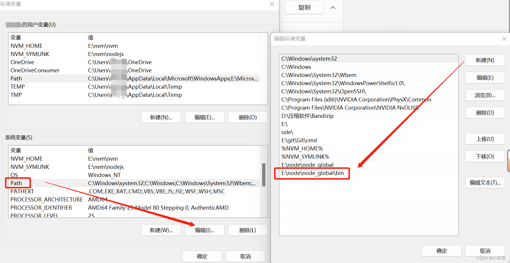

4.最后我们检查一下

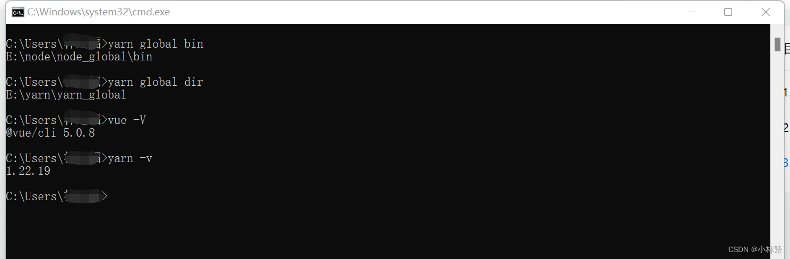
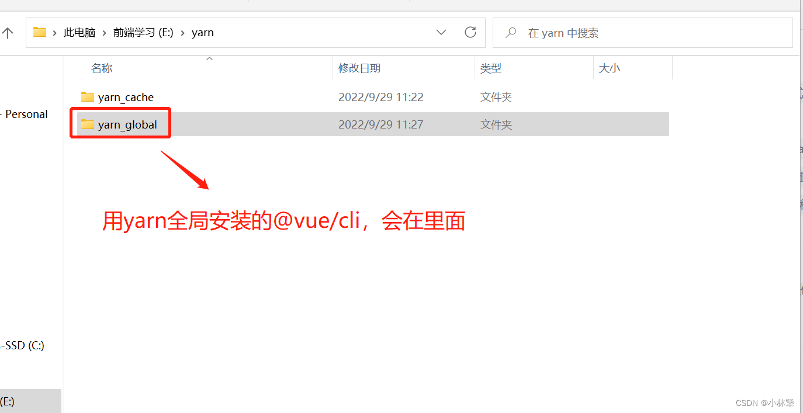
以上，是我遇到的问题和解决方案，希望对你有所帮助💕💕💕