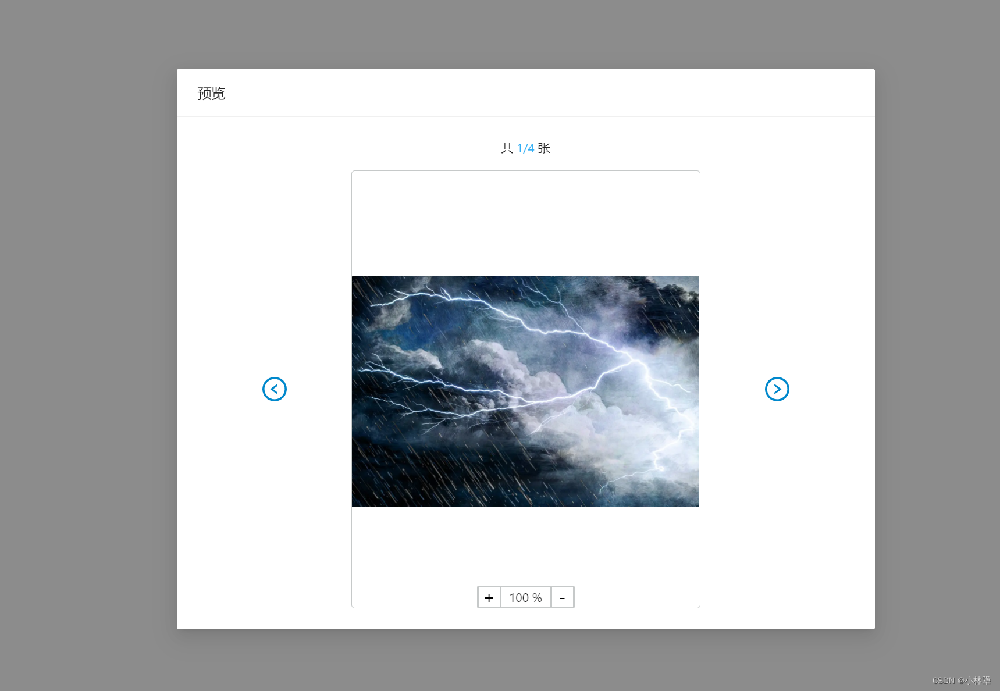

在一个React项目上，新增一个图片预览功能，如果你们的UI是基于 [antd4.x](https://ant.design/components/image-cn/) 的可以看看这个，然后我的项目是基于 antd3.x，因为项目比较大，不好升级

gitee地址：[https://gitee.com/yunfulin/react-image](https://gitee.com/yunfulin/react-image)

实现效果😁：

<div style="position: relative; width: 100%; height: 0; padding-bottom: 75%;"><iframe 
src="https://live.csdn.net/v/embed/234535" scrolling="no" border="0" 
frameborder="no" framespacing="0" allowfullscreen="true" style="position: absolute; width: 100%; 
height: 100%; left: 0; top: 0;"> </iframe></div>


## 上代码
注意这里的左右箭头是antd4.x的，因为创建项目时默认下载了最新依赖
```javascript
import React, { Component } from 'react'
import { Modal,Carousel  } from 'antd';
import { LeftCircleOutlined, RightCircleOutlined } from '@ant-design/icons';
import './picture.less'
import pic1 from '../../images/01.jpg'
import pic2 from '../../images/02.jpg'
import pic3 from '../../images/03.jpg'
import pic4 from '../../images/04.jpg'

export default class Picture extends Component {
  state = {
    imgAddress:[pic1,pic2,pic3,pic4],
    zoom: 1, //缩放
    left: 0, //左偏移
    top: 0, //右偏移
    imgNum:1, //轮播第n张
  };

  componentDidMount() {
    this.onDrag()
  }
  
  reset(classDom){
    let imgDom= document.querySelector(classDom)
    imgDom.style.transform = "scale(1)"
    imgDom.style.position = 'static'
    this.setState({zoom:1})
  }
  // 下一页
  next=()=> {
    this.carousel.next();
    //重置图片参数
    this.reset('.slick-active .img')
  }
  // 上一页
  previous=()=> {
    this.carousel.prev();
    //重置图片参数
    this.reset('.slick-active .img')
  }
   //切换面板的回调
   switchOver = (index) =>{
    this.setState({ imgNum: index + 1 })
    //重新获取最新图片dom
    this.onDrag()
  }

  //点击控制图片缩放
  imgToSize(flag) {
    let imgDom= document.querySelector('.slick-active .img')
    let { zoom } = this.state
    if(flag){
      zoom = (parseInt(zoom*100) + 50)/100 >=5? 5: (parseInt(zoom*100) + 50)/100
    }else{
      zoom = (parseInt(zoom*100) - 50)/100 <=0.1? 0.1: (parseInt(zoom*100) - 50)/100
    }
    this.setState({ zoom })
    imgDom.style.transform = `scale( ${zoom} )`
  }

   //滚轮控制图片缩放
  onWheel (e) {
    let imgDom= document.querySelector('.slick-active .img')
    let { zoom } = this.state
    zoom += e.nativeEvent.wheelDelta / 1200;
    if (zoom >= 0.1) {
      if (zoom >= 5 ) zoom = 5
      imgDom.style.transform = `scale(${zoom})`
      this.setState({zoom})
    } else {
      zoom = 0.1;
      imgDom.style.transform = `scale(${zoom})`
      this.setState({zoom})
    }
  };

  //拖拽的实现
  onDrag = () => {
    let obj = document.querySelector('.slick-active .img')
    if(!obj) return
    // 鼠标被按下
    obj.onmousedown = (event) => {
      event = event || window.event
      // 阻止默认事件
      event.preventDefault()
  
      // 计算鼠标当前坐标 = 鼠标按下坐标 - 元素当前坐标(距离父元素距离)
      // div的水平偏移量  鼠标.clentX - 元素.offsetLeft
      // div的垂直偏移量  鼠标.clentY - 元素.offsetTop
      var ol = event.clientX - obj.offsetLeft
      var ot = event.clientY - obj.offsetTop
  
      // 绑定鼠标移动事件
      document.onmousemove = (event2) => {
        event2 = event2 || window.event;
        // 计算移动距离 = 当前鼠标坐标 - 鼠标按下坐标
        var left = event2.clientX - ol
        var top = event2.clientY - ot
  
        obj.style.left = parseInt(left, 10) + "px"
        obj.style.top = parseInt(top, 10) + "px"
        obj.style.position = 'absolute'
      }
  
      // 绑定一个鼠标松开事件
      document.onmouseup = () => {
        // 取消鼠标移动事件
        document.onmousemove = null;
        document.onmouseup = null;
      }
    }
  }
  
  render() {
    const { imgAddress,imgNum,zoom } = this.state
    let zoomVal = parseInt(zoom*100)
    return (
      <div>
        <Modal title="预览" closable={false} centered={true} footer={null} width={800} maskClosable={false} visible={true}>
          <div className="CarouselDialog_num">共 <span>{imgNum}/{imgAddress.length}</span> 张</div>
          <div className='CarouselDialog_content'>
            <LeftCircleOutlined  onClick={this.previous} style={{ fontSize: '28px', color: '#08c' }} />

            <Carousel dots={false} ref={node => (this.carousel = node)} afterChange={this.switchOver}>
              {
                imgAddress.map((item,index)=>{
                  return(this.onWheel(e)} alt='' title="可拖动"/>)
                })
              }
            </Carousel>

            <RightCircleOutlined onClick={this.next} style={{ fontSize: '28px', color: '#08c' }}/>
            <div className="zoomBox">
              <div className="add" onClick={ ()=>this.imgToSize(true) }>+</div>
              <span>{ zoomVal } %</span>
              <div className="add" onClick={ ()=>this.imgToSize(false) }>-</div>
            </div>
          </div>
        </Modal>
      </div>
    );
  }
}
```
## CSS样式
```css
.CarouselDialog_num {
  margin-bottom: 15px;
  text-align: center;
  span {
    color: #31aef5;
  }
}

.CarouselDialog_content {
  display: flex;
  justify-content: space-evenly;
  align-items: center;
  position: relative;
  .ant-carousel {
    display: inline-block;
    width: 400px;
    border: 1px solid #c6c9c9;
    border-radius: 4px;
    .img {
      cursor: grab;
    }
  }
  .zoomBox {
    position: absolute;
    bottom: 0;
    left: 50%;
    transform: translateX(-50%);
    background: #fff;
    height: 26px;
    border: 2px solid #c6c9c9;
    border-radius: 2px;
    user-select: none;
    .add {
      display: inline-block;
      width: 24px;
      height: 22px;
      line-height: 20px;
      font-size: 20px;
      color: #000;
      text-align: center;
      cursor: pointer;
    }
    span {
      width: 60px;
      display: inline-block;
      border-left: 2px solid #c6c9c9;
      border-right: 2px solid #c6c9c9;
      font-size: 14px;
      height: 22px;
      line-height: 22px;
      text-align: center;
      vertical-align: top;
    }
  }
}

.ant-carousel .slick-slide {
  text-align: center;
  height: 500px;
  line-height: 500px;
  overflow: hidden;
  div {
    height: 100%;
    position: relative;
  }
}
```