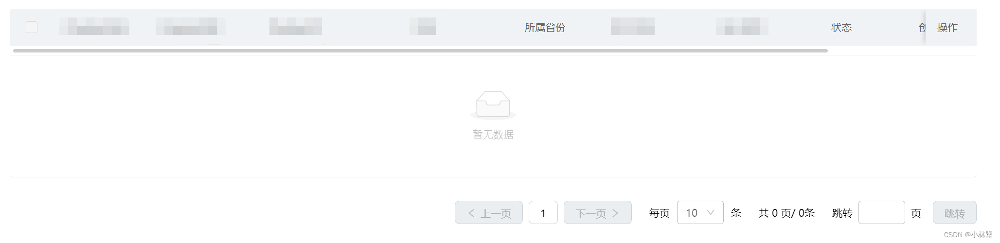
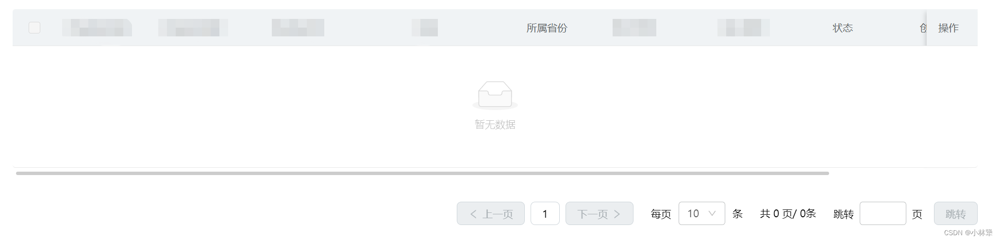
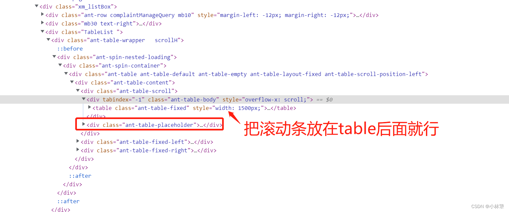
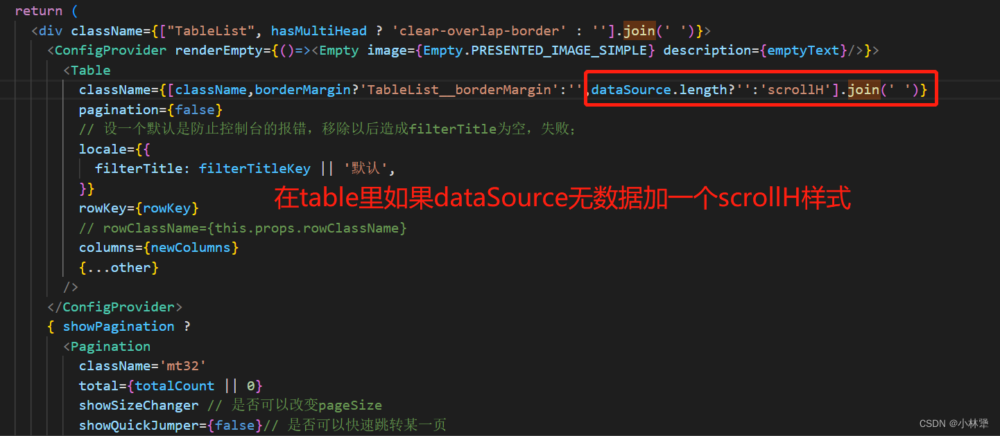

<font color=red> antd3.x </font>的Table组件，设置横向滚动，如果没有数据，横向滚动条会展示在暂无数据的上方，现在想要把暂无数据展示在滚动条的上面

原本

效果

## 解决方法
1. 将antd3.x升级到antd4.x，因为antd4的table组件已经解决了这个bug
2. antd3.x 和 antd4.x 共存，调用antd4的table组件
3. 修改样式，实现滚动条在暂无数据下方
## 这里主要讲第三点
思路：表单无数据的时候，把 ant-table-tbody（表单内容） 撑高，然后通过绝对定位把 ant-table-placeholder （暂无数据的div）脱离文档流，移动上去

上代码

```css
.scrollH .ant-table-tbody{
  height: 168px;
}
.scrollH .ant-table-placeholder{
  position: absolute;
  width: 100%;
  top: 51px;
  z-index: 5;
}
```
大功告成👍👍👍
