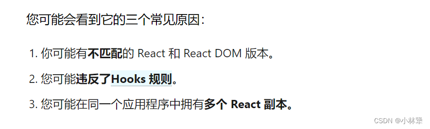
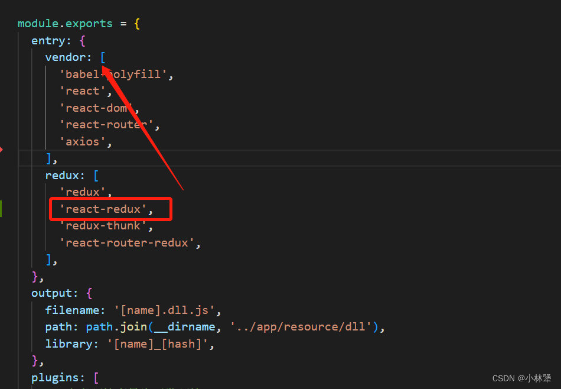
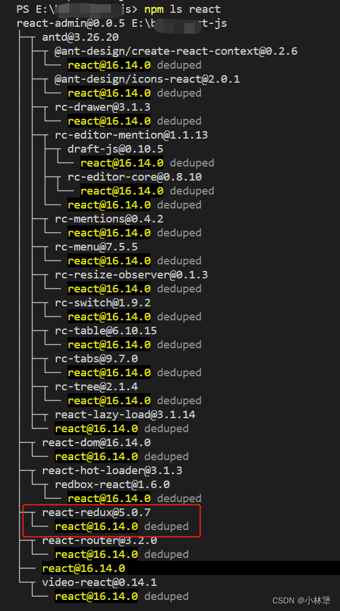

我在react16.8之前不支持hook的项目上，引入拖拽插件报错#321,提示Error: Minified React error #321，react官方([https://reactjs.org/warnings/invalid-hook-call-warning.html](https://reactjs.org/warnings/invalid-hook-call-warning.html))提示导致可能这个错误的原因如下：

#### 1、在package.json文件中我的react版本是
```javascript
"react": "^16.5.2",
"react-dom": "^16.5.2",
```
普及一下package.json文件中，^ 和 ~ 的区别：

<font color=red> ^ </font>：它将当前库的版本更新到第一个数字（major version)中的最新版本，比如：<font color=red> “^16.5.2” </font>，库会匹配更新到<font color=red> 16.X.X </font>的最新版本(也就是16.14.0)，但是不会更新到17.X.X版本

<font color=red> ~ </font>：当下载的时候，它会自动更新到中间那个数字（minor version）的最新版本，比如：“~4.2.0”，库就会更新到 4.2.X 的最新版本，但是不会更新到4.3.X版本，波浪符号是曾经 npm 安装时候的默认符号，现在已经变为了插入符号

在 node_modules 中 <font color=red> react </font>和 <font color=red> react-dom </font> 可以看到他的版本已经升级到了 16.14.0😮，也就是说他是支持hook的

#### 2、逐个排查
```javascript
确定 react 和 react-dom 是相同版本，16.14.0，支持hooks语法
确定自己的代码没有违背hooks的使用准则
项目中引入了不止一个react实例？？？
```
很快定位到是第三个原因，那就说明应该是打包的配置文件有问题，我这边用的是webpack配置，而且是用了 dll 抽离打包，在 webpack.dll.config.js 这个预打包文件



react-redux 是依赖 react 的，放到redux这个入口，打包会产生两个react实例，解决办法很简单，移动到 vendor 的入口，再打包就不会出现这个问题了

#### 3、那我们怎么知道 react-redux 是依赖 react 的，而 redux-router-redux 却没有依赖react呢

我使用的是 Node 进行包管理，在项目文件夹中运行此检查：
```javascript
npm ls react
```


npm ls react 这个命令会告诉我们，有哪些插件是依赖 react 的，很显然上面没有 redux-router-redux（那就是它没有依赖react），但是有 react-redux

#### 4、可以尝试通过添加一些日志并重新启动开发服务器来调试此问题：
```javascript
// 在 node_modules/react-dom/index.js 添加
window.React1 = require('react');

// 在随意一个组件里添加（我是在首页）
require('react-dom');
window.React2 = require('react');
console.log(window.React1 === window.React2);
```
如果它打印了，false那么你可能有两个 React

如果你的 react-dom 是放在了 webpack.dll.config.js 文件里
那么修改保存后，你要先执行 npm run dll，再执行npm run dev

然后就大功告成拉❤️❤️❤️可以使用支持hook的新轮子👍