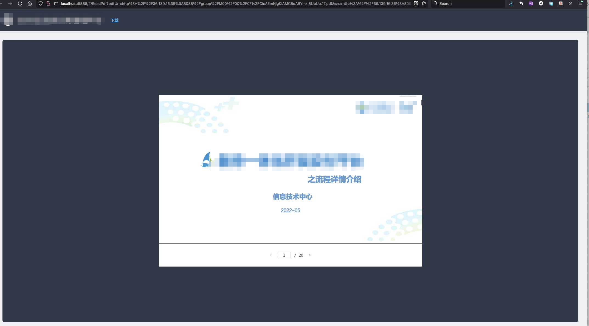

>因为`webpack 3`版本太低无法兼容最新版`react-pdf: ^6.2.2`，经过尝试发现 `5.2.0`版本可以正常运行

>环境：`webpack: 3.10.0`、`react: 16.14.0`、`react-pdf: 5.2.0`
## 一、安装 react-pdf
```javascript
npm i react-pdf@5.2.0
```
## 二、引入页面
```javascript
import React, { useState } from 'react';
import { Document, Page, pdfjs } from 'react-pdf';
import pdfjsWorker from "pdfjs-dist/build/pdf.worker.entry";
pdfjs.GlobalWorkerOptions.workerSrc = pdfjsWorker;

function MyApp() {
  const [numPages, setNumPages] = useState(null); //pdf的总页数
  const [pageNumber, setPageNumber] = useState(1); //正在阅读的页码

  function onDocumentLoadSuccess({ numPages }) {
    setNumPages(numPages);
  }

  return (
    <div>
      <Document file={ preViewPath } onLoadSuccess={onDocumentLoadSuccess} error='加载预览文件失败' loading='加载中，请稍候...'>
        <Page scale={1.5} pageNumber={pageNumber} />
      </Document>
      <p>
        Page {pageNumber} of {numPages}
      </p>
    </div>
  );
}
```
## 三、分页展示效果图

## 四、一次性展示全部效果图

>- 创建一个长度为总页数`numPages`的数组进行`map`遍历，用`index`做页数，因为`index`等于0，因此`index+1`
>- 缺点：`pdf`页数过多会出现`性能问题`，可以自行考虑加载方法（例如每滑动十页再进行下面十页的加载）
```javascript
  return (
    <div>
      <Document file={ preViewPath } onLoadSuccess={onDocumentLoadSuccess} error='加载预览文件失败' loading='加载中，请稍候...'>
	  { 
		new Array(numPages).fill('').map((item, index) => (
			<Page className='mb24' scale={1.5} key={ index } pageNumber={ index + 1 } /> 
		)) 
	  } 
      </Document>
    </div>
  );
```
## 五、react-pdf pdf.worker.js报错
### 1、官网提供实例
`pdf.worker.min.js`是国外 CDN 托管，国内访问不稳定（不推荐）
```javascript
import { pdfjs } from 'react-pdf';
pdfjs.GlobalWorkerOptions.workerSrc = `//unpkg.com/pdfjs-dist@${pdfjs.version}/build/pdf.worker.min.js`;
```
### 2、从本地引入 （推荐）
```javascript
import { pdfjs } from 'react-pdf';
import pdfjsWorker from "pdfjs-dist/build/pdf.worker.entry";
pdfjs.GlobalWorkerOptions.workerSrc = pdfjsWorker;
```
