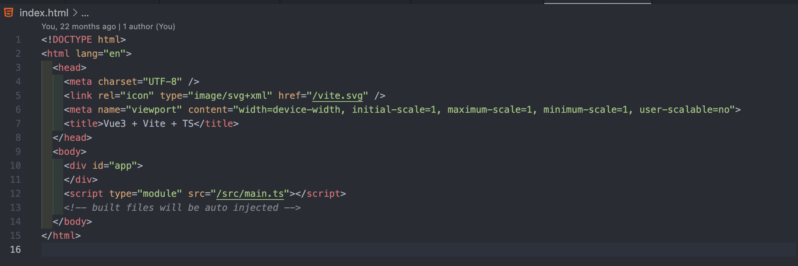

# 移动端适配最佳实践


#### viewport----视图、视窗
移动端设备中，整块显示屏就相当于视图、视窗

>在移动端设备中，浏览器视图并不是整个屏幕。因此viewport又被分为了3种layout viewport、visual viewport、ideal viewport

**layout viewport：** 大部分浏览器把viewport的宽度设为了980px，这个浏览器默认设置的视图被称为 layout viewport。我们可以使用document.documentElement.clientWidth 来获取


**visual viewport：** layout viewport的宽度是远大于浏览器宽度的，因此我们需要一个新的viewport来代表浏览器的可视区域宽度，这个视图则被成为visual viewport我们可以使用window.innerWidth来获取


**ideal viewport：** 现在越来越多的网站都会为移动设备进行单独的设计，所以必须还要有一个能完美适配移动设备的ideal viewport

#### viewport的单位vw、vh
vw、vh将viewport分成了一百份。vw即 viewport width，vh即viewport height

>1vw等于视图单位的1%的宽度
1vh等于视图单位的1%的高度
如果设计稿的视图为375px 那么1vw 等于 3.75px

要使用viewport适配，我们必须安装postcss-px-to-viewport这个包。这包和postcss-pxtorem类似。

不仅名字相似，功能也有相似的地方

postcss-pxtorem是将 px单位转换为rem单位。

postcss-px-to-viewport则是将px单位转换为vw、vh

```css
//引入 postcss-px-to-viewport
pnpm i postcss-px-to-viewport --save-dev
```

安装完成后，我们需要进行postcss插件相关的配置，在根目录新建一个名为postcss.config.js的文件，如果项目中已包含该文件则无需新建。在文件中写入如下代码:

```javascript
//postcss.config.js
module.exports = {
  plugins: {
    'postcss-px-to-viewport': {
      unitToConvert: "px", // 要转化的单位       
      viewportWidth: 375, // UI设计稿的宽度       
      unitPrecision: 6, // 转换后的精度，即小数点位数       
      propList: ["*"], // 指定转换的css属性的单位，*代表全部css属性的单位都进行转换     
      viewportUnit: "vw", // 指定需要转换成的视窗单位，默认vw       
      fontViewportUnit: "vw", // 指定字体需要转换成的视窗单位，默认vw      selectorBlackList: ["wrap"], // 指定不转换为视窗单位的类名，       
      minPixelValue: 1, // 默认值1，小于或等于1px则不进行转换       
      mediaQuery: true, // 是否在媒体查询的css代码中也进行转换，默认false      
      replace: true, // 是否转换后直接更换属性值       
      exclude: [/node_modules/], // 设置忽略文件，用正则做目录名匹配       
    }
  }
}

```

> **注意: <font color=red> postcss-px-to-viewport </font> 同样存在第三方组件库兼容性的问题。比如在设计稿为750px时，使用vant组件库会将vant组件的样式缩小。**

vant组件库的设计稿是按照375px来开发的。因此在<font color=red> viewportWidth </font>为<font color=red> 750px </font>时会出现转换问题

下面是webapck的配置：

```javascript
// postcss.config.js
const path = require('path');

module.exports = ({ webpack }) => {
  const viewWidth = webpack.resourcePath.includes(path.join('node_modules', 'vant')) ? 375 : 750;
  return {
    plugins: {
      autoprefixer: {},
      "postcss-px-to-viewport": {
        unitToConvert: "px",
        viewportWidth: viewWidth,
        unitPrecision: 6,
        propList: ["*"],
        viewportUnit: "vw",
        fontViewportUnit: "vw",
        selectorBlackList: [],
        minPixelValue: 1,
        mediaQuery: true,
        exclude: [],
        landscape: false
      }
    }
  }
}

```

>读取 node_modules 中的文件是 vant，那么就将设计稿变为375px。如果读取的文件不是vant的文件,那么就将设计稿变为750px。这样就可以避免vant组件在750px下出现样式缩小的问题了。
