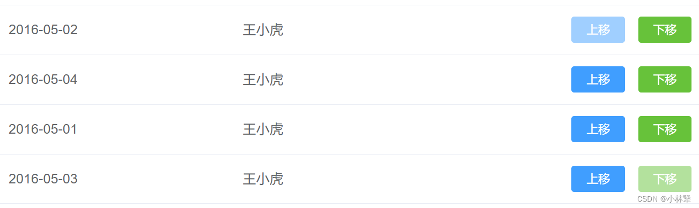

## 场景：
点击`上移`或`下移`按钮进行列表移动，`第一行`则`不能上移`，`最后一行`则`不能下移`



## 解决方案：
```javascript
<el-button @click="moveUp(index)">上移</el-button>
<el-button @click="moveDown(index)">下移</el-button>

data() {
    return {
        list: [
            { id: 1, name: '张三' },
            { id: 2, name: '李四' },
            { id: 3, name: '王五' }
        ]
    }
}

// 上移
moveUp (index) {
    const arr = this.list
    arr.splice(index - 1, 1, ...arr.splice(index, 1, arr[index - 1]))
},
// 下移
moveDown (index) {
    const arr = this.list
    arr.splice(index, 1, ...arr.splice(index + 1, 1, arr[index]))
},
```
## 禁用上下移逻辑
> 禁用上移：`:disabled="index === 0"`，禁用下移：`:disabled="index === list.length - 1"`
