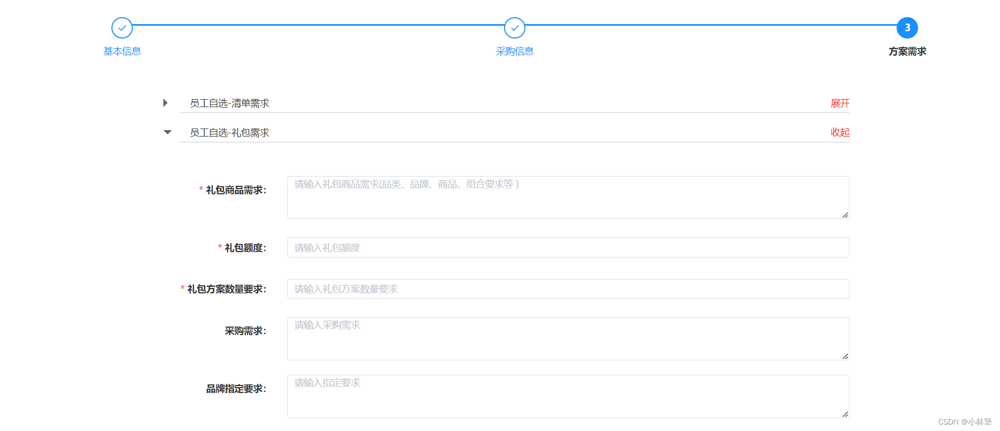

## 场景：
>同一个页面有多个模块，每个模板又单独使用了一个`表单`组件，那么我们在点击`提交按钮`时如何同时校验多个表单，我们可以使用Promise



---
# 方案：
### 1、子组件
`子组件：return 出当前的表单的数据`
```javascript
onSubmit() {
    let _self=this
    return new Promise((resolve, reject) =>{
        _self.$refs.form.validate(valid => {
            if (valid) { // 检验成功 传当前表单的数据
                resolve({0:_self.form})
            } else {
                this.$message.error('员工自选-清单需求，请按要求填写')
                reject()
            }
        })
    })
},
```
### 2、父组件
```javascript
<!-- 方案需求 -->
<div v-show="active === 2">
    <FormEmployeeList ref="Form0"></FormEmployeeList>
    <FormEmployeeGift ref="Form1"></FormEmployeeGift>
    <FormEmployeeCustomization ref="Form2"></FormEmployeeCustomization>
    <FormEnterprisesList ref="Form3"></FormEnterprisesList>
    <FormEnterprisesGift ref="Form4"></FormEnterprisesGift>
    <FormEnterprisesCustomization ref="Form5"></FormEnterprisesCustomization>
</div>
```
`父组件：onSubmit时，调用子组件的onSubmit方法，接受promise的返回结果，再通过Promise.all()方法一一验证`
```javascript
onSubmit() {
    let  newArr = [] //承接promise的返回结果
    for (let v = 0; v < 6; v ++) {
        let res =this.$refs['Form' + v].onSubmit()
        newArr.push(res)
    }
    Promise.all(newArr).then(res => { //都通过了
    	console.log('res',res)
        //res是数组，需转对象
        let obj = Object.assign({},...res)
        this.form = obj
        console.log('大功告成',this.form)
    }).catch(err=> {
        console.log('err',err)
    })
},
```