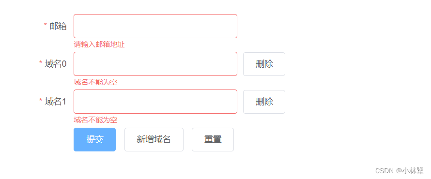

效果图：


```javascript
<el-form :model="Form" ref="Form" label-width="100px" class="demo-dynamic">
  <el-form-item
    prop="email"
    label="邮箱"
    :rules="[
      { required: true, message: '请输入邮箱地址', trigger: 'blur' },
      { type: 'email', message: '请输入正确的邮箱地址', trigger: ['blur', 'change'] }
    ]"
  >
    <el-input v-model="Form.email"></el-input>
  </el-form-item>
  <el-form-item
    v-for="(item, index) in Form.domains"
    :label="'域名' + index"
    :key="item.key"
    :prop="'domains.' + index + '.name'"
    :rules="{
      required: true, message: '域名不能为空', trigger: 'blur'
    }"
  >
    <el-input v-model="item.name"></el-input><el-button @click.prevent="removeDomain(item)">删除</el-button>
  </el-form-item>
  <el-form-item>
    <el-button type="primary" @click="submitForm('Form')">提交</el-button>
    <el-button @click="addDomain">新增域名</el-button>
    <el-button @click="resetForm('Form')">重置</el-button>
  </el-form-item>
</el-form>
```
`v-for 循环的数组名 Form.domains，在prop中，需要按照 :prop = 循环对象.下标.子属性，例：:prop="'domains.' + index + '.name'"`
```javascript
 data() {
 	return {
    	Form: {
        	domains: [
          		{ name: ''}
          	],
          	email: ''
        },
	};
},
```
注意：
1、`v-mode`l 和 `:model` 的区别问题
`v-model:` 通常是用于 input 的双向绑定，但是它不会向子组件传递数据 
`:model:` 表示绑定自定义的属性，它只是将父组件的数据传递给子组件，没有实现父子组件间的数据双向绑定
 
2、`el-form-item`上的`prop名称`、`v-model的子属性` 必须和 `rules`中的名称一致；