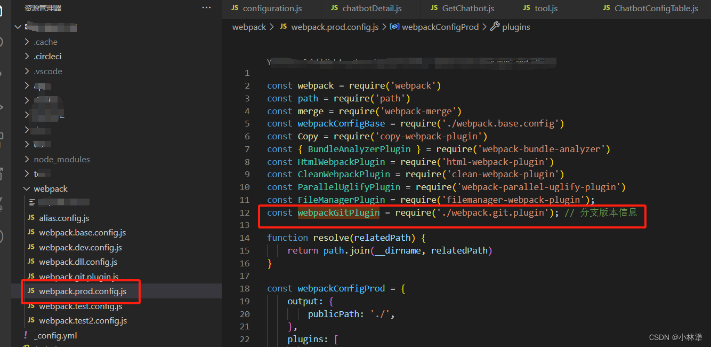

## 场景：
>为方便管理每次打包部署到测试环境，具体是哪条分支、什么时间、打包人... 所以手写一个 `webpack 插件`：实现打包时生成一个 `git` 分支版本信息的`文件`

效果图：

## 分析：
1、`首先获取项目当前所在分支的信息，如：分支名，提交人，时间，提交描述...`

2、`把这些信息放到 txt 文本里面，在打包的时候添加到打包目录里`
## 方案：
### 1、在根目录新建一个 webpack 文件夹，在这个文件夹里新建一个 `webpack.git.plugin.js` 文件

>利用 node 的 api，`child_process` 同步子进程获取分支信息：[https://nodejs.cn/api/child_process.html](https://nodejs.cn/api/child_process.html)

 ### 2、`webpack.git.plugin.js`  代码如下：
 ```javascript
// 同步子进程
const execSync = require('child_process').execSync;
// 时间格式生成
function dateFormat(date) {
  let y = date.getFullYear();
  let M = date.getMonth() + 1 < 10 ? `0${date.getMonth() + 1}` : date.getMonth() + 1;
  let d = date.getDate() < 10 ? `0${date.getDate()}` : date.getDate();
  let h = date.getHours() < 10 ? `0${date.getHours()}` : date.getHours();
  let m = date.getMinutes() < 10 ? `0${date.getMinutes()}` : date.getMinutes();
  let s = date.getSeconds() < 10 ? `0${date.getSeconds()}` : date.getSeconds();
  return `${y}-${M}-${d} ${h}:${m}:${s}`;
}
// 获取当前git分支信息
function getBranchVersionInfo() {
  // 当前分支名
  let vName = execSync('git name-rev --name-only HEAD').toString().trim();
  // 提交的commit hash
  let commitHash = execSync('git show -s --format=%H').toString().trim();
  // 提交人姓名
  let name = execSync('git show -s --format=%cn').toString().trim();
  // 提交日期
  let date = dateFormat(new Date(execSync('git show -s --format=%cd').toString()));
  // 提交描述
  let message = execSync('git show -s --format=%s').toString().trim();
  // 打包日期
  let vDate = dateFormat(new Date());
  // 打包人
  let packer = execSync('git config user.name').toString().trim();
  if(packer===null){
    packer = execSync('git config --global user.name ').toString().trim();
  }
  
  return `
    当前分支名：${vName}\n
    提交的hash：${commitHash}\n
    提交人姓名：${name}\n
    提交日期：${date}\n
    提交描述：${message}\n
    打包日期：${vDate}\n
    打包人：${packer}
  `;
}
// 创建分支版本类
class webpackGitPlugin {
  constructor(options) {
    // options 为调用时传的参数
    console.log('webpackGitPlugin 被调用！', options);
  }
  /**
   * compiler: webpack 的实例 所有的内容
   * compilation: 本次打包的内容
   * */ 

  apply(compiler) {
    // 异步方法，生成打包目录时：生成文件
    compiler.plugin('emit', (compilation, cb) => {
      // 添加分支版本信息文件
      let branchVersionInfo = getBranchVersionInfo();
      compilation.assets['version.txt'] = {
        source: () => branchVersionInfo,
        size: () => branchVersionInfo.length
      }
      cb();
    })
  }
}

module.exports = webpackGitPlugin;

```
### 3、在测试环境、生产环境引入

```javascript
const webpackGitPlugin = require('./webpack.git.plugin'); // 分支版本信息

module.exports = {
  plugins: [
    // 版本信息文件生成
    new webpackGitPlugin(),
  ],
};
```
### 4、注意事项
上面用的是`webpack 3.x` 的写法
```javascript
// 创建分支版本类
class webpackGitPlugin {
  constructor(options) {
    // options 为调用时传的参数
    console.log('webpackGitPlugin 被调用！', options);
  }
  /**
   * compiler: webpack 的实例 所有的内容
   * compilation: 本次打包的内容
   * */ 

  apply(compiler) {
    // 异步方法，生成打包目录时：生成文件
    compiler.plugin('emit', (compilation, cb) => {
      // 添加分支版本信息文件
      let branchVersionInfo = getBranchVersionInfo();
      compilation.assets['version.txt'] = {
        source: () => branchVersionInfo,
        size: () => branchVersionInfo.length
      }
      cb();
    })
  }
}
```
`webpack 4.x` 的写法
>hooks 使用 emit：输出目录之前执行。 [https://v4.webpack.js.org/api/compiler-hooks/#emit](https://v4.webpack.js.org/api/compiler-hooks/#emit)
```javascript
// 创建分支版本类
class webpackGitPlugin {
  constructor(options) {
    // options 为调用时传的参数
    console.log('webpackGitPlugin 被调用！', options);
  }
  /**
   * compiler: webpack 的实例 所有的内容
   * compilation: 本次打包的内容
   * */ 

  apply(compiler) {
    // 异步方法，生成打包目录时：生成文件
    compiler.hooks.emit.tapAsync('webpackGitPlugin', (compilation, cb) => {
      // 添加分支版本信息文件
      let branchVersionInfo = getBranchVersionInfo();
      compilation.assets['version.txt'] = {
        source: () => branchVersionInfo,
        size: () => branchVersionInfo.length
      }
      cb();
    })
  }
}
```
