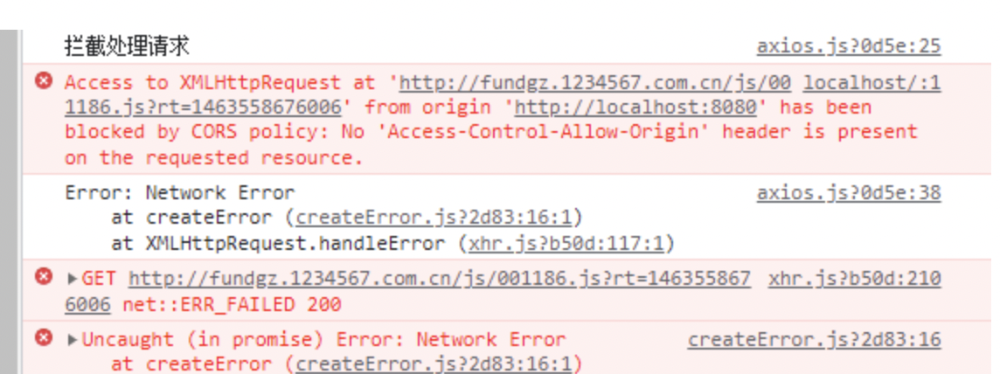
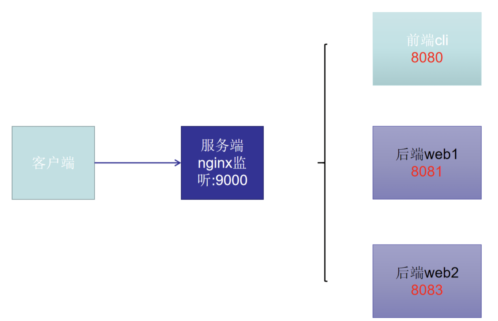
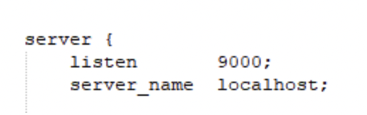
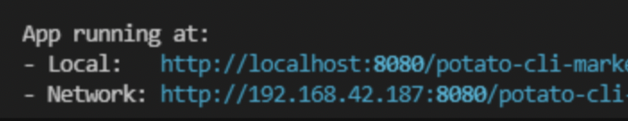
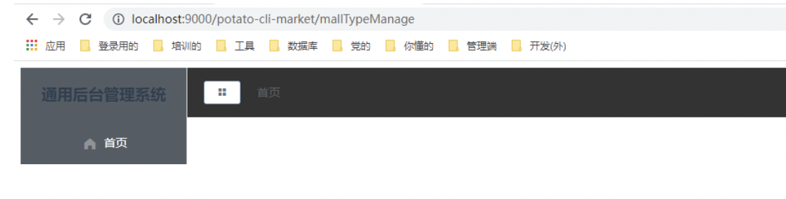

### Nginx转发解决前后端分离项目跨域请求

前端使用 <font color=#4ea1db>vue</font>，后端使用spring boot，前端学习到了发送请求，就测试了一下发送天天基金的接口（接口地址为: [http://fundgz.1234567.com.cn/js/001186.js?rt=1463558676006](http://fundgz.1234567.com.cn/js/001186.js?rt=1463558676006)），发现报了个[跨域请求](https://so.csdn.net/so/search?q=%E8%B7%A8%E5%9F%9F%E8%AF%B7%E6%B1%82&spm=1001.2101.3001.7020)的错，如下图



### 使用nginx反向代理 解决跨域



>通过nginx来进行转发，nginx的作用相当于是个传话筒，用来做分发转发的作用，如下图，客户端请求服务端，服务端的9000端口被监听，如果nginx做了转发，将服务端的某个请求前缀转发到了不同的前端、后端服务器，那么就可以实现客户端请求同一个端口，但是服务器会响应不同的后台给客户端。

#### 1.nginx官网：nginx

下载地址：[nginx: download](https://nginx.org/en/download.html)

nginx常用命令：

```nginx
开启：start nginx

关闭：nginx.exe -s quit

重启：nginx.exe -s reload  （修改配置文件后需要重启才生效）
```

#### 2.配置文件：

2.1配置监听端口

我这里监听的是9000



2.2 配置转发地址：

这个proxy_pass一定要加，默认没有，不加的话访问不了

参考这个： [https://www.cnblogs.com/BoatGina/p/8409549.html](https://www.cnblogs.com/BoatGina/p/8409549.html)

我的自己的配置如下：可参考

```nginx
server {
        listen       9000;
        server_name  localhost;
 
        #charset koi8-r;
 
        #access_log  logs/host.access.log  main;
 
        location / {
            root   html;
            index  index.html index.htm;
        }
        #自己前端的cli
		location /potato-cli-market/ {
			proxy_pass   http://localhost:8080/potato-cli-market/;
		}
        #自己后端的web
		location /potato-web-market/ {
			proxy_pass   http://localhost:8081/potato-web-market/;
		}
        #请求基金接口
		location /fund/ {
			proxy_pass    http://fundgz.1234567.com.cn/;
		}
}
```

监听的地址为localhost和端口为9000;

请求地址如下：

localhost:9000/potato-cli-market/mallTypeManage会直接转发到localhost:8080/potato-cli-market/mallTypeManage

同样如果请求

localhost:9000/potato-web-market/hello会直接转发到localhost:8081/potato-web-market/hello上

同样如果请求的接口

localhost:9000/fund/js/001186.js?rt=1463558676006会直接转发到 [http://fundgz.1234567.com.cn/js/001186.js?rt=1463558676006](http://fundgz.1234567.com.cn/js/001186.js?rt=1463558676006)


#### 3.测试

我本地vue启动访问是：



启动nginx后，我访问 [http://localhost:9000/potato-cli-market/mallTypeManage](http://localhost:9000/potato-cli-market/mallTypeManage)

就可以访问了：localhost:8080/potato-cli-market/mallTypeManage


