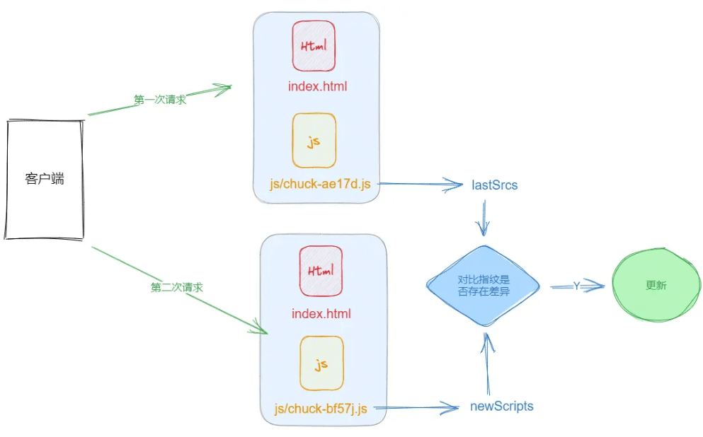
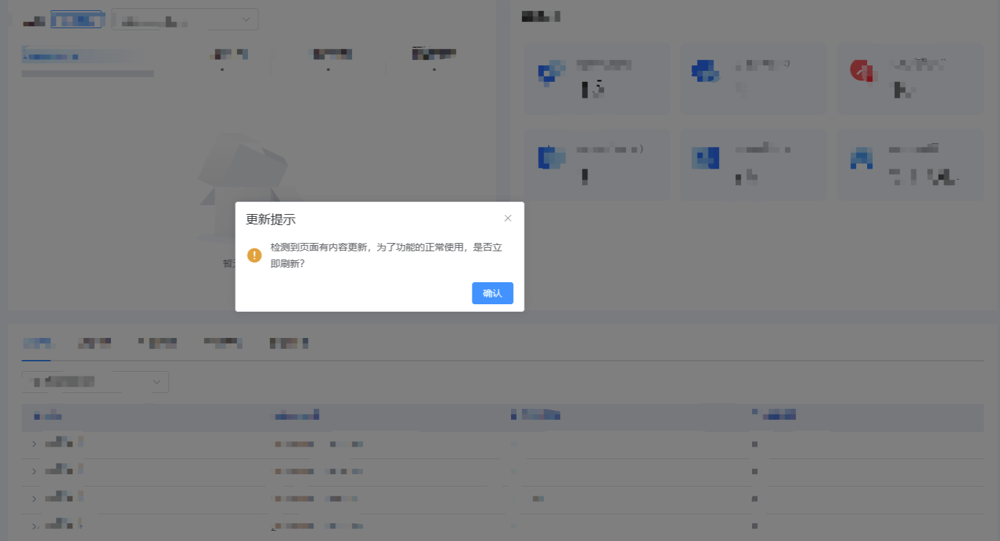

### 背景

>用户在访问单页面网站时，如果生产环境已经发布了新的版本（有功能上的变化），由于单页面中路由特性或浏览器缓存的原因，并不会重新加载前端资源，此时用户浏览器并非加载是最新的代码，从而可能遇到一些bug。<br/>
部署之后，如何提醒用户版本更新，并引导用户刷新页面呢？


### 方案
这里用的【轮询】的方式请求 <font style="color:rgb(10, 191, 91);background-color:rgb(243, 245, 249);"> index.html </font>文件，从中解析里面的<font style="color:rgb(10, 191, 91);background-color:rgb(243, 245, 249);"> js </font>文件，由于vue打包后每个<font style="color:rgb(10, 191, 91);background-color:rgb(243, 245, 249);"> js </font>文件都有<font style="color:rgb(10, 191, 91);background-color:rgb(243, 245, 249);"> 指纹标识 </font>，因此对比每次打包后的指纹，分析文件是否存在变动，如果有变动则提示用户更新！

环境：vue3 + ts + vite + element-plus



### 步骤
##### 1、在<font style="color:rgb(10, 191, 91);background-color:rgb(243, 245, 249);"> utils </font>文件夹下新建<font style="color:rgb(10, 191, 91);background-color:rgb(243, 245, 249);"> auto-update.ts </font>，内容如下

```javascript

import { ElMessageBox } from 'element-plus'


let lastSrcs: any;  //上一次获取到的script地址
let needTip = true; // 默认开启提示

const scriptReg = /<script.*src=["'](?<src>[^"']+)/gm;

const extractNewScripts = async () => {
    const html = await fetch('/?_timestamp=' + Date.now()).then((resp) => resp.text());
    scriptReg.lastIndex = 0;
    let result = [];
    let match: RegExpExecArray
    while ((match = scriptReg.exec(html) as RegExpExecArray)) {
        result.push(match.groups?.src)
    }
    return result;
}

const needUpdate = async () => {
    const newScripts = await extractNewScripts();
    if (!lastSrcs) {
        lastSrcs = newScripts;
        return false;
    }
    let result = false;
    if (lastSrcs.length !== newScripts.length) {
        result = true;
    }
    for (let i = 0; i < lastSrcs.length; i++) {
        if (lastSrcs[i] !== newScripts[i]) {
            result = true;
            break
        }
    }
    lastSrcs = newScripts;
    return result;
}
const DURATION = 10000;

export const autoRefresh = () => {
    setTimeout(async () => {
        const willUpdate = await needUpdate();
        if (willUpdate) {
            // 延时更新，防止部署未完成用户就刷新空白
            setTimeout(() => {
                ElMessageBox.confirm('检测到页面有内容更新，为了功能的正常使用，是否立即刷新？', '更新提示', {
                    confirmButtonText: '确认',
                    showCancelButton: false,
                    type: 'warning'
                }).then(() => {
                    location.reload();
                })
            }, 30000);
            needTip = false; // 关闭更新提示，防止重复提醒
        }
        if (needTip) {
            autoRefresh();
        }
    }, DURATION)
}
```

##### 2、Vite<font style="color:rgb(51, 51, 51);">的相关配置</font>

```javascript
/** 
 * @description vite document address
 * https://vitejs.cn/config/ 
 */
export default xxx = () => {
  return {
    base: './',
    resolve: {
      ...
    },
    server: {
      ...
    },
    build: {
      rollupOptions: {
        output: {
          chunkFileNames: 'js/[hash].js', // 引入文件名的名称
          entryFileNames: 'js/[hash].js', // 包的入口文件名称
          assetFileNames: '[ext]/[hash].[ext]', // 资源文件像 字体，图片等
        }
      }
    }
  }
}
```

##### 3、在入口文件<font style="color:rgb(10, 191, 91);background-color:rgb(243, 245, 249);"> mati.ts </font>中引入<font style="color:rgb(10, 191, 91);background-color:rgb(243, 245, 249);"> autoRefresh </font>，如果是生产环境，则执行<font style="color:rgb(10, 191, 91);background-color:rgb(243, 245, 249);"> autoRefresh </font>方法。

```javascript
import { autoRefresh } from "@/utils/auto-update"
if (import.meta.env.MODE == 'production') {
  autoRefresh()
}
```


