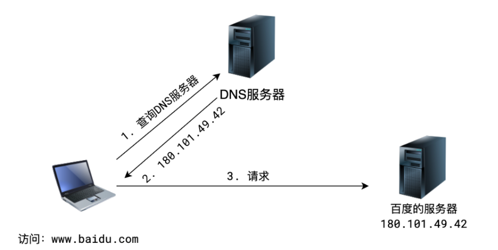
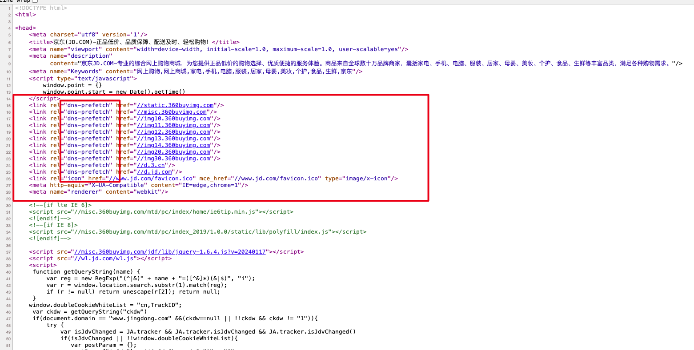
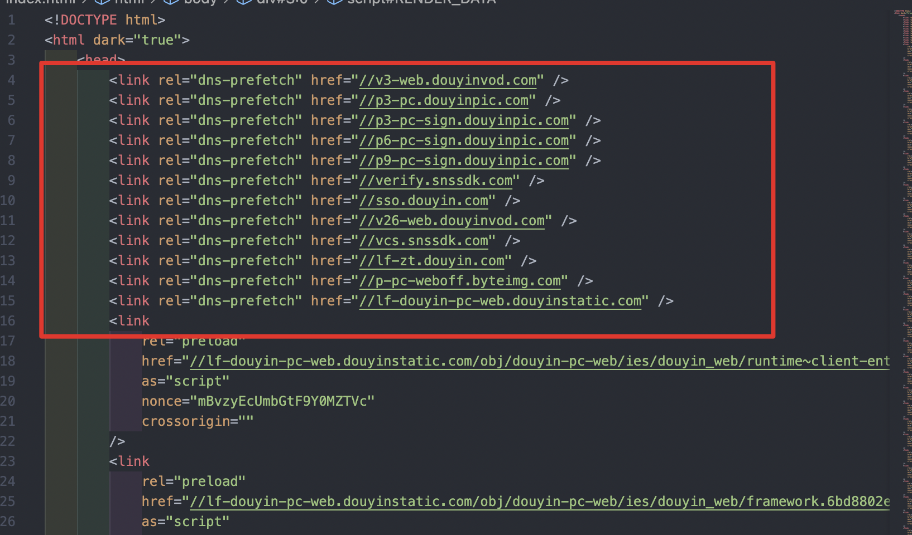
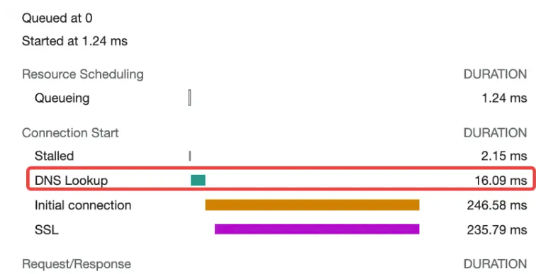
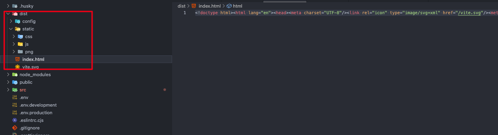
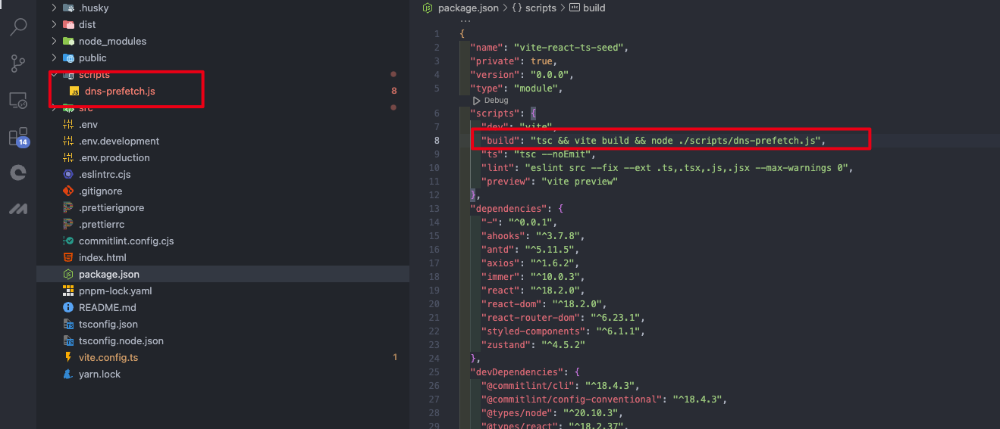

>**DNS预解析**（`dns-prefetch` ）是前端网络性能优化的一种措施，它根据浏览器定义的规则，**提前解析**之后可能会用到的域名，使解析结果**缓存到系统缓存**中，缩短DNS解析时间，进而提高网站的访问速度。

DNS预解析能够让浏览器在用户访问链接之前解析域名，其范围包括文档的所有链接，包括图片、CSS、JS；


域名解析后，如果用户确实访问该域名，那么DNS解析时间将不会有延迟。因为预读取会在后台执行，所以DNS很可能在链接对应的东西出现之前就已经解析完毕，这能够减少用户点击链接时的延迟。


## DNS预解析的原理
当浏览器访问一个域名的时候，需要解析一次 DNS，获得对应域名的 ip 地址；在解析过程中，按照如下的顺序逐步读取缓存，直到拿到IP地址：

+ 浏览器缓存
+ 系统缓存
+ 路由器缓存
+ ISP(运营商)DNS缓存
+ 根域名服务器
+ 顶级域名服务器
+ 主域名服务器

dns-prefetch 就是在**将解析后的IP缓存在系统中**；这样就有效地缩短了 DNS 解析时间。因为在本地操作系统做了 DNS 缓存，使得 DNS 在解析的过程中，提前在系统缓存中找到了对应 IP；这样一来，后续的解析步骤就不用执行了，进而也就缩短了 DNS 解析时间。

假如浏览器首次将一个域名解析为 IP 地址，并缓存至操作系统，那么下一次 DNS 解析时间可以低至 0-1ms；倘若结果不缓存在系统，那么就需要读取路由器的缓存，进而后续的解析时间最小也要约 15ms

如果路由器缓存也不存在，则需要读取 ISP（运营商）DNS缓存，一般像 `taobao.com`、`baidu.com` 这些常见的域名，读取ISP（运营商）DNS 缓存需要的时间在 80-120ms，如果是不常见的域名，平均需要 200-300ms

那也就是说，`dns-prefetch` 可以给 DNS 解析过程带来 15-300ms 的提升，尤其是一些大量引用很多其他域名资源的网站，提升效果就更加明显了。


 

 


## 如何开启DNS预解析
在 HTML 的 head 部分添加以下代码来启用 DNS 预解析，href 属性指定了需要预解析的主机名：

```html
<link rel="dns-prefetch" href="//douyin.com">
```

某东页面  



抖音页面






## 工程化的项目中使用DNS预解析
>在项目中我们可能会遇到一个问题，就是很多地方使用到了第三方的外链，比如图片、CSS、JS，由于项目是团队开发，有时候还不知道项目哪些地方引用了第三方的外链，所以我们不可能通过 link 标签的形式将这些第三方外链一个个引入并开启 DNS 预解析。<br>
这个时候需要写一个插件去帮我们查找项目中所有的引入的第三方外链





Vite 项目使用 rollup 打包的，而 Vue-cli 项目用的是 webpack， create-react-app项目是webapck

```javascript

"scripts": {
  "build": "vite bulid && node ./scripts/dns-prefetch.js"
}

```

具体的代码如下，简单来说就是，遍历打包后的 dist 目录中的所有 HTML、JS、CSS 文件，将所有外链的域名存起来，然后在 dist 目录下 index.html 文件的 head 标签中依次插入 link 标签，同时开启 DNS 预解析：

```javascript
// dns-prefetch.js
const fs = require('fs')
const path = require('path')
const { parse } = require('node-html-parser')
const { glob } = require('glob')
const urlRegex = require('url-regex')

// 获取外部链接的正则表达式
const urlPattern = /(https?:\/\/[^/]*)/i
const urls = new Set()

// 遍历dist目录中的所有HTML、JS、CSS文件
async function searchDomin() {
    const files = await glob('dist/**/*.{html,css,js}')
    for (const file of files) {
        const source = fs.readFileSync(file, 'utf-8')
        const matches = source.match(urlRegex({ strict: true }))
        if (matches) {
            matches.forEach((url) => {
                const match = url.match(urlPattern)
                if (match && match[1]) {
                    urls.add(match[1])
                }
            })
        }
    }
}

// 在index.html文件<head>标签中插入link标签
async function insertLinks() {
    const files = await glob('dist/**/*.html')
    const links = [...urls].map((url) => `<link rel="dns-prefetch" href="${url}" />`).join('\n')
    
    for (const file of files) {
        const html = fs.readFileSync(file, 'utf-8')
        const root = parse(html)
        const head = root.querySelector('head')
        head.insertAdjacentHTML('afterbegin', links)
        fs.writeFileSync(file, root.toString())
    }
}

async function main() {
    await searchDomin()
    await insertLinks()
}

main()

```


