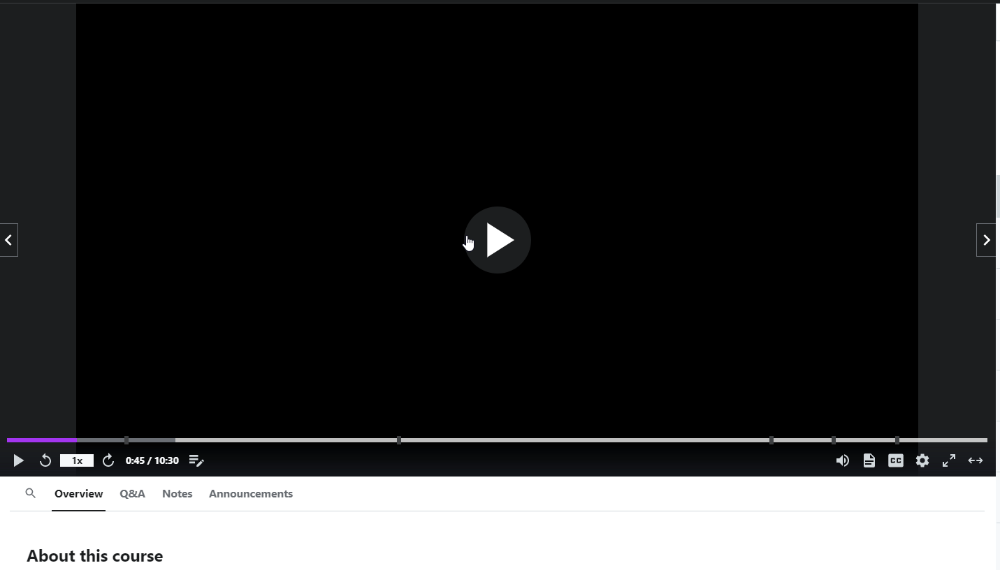

比如视频网站：优酷，爱奇艺 ，课程网站播放课程视频的时候，用屏幕录制软件录制视频区域会显示一片漆黑 (如下图)




传统的方式： 针对视频和dom添加水印


更高级的玩法！ 

[https://developer.mozilla.org/zh-CN/docs/Web/API/Encrypted_Media_Extensions_API](https://developer.mozilla.org/zh-CN/docs/Web/API/Encrypted_Media_Extensions_API)


>Encrypted Media Extensions（EME）API是一个用于播放加密媒体内容的接口，其目的是通过内容加密保护版权，用户录屏后将会是黑屏。<br>
EME主要提供了一个系统来导航需要支持DRM（Digital Rights Management，数字权利管理）的内容。它允许JavaScript与DRM服务器进行交互，获取许可证和解密密钥，然后将这些信息提供给浏览器的解密模块来解密和播放内容。

下面是一个使用EME如何播放加密视频的基础例子：

```javascript
// 创建媒体元素
const video = document.createElement('video');
document.body.appendChild(video);

// 设置媒体源
const mediaSource = new MediaSource();
video.src = URL.createObjectURL(mediaSource);

// 当媒体源打开时，添加源缓冲区
mediaSource.addEventListener('sourceopen', function() {
  const sourceBuffer = mediaSource.addSourceBuffer('video/webm; codecs="opus,vp09.00.10.08"');

  // 在获取许可证和解密密钥后，将加密的视频数据添加到源缓冲区
  fetch('your_encrypted_video.webm')
    .then(response => response.arrayBuffer())
    .then(data => {
      sourceBuffer.appendBuffer(data);
    });
});

// 设置媒体键系统访问
navigator.requestMediaKeySystemAccess('org.w3.clearkey', [{
  initDataTypes: ['keyids'],
  videoCapabilities: [{ contentType: 'video/webm; codecs="vp09.00.10.08"' }]
}]).then(function(mediaKeySystemAccess) {
  return mediaKeySystemAccess.createMediaKeys();
}).then(function(mediaKeys) {
  // 设定用于解密的媒体密钥
  video.setMediaKeys(mediaKeys);

  // 创建一个keySession，它将用于获取许可证和解密密钥
  const keySession = mediaKeys.createSession();

  // 监听message事件以获取解密密钥
  keySession.addEventListener('message', function(e) {
    // fetch许可证和解密密钥
    fetch('your_license_and_key_url', {
      method: 'POST',
      body: e.message
    }).then(function(response) {
      return response.arrayBuffer();
    }).then(function(data) {
      keySession.update(data);
    });
  });

  keySession.generateRequest('keyids', your_init_data);
});
```

在这个例子中，首先创建并设置了一个`<video>`元素和一个MediaSource对象。然后，再获取到许可证和解密密钥之后，将加密的视频数据添加到MediaSource的源缓冲区中。这使得浏览器能够解密并播放视频。请注意，这只是一个简化的例子，并假设视频是以WebM格式进行加密，并使用Clear Key加密系统（一个简单的现实世界的加密系统）。

实际上，使用EME API会涉及到大量的细节和更复杂的步骤，例如媒体数据初始化、处理多种加密密钥、处理各种错误等。此外，如何获取许可证和解密密钥以及如何处理许可证更新等，是由DRM系统和服务提供商决定的，需要根据具体的业务需求来实现。


#### <font style="color:rgb(79, 79, 79);">法律声明和用户协议
<font style="color:rgb(77, 77, 77);">明确告知用户关于内容的版权信息及禁止未经许可的截屏录屏行为，并在用户注册或使用服务前获得同意。虽然这不能从技术上阻止截屏，但可以在法律层面上提供一定的保护。
