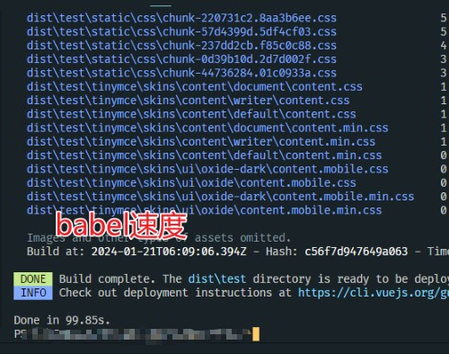
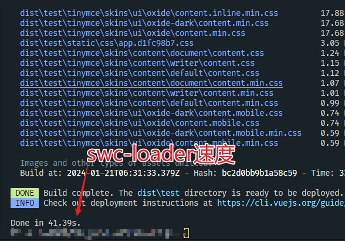

## 前言
我们都知道 webpack 项目中默认的 loader 是用的 `babel-loader`，而在打包工具这么卷的今天 babel 打包的速度实在是不敢恭维...

今天给大家介绍一款号称比 babel 速度快 10 倍的 swc-loader

我们先来看看 babel 打包项目的速度



打包将近 100s，这还是我本地的打包速度，如果是在服务器上打包的话，那么打包时间就更长了

接下来我们来看看 `swc-loader` 的打包速度



打包时间只相当于 babel 的一半，这个速度真的是快了不少

## 使用
接下来我们来看看如何使用 `swc-loader`

首先我们需要安装 `swc-loader` 和 `@swc/core`

`swc-loder` 是 webpack 的 loader，`@swc/core` 是 swc 的核心库是 `swc-loader` 的依赖


```bash
pnpm i swc-loader @swc/core -D
```

然后我们需要在`webpack.config.js`中配置`swc-loader`


```javascript
module.exports = {
  module: {
    rules: [
      {
        test: /\.js$/,
        use: [
          {
            loader: 'swc-loader',
          },
        ],
      },
    ],
  },
}
```

 

这样我们在打包的时候使用的就是`swc-loader`了

## swc-loader 的配置
`swc-loader` 的配置和 `babel-loader` 的配置基本上是一样的，我们来看看如何配置

```javascript
module.exports = {
  module: {
    rules: [
      {
        test: /\.js$/,
        use: [
          {
            loader: 'swc-loader',
            options: {
              jsc: {
                // jsc配置
                parser: {
                  // 解析器配置
                  syntax: 'typescript', // 支持的语法
                  tsx: true, // 支持tsx
                  dynamicImport: true, // 支持动态导入
                  decorators: true, // 支持装饰器
                  privateMethod: true, // 支持私有方法
                  functionBind: true, // 支持函数绑定
                  exportDefaultFrom: true, // 支持export default from
                  exportNamespaceFrom: true, // 支持export * as ns from
                  nullishCoalescing: true, // 支持空值合并
                  optionalChaining: true, // 支持可选链
                  classPrivateProperty: true, // 支持私有属性
                  classPrivateMethod: true, // 支持私有方法
                  classProperty: true, // 支持类属性
                  numericSeparator: true, // 支持数字分隔符
                  bigInt: true, // 支持大整数
                  importMeta: true, // 支持import.meta
                  throwExpressions: true, // 支持throw表达式
                  pipelineOperator: true, // 支持管道操作符
                  nullishCoalescingOperator: true, // 支持空值合并操作符
                  optionalChainingOperator: true, // 支持可选链操作符
                  logicalAssignment: true, // 支持逻辑赋值
                  partialApplication: true, // 支持部分应用
                  privateIn: true, // 支持私有in
                  recordAndTuple: true, // 支持record和tuple
                  topLevelAwait: true, // 支持顶级await
                  importAssertions: true, // 支持import断言
                  moduleAttributes: true, // 支持模块属性
                  exportExtensions: true, // 支持导出扩展
                  functionSent: true, // 支持函数sent
                  exportNamespaceFrom: true, // 支持export * as ns from
                  exportDefaultFrom: true, // 支持export default from
                },
              },
            },
          },
        ],
      },
    ],
  },
}
```


## 总结
`swc-loader`的配置和`babel-loader`的配置基本上是一样的，但是`swc-loader`的打包速度比`babel-loader`快了不少

当然并没有什么技术是完美的，`swc-loader`也有一些缺点，比如`swc-loader`不支持`@babel/plugin-transform-runtime`这个插件，所以如果你的项目中使用了这个插件的话，那么你就不能使用 swc-loader 了

`babel`毕竟是一个成熟的打包工具，所以在使用`swc-loader`的时候还是要谨慎一些，毕竟`swc-loader`还是一个新的打包工具，可能会有一些 bug，所以在使用的时候还是要多多注意一些，如果是早期的成熟项目的话，还是建议使用`babel-loader`
