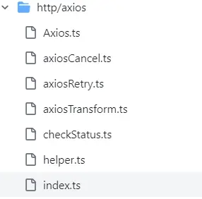
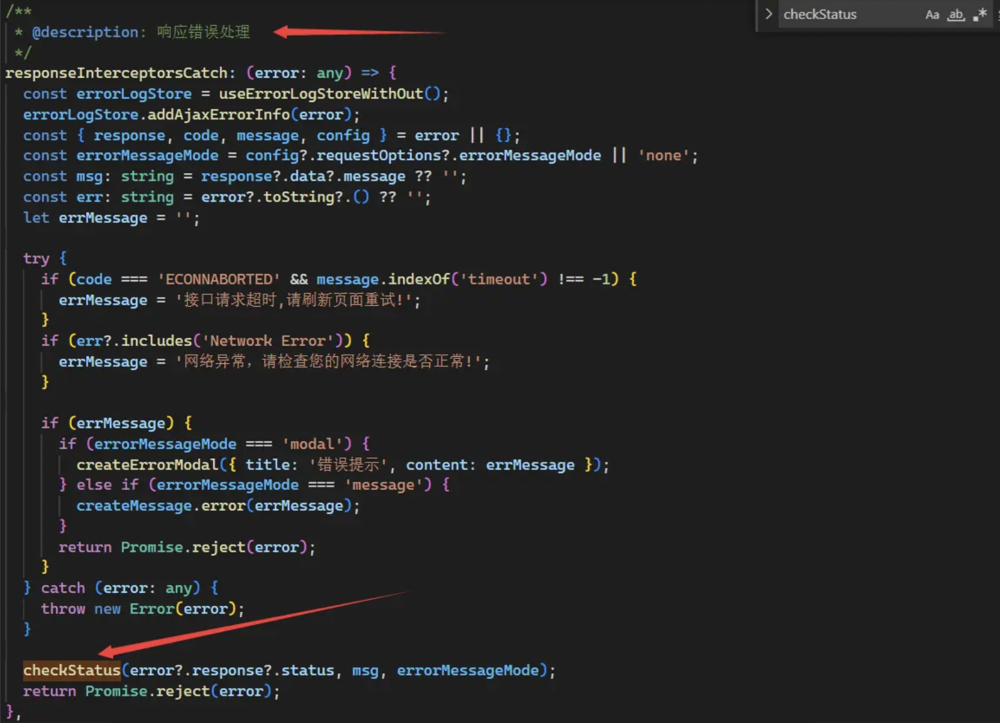
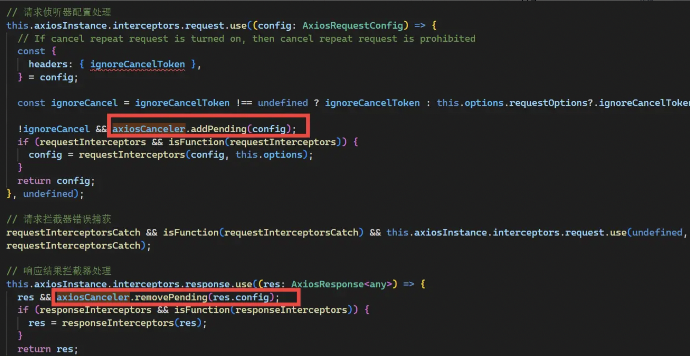
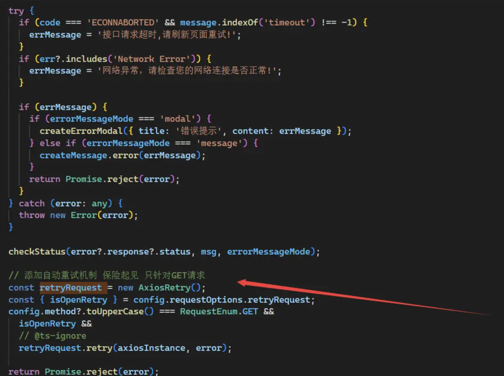

极致的优化和封装了 Axios 请求数据的体验(请求重试，请求缓存，请求竞态, 参数加密)

### **一、为什么要封装？**
随着项目`规模增大`，如果每发起一次`HTTP`请求，就要把这些比如设置超时时间、设置请求头、根据项目环境判断使用哪个请求地址、错误处理等等操作，都需要写一遍，这种重复劳动不仅浪费时间，而且让代码变得冗余不堪，难以维护。总的来说，对 axios 进行二次封装有如下好处：

1. 代码封装，重用性高，减少代码量，减少维护难度
2. 统一处理一些常规的问题，一劳永逸，比如 HTTP 错误
3. 拦截请求和响应，提前对数据进行处理，如获取 TOKEN，修改配置项

如果对 axios 的用法不熟悉的话，可以去参考 [axios官方文档](https://axios-http.com/docs/intro) 进行学习。本文有点长，希望能够有耐心阅读完，相信对您有所帮助！

### **二、如何二次封装？**
既然是二次封装，那么我们一定要做好通用性以及扩展性，要能够满足我们项目开发的大部分需求，同时尽可能提供多的功能，比如：

+ 根据开发、测试、生产环境的不同，接口请求前缀需要加以区分
+ 请求之前处理 config
+ 根据接口返回的不同状态码做不同的处理
+ 对 Get、Post 等方法进行封装，使用起来更方便
+ 针对文件上传封装统一的请求方法
+ 在响应拦截器中进行错误捕获
+ 具备取消重复请求、错误请求重连的功能
+ 对接口返回的数据进行处理，封装消息提示方法

### **三、前置知识准备**
#### **1. 请求封装的目录结构**


+ Axios.ts：请求实体类，包括实例创建、拦截器配置、请求方法封装
+ axiosCancel.ts：请求取消实体类，具备添加请求、移除请求、清空请求等方法
+ axiosRetry.ts：错误请求重连实体类，请求重试机制的具体逻辑
+ axiosTransform.ts：拦截器、错误请求、数据处理的具体逻辑
+ checkStatus.ts：根据接口返回的不同状态码做不同的处理
+ helper.ts：辅助、工具类函数
+ index.ts：请求调用入口，返回一个请求实体类对象

#### **2. 定义请求的相关类型**
```javascript
/**
 * @description: 请求结果类型
 */
export enum ResultEnum {
  SUCCESS = 0,
    ERROR = 1,
    TIMEOUT = 401,
    TYPE = 'success',
    }

/**
 * @description: 请求方法类型
 */
export enum RequestEnum {
  GET = 'GET',
    POST = 'POST',
    PUT = 'PUT',
    DELETE = 'DELETE',
    }

/**
 * @description:  Content类型
 */
export enum ContentTypeEnum {
  // json
  JSON = 'application/json;charset=UTF-8',
    // form-data qs
    FORM_URLENCODED = 'application/x-www-form-urlencoded;charset=UTF-8',
    // form-data  upload
    FORM_DATA = 'multipart/form-data;charset=UTF-8',
    }

/**
 * @description:  请求头类型
 */
export enum ConfigEnum {
  // TOKEN
  TOKEN = 'X-Access-Token',
    // TIMESTAMP
    TIMESTAMP = 'X-TIMESTAMP'
}

export type ErrorMessageMode = 'none' | 'modal' | 'message' | undefined;
export type SuccessMessageMode = 'none' | 'success' | 'error' | undefined;

export interface RequestOptions {
  // 将请求参数拼接到url
  joinParamsToUrl?: boolean;
  // 格式化请求参数时间
  formatDate?: boolean;
  // 是否处理请求结果
  isTransformResponse?: boolean;
  // 是否返回本地响应头,需要获取响应头时使用此属性
  isReturnNativeResponse?: boolean;
  // Whether to join url
  joinPrefix?: boolean;
  // 接口地址，如果保留为空，则使用默认值
  apiUrl?: string;
  // 请求拼接路径
  urlPrefix?: string;
  // 错误消息提示类型
  errorMessageMode?: ErrorMessageMode;
  // 成功消息提示类型
  successMessageMode?: SuccessMessageMode;
  // 是否添加时间戳
  joinTime?: boolean;
  ignoreCancelToken?: boolean;
  //是否在标头中发送令牌
  withToken?: boolean;
  // 请求重试机制
  retryRequest?: RetryRequest;
}

export interface RetryRequest {
  isOpenRetry: boolean;
  count: number;
  waitTime: number;
}

export interface Result<T = any> {
  code: number;
type: 'success' | 'error' | 'warning';
message: string;
result: T;
info: T;
msg: string;
}
```

### **四、具体封装细节**
把上面列出的一些内容准备好以后，便可以开始进行 `axios` 的二次封装啦！

#### **1. 创建请求实体类**
我们主要关注 class VAxios 里的逻辑（其他的引用代码可以不管），包括创建 axios 实例，请求拦截器、响应拦截器的配置，不过这里将拦截器里的具体逻辑抽离到其他文件中，待会再分析具体的逻辑。

```javascript
import type { AxiosRequestConfig, AxiosInstance, AxiosResponse } from 'axios';
import axios from 'axios';
import { AxiosCanceler } from './axiosCancel';
import { isFunction } from '@/utils/is';
import { cloneDeep } from 'lodash-es';
import type { RequestOptions, CreateAxiosOptions, Result, UploadFileParams } from './types';
import { ContentTypeEnum } from '@/enums/httpEnum';
export * from './axiosTransform';

/**
 * @description:  axios模块
 */
export class VAxios {
  private axiosInstance: AxiosInstance;
  private options: CreateAxiosOptions;

  constructor(options: CreateAxiosOptions) {
    this.options = options;
    this.axiosInstance = axios.create(options);
    this.setupInterceptors();
  }

  getAxios(): AxiosInstance {
    return this.axiosInstance;
  }

  /**
   * @description: 重新配置axios
   */
  configAxios(config: CreateAxiosOptions) {
    if (!this.axiosInstance) {
      return;
    }
    this.createAxios(config);
  }

  /**
   * @description: 设置通用header
   */
  setHeader(headers: any): void {
    if (!this.axiosInstance) {
      return;
    }
    Object.assign(this.axiosInstance.defaults.headers, headers);
  }

  /**
   * @description:  创建axios实例
   */
  private createAxios(config: CreateAxiosOptions): void {
    this.axiosInstance = axios.create(config);
  }

  private getTransform() {
    const { transform } = this.options;
    return transform;
  }

  /**
   * @description: 拦截器配置
   */
  private setupInterceptors() {
    const transform = this.getTransform();
    if (!transform) {
      return;
    }
    const {
      requestInterceptors,
      requestInterceptorsCatch,
      responseInterceptors,
      responseInterceptorsCatch,
    } = transform;

    const axiosCanceler = new AxiosCanceler();

    // 请求拦截器配置处理
    this.axiosInstance.interceptors.request.use((config: AxiosRequestConfig) => {
      const {
        headers: { ignoreCancelToken },
      } = config;
      const ignoreCancel =
        ignoreCancelToken !== undefined
        ? ignoreCancelToken
        : this.options.requestOptions?.ignoreCancelToken;

      !ignoreCancel && axiosCanceler.addPending(config);
      if (requestInterceptors && isFunction(requestInterceptors)) {
        config = requestInterceptors(config, this.options);
      }
      return config;
    }, undefined);

    // 请求拦截器错误捕获
    requestInterceptorsCatch &&
      isFunction(requestInterceptorsCatch) &&
      this.axiosInstance.interceptors.request.use(undefined, requestInterceptorsCatch);

    // 响应结果拦截器处理
    this.axiosInstance.interceptors.response.use((res: AxiosResponse<any>) => {
      res && axiosCanceler.removePending(res.config);
      if (responseInterceptors && isFunction(responseInterceptors)) {
        res = responseInterceptors(res);
      }
      return res;
    }, undefined);

    // 响应结果拦截器错误捕获
    responseInterceptorsCatch &&
      isFunction(responseInterceptorsCatch) &&
      this.axiosInstance.interceptors.response.use(undefined, responseInterceptorsCatch);
  }
  }
```

下面我们在 axios 实例类中封装请求方法（Get、Post、Put、Delete）：

```javascript
/**
 * @description:  axios模块
 */
export class VAxios {
  ........
  ........

  /**
   * @description:   请求方法
   */
  request<T = any>(config: AxiosRequestConfig, options?: RequestOptions): Promise<T> {
    let conf: AxiosRequestConfig = cloneDeep(config);
    const transform = this.getTransform();

    const { requestOptions } = this.options;

    const opt: RequestOptions = Object.assign({}, requestOptions, options);

    const { beforeRequestHook, requestCatch, transformRequestData } = transform || {};
    if (beforeRequestHook && isFunction(beforeRequestHook)) {
      conf = beforeRequestHook(conf, opt);
    }

    //这里重新 赋值成最新的配置
    // @ts-ignore
    conf.requestOptions = opt;

    return new Promise((resolve, reject) => {
      this.axiosInstance
        .request<any, AxiosResponse<Result>>(conf)
        .then((res: AxiosResponse<Result>) => {
          // 请求是否被取消
          const isCancel = axios.isCancel(res);
          if (transformRequestData && isFunction(transformRequestData) && !isCancel) {
            try {
              const ret = transformRequestData(res, opt);
              resolve(ret);
            } catch (err) {
              reject(err || new Error('request error!'));
            }
            return;
          }
          resolve(res as unknown as Promise<T>);
        })
        .catch((e: Error) => {
          if (requestCatch && isFunction(requestCatch)) {
            reject(requestCatch(e));
            return;
          }
          reject(e);
        });
    });
  }

  get<T = any>(config: AxiosRequestConfig, options?: RequestOptions): Promise<T> {
    return this.request({ ...config, method: 'GET' }, options);
  }

  post<T = any>(config: AxiosRequestConfig, options?: RequestOptions): Promise<T> {
    return this.request({ ...config, method: 'POST' }, options);
  }

  put<T = any>(config: AxiosRequestConfig, options?: RequestOptions): Promise<T> {
    return this.request({ ...config, method: 'PUT' }, options);
  }

  delete<T = any>(config: AxiosRequestConfig, options?: RequestOptions): Promise<T> {
    return this.request({ ...config, method: 'DELETE' }, options);
  }
}
```

#### **2. 状态码统一处理**
```javascript
import type { ErrorMessageMode } from '/#/axios';
import { useMessage } from '/@/hooks/web/useMessage';
import { useUserStoreWithOut } from '/@/store/modules/user';
import projectSetting from '/@/settings/projectSetting';
import { SessionTimeoutProcessingEnum } from '/@/enums/appEnum';

const { createMessage, createErrorModal } = useMessage();
const error = createMessage.error!;
const stp = projectSetting.sessionTimeoutProcessing;

export function checkStatus(status: number, msg: string, errorMessageMode: ErrorMessageMode = 'message'): void {
  const userStore = useUserStoreWithOut();
  let errMessage = '';

  switch (status) {
    case 400:
      errMessage = `${msg}`;
      break;
    case 401:
      userStore.setToken(undefined);
      errMessage = msg || '用户没有权限（令牌、用户名、密码错误）!';
      if (stp === SessionTimeoutProcessingEnum.PAGE_COVERAGE) {
        userStore.setSessionTimeout(true);
      } else {
        userStore.logout(true);
      }
      break;
    case 403:
      errMessage = '用户得到授权，但是访问是被禁止的!';
      break;
    case 404:
      errMessage = '网络请求错误,未找到该资源!';
      break;
    case 405:
      errMessage = '网络请求错误,请求方法未允许!';
      break;
    case 408:
      errMessage = '网络请求超时!';
      break;
    case 500:
      errMessage = '服务器错误,请联系管理员!';
      break;
    case 501:
      errMessage = '网络未实现!';
      break;
    case 502:
      errMessage = '网络错误!';
      break;
    case 503:
      errMessage = '服务不可用，服务器暂时过载或维护!';
      break;
    case 504:
      errMessage = '网络超时!';
      break;
    case 505:
      errMessage = 'http版本不支持该请求!';
      break;
    default:
  }

  if (errMessage) {
    if (errorMessageMode === 'modal') {
      createErrorModal({ title: '错误提示', content: errMessage });
    } else if (errorMessageMode === 'message') {
      error({ content: errMessage, key: `global_error_message_status_${status}` });
    }
  }
}
```

在响应错误处理方法中，调用 checkStatus 方法，显示不同状态码对应的信息

#### **3. 封装辅助类函数**
下面的这两个方法，在请求之前处理 config 中会用到，都是与时间有关的

```javascript
import { isObject, isString } from '/@/utils/is';

const DATE_TIME_FORMAT = 'YYYY-MM-DD HH:mm';

/**
 * @description: 拼接时间戳
 */
export function joinTimestamp(join: boolean, restful = false): string | object {
  if (!join) {
    return restful ? '' : {};
  }
  const now = new Date().getTime();
  if (restful) {
    return `?_t=${now}`;
  }
  return { _t: now };
}

/**
 * @description: 格式化请求参数中的时间
 */
export function formatRequestDate(params: Recordable) {
  if (Object.prototype.toString.call(params) !== '[object Object]') {
    return;
  }

  for (const key in params) {
    if (params[key] && params[key]._isAMomentObject) {
      params[key] = params[key].format(DATE_TIME_FORMAT);
    }
    if (isString(key)) {
      const value = params[key];
      if (value) {
        try {
          params[key] = isString(value) ? value.trim() : value;
        } catch (error: any) {
          throw new Error(error);
        }
      }
    }
    if (isObject(params[key])) {
      formatRequestDate(params[key]);
    }
  }
}
```

#### **4. 取消重复请求**
当发起一个请求还没得到响应时，又发起相同的请求，为了节省网络资源，此时需要将前一个请求取消，保留最近发起的请求。

```javascript
import axios, { AxiosRequestConfig, Canceler } from 'axios';
import qs from 'qs';

import { isFunction } from '@/utils/is/index';

// 声明一个 Map 用于存储每个请求的标识 和 取消函数
let pendingMap = new Map<string, Canceler>();

export const getPendingUrl = (config: AxiosRequestConfig) =>
  [config.method, config.url, qs.stringify(config.data), qs.stringify(config.params)].join('&');

export class AxiosCanceler {
  /**
   * 添加请求
   * @param {Object} config
   */
  addPending(config: AxiosRequestConfig) {
    this.removePending(config);
    const url = getPendingUrl(config);
    config.cancelToken =
      config.cancelToken ||
      new axios.CancelToken((cancel) => {
        if (!pendingMap.has(url)) {
          // 如果 pending 中不存在当前请求，则添加进去
          pendingMap.set(url, cancel);
        }
      });
  }

  /**
   * @description: 清空所有pending
   */
  removeAllPending() {
    pendingMap.forEach((cancel) => {
      cancel && isFunction(cancel) && cancel();
    });
    pendingMap.clear();
  }

  /**
   * 移除请求
   * @param {Object} config
   */
  removePending(config: AxiosRequestConfig) {
    const url = getPendingUrl(config);

    if (pendingMap.has(url)) {
      // 如果在 pending 中存在当前请求标识，需要取消当前请求，并且移除
      const cancel = pendingMap.get(url);
      cancel && cancel(url);
      pendingMap.delete(url);
    }
  }

  /**
   * @description: 重置
   */
  reset(): void {
    pendingMap = new Map<string, Canceler>();
  }
}
```

AxiosCanceler 类的使用时机：首先准备一个 Map 用于存储每个请求的标识和取消函数，在请求拦截器中调用添加请求的方法，然后判断 Map 结构中是否已有该请求，如果是重复请求，则将之前的请求取消掉，axios.CancelToken 可以实现取消请求；反之将该请求放入 Map 结构中；在响应拦截器中，当请求已经完成后，调用方法从 Map 结构中移除请求。



#### **5. 错误请求重连**
```javascript
import { AxiosError, AxiosInstance } from 'axios';
/**
 *  请求重试机制
 */

export class AxiosRetry {
  /**
   * 重试
   */
  retry(axiosInstance: AxiosInstance, error: AxiosError) {
    // @ts-ignore
    const { config } = error.response;
    const { waitTime, count } = config?.requestOptions?.retryRequest ?? {};
    config.__retryCount = config.__retryCount || 0;
    if (config.__retryCount >= count) {
      return Promise.reject(error);
    }
    config.__retryCount += 1;
    //请求返回后config的header不正确造成重试请求失败,删除返回headers采用默认headers
    delete config.headers;
    return this.delay(waitTime).then(() => axiosInstance(config));
  }

  /**
   * 延迟
   */
  private delay(waitTime: number) {
    return new Promise((resolve) => setTimeout(resolve, waitTime));
  }
}
```

同样是在响应错误处理方法中使用 AxiosRetry 类，可以在请求参数中配置是否开启请求重连，同时可以设置最大重试次数以及等待时间：




#### **6. 拦截器具体逻辑、数据（错误）处理**
```javascript
import type { AxiosRequestConfig, AxiosResponse } from 'axios';
import type { RequestOptions, Result } from '/#/axios';
import { checkStatus } from './checkStatus';
import { RequestEnum, ResultEnum, ConfigEnum } from '/@/enums/httpEnum';
import { useMessage } from '/@/hooks/web/useMessage';
import { isString } from '/@/utils/is';
import { getToken } from '/@/utils/auth';
import { useErrorLogStoreWithOut } from '/@/store/modules/errorLog';
import { setObjToUrlParams } from '/@/utils';
import { joinTimestamp, formatRequestDate } from './helper';
import { useUserStoreWithOut } from '/@/store/modules/user';
import { AxiosRetry } from '/@/utils/http/axios/axiosRetry';
const { createMessage, createErrorModal } = useMessage();

export interface CreateAxiosOptions extends AxiosRequestConfig {
  authenticationScheme?: string;
transform?: AxiosTransform;
requestOptions?: RequestOptions;
}

export abstract class AxiosTransform {
  /**
   * @description: Process configuration before request
   * @description: Process configuration before request
   */
  beforeRequestHook?: (config: AxiosRequestConfig, options: RequestOptions) => AxiosRequestConfig;

  /**
   * @description: Request successfully processed
   */
  transformRequestHook?: (res: AxiosResponse<Result>, options: RequestOptions) => any;

  /**
   * @description: 请求失败处理
   */
  requestCatchHook?: (e: Error, options: RequestOptions) => Promise<any>;

  /**
   * @description: 请求之前的拦截器
   */
  requestInterceptors?: (config: AxiosRequestConfig, options: CreateAxiosOptions) => AxiosRequestConfig;

  /**
   * @description: 请求之后的拦截器
   */
  responseInterceptors?: (res: AxiosResponse<any>) => AxiosResponse<any>;

  /**
   * @description: 请求之前的拦截器错误处理
   */
  requestInterceptorsCatch?: (error: Error) => void;

  /**
   * @description: 请求之后的拦截器错误处理
   */
  responseInterceptorsCatch?: (error: Error) => void;
}
```

```javascript
/**
 * @description: 数据处理，方便区分多种处理方式
 */
export const transform: AxiosTransform = {
  /**
   * @description: 处理请求数据。如果数据不是预期格式，可直接抛出错误
   */
  transformRequestHook: (res: AxiosResponse<Result>, options: RequestOptions) => {
    const { isTransformResponse, isReturnNativeResponse } = options;

    // 是否返回原生响应头 比如：需要获取响应头时使用该属性
    if (isReturnNativeResponse) {
      return res;
    }
    // 不进行任何处理，直接返回
    // 用于页面代码可能需要直接获取code，data，message这些信息时开启
    if (!isTransformResponse) {
      return res.data;
    }
    // 错误的时候返回

    const { data } = res;
    if (!data) {
      throw new Error('请求出错，请稍候重试');
    }
    //  这里 code，result，message为 后台统一的字段，需要修改为自己项目中的接口返回格式
    const { code, result, message, success, info, msg } = data;
    // 这里逻辑可以根据项目进行修改
    // 兼容导出接口
    let hasSuccess = true;
    if (Object.prototype.toString.call(data) === '[object Object]') {
      hasSuccess = data && Reflect.has(data, 'code') && (code === ResultEnum.SUCCESS || code === 200);
    }
    if (hasSuccess) {
      if (success && message && options.successMessageMode === 'success') {
        //信息成功提示
        createMessage.success(message);
      }
      // 兼容导出接口
      if (Object.prototype.toString.call(data) !== '[object Object]') return data;
      if (info) {
        return info;
      } else {
        return result;
      }
    }

    // 在此处根据自己项目的实际情况对不同的code执行不同的操作
    // 如果不希望中断当前请求，请return数据，否则直接抛出异常即可
    let timeoutMsg = '';
    switch (code) {
      case ResultEnum.TIMEOUT:
        timeoutMsg = '登录超时,请重新登录!';
        const userStore = useUserStoreWithOut();
        userStore.setToken(undefined);
        userStore.logout(true);
        break;
      default:
        if (message) {
          timeoutMsg = message;
        }
    }

    // errorMessageMode=‘modal’的时候会显示modal错误弹窗，而不是消息提示，用于一些比较重要的错误
    // errorMessageMode='none' 一般是调用时明确表示不希望自动弹出错误提示
    if (options.errorMessageMode === 'modal') {
      createErrorModal({ title: '错误提示', content: timeoutMsg });
    } else if (options.errorMessageMode === 'message') {
      createMessage.error(timeoutMsg);
    }

    throw new Error(timeoutMsg || '请求出错，请稍候重试');
  },

  // 请求之前处理config
  beforeRequestHook: (config, options) => {
    const { apiUrl, joinPrefix, joinParamsToUrl, formatDate, joinTime = true, urlPrefix } = options;

    if (joinPrefix) {
      config.url = `${urlPrefix}${config.url}`;
    }

    if (apiUrl && isString(apiUrl)) {
      config.url = `${apiUrl}${config.url}`;
    }
    const params = config.params || {};
    const data = config.data || false;
    formatDate && data && !isString(data) && formatRequestDate(data);
    if (config.method?.toUpperCase() === RequestEnum.GET) {
      if (!isString(params)) {
        // 给 get 请求加上时间戳参数，避免从缓存中拿数据。
        config.params = Object.assign(params || {}, joinTimestamp(joinTime, false));
      } else {
        // 兼容restful风格
        config.url = config.url + params + `${joinTimestamp(joinTime, true)}`;
        config.params = undefined;
      }
    } else {
      if (!isString(params)) {
        formatDate && formatRequestDate(params);
        if (Reflect.has(config, 'data') && config.data && Object.keys(config.data).length > 0) {
          config.data = data;
          config.params = params;
        } else {
          // 非GET请求如果没有提供data，则将params视为data
          config.data = params;
          config.params = undefined;
        }
        if (joinParamsToUrl) {
          config.url = setObjToUrlParams(config.url as string, Object.assign({}, config.params, config.data));
        }
      } else {
        // 兼容restful风格
        config.url = config.url + params;
        config.params = undefined;
      }
    }
    return config;
  },

  /**
   * @description: 请求拦截器处理
   */
  requestInterceptors: (config: Recordable, options) => {
    // 请求之前处理config
    const token = getToken();
    if (token && (config as Recordable)?.requestOptions?.withToken !== false) {
      // jwt token
      config.headers.Authorization = options.authenticationScheme ? `${options.authenticationScheme} ${token}` : token;
      config.headers[ConfigEnum.TOKEN] = token;
      config.headers['ClientToken'] = token;
    }
    return config;
  },

  /**
   * @description: 响应拦截器处理
   */
  responseInterceptors: (res: AxiosResponse<any>) => {
    return res;
  },

  /**
   * @description: 响应错误处理
   */
  responseInterceptorsCatch: (error: any) => {
    const errorLogStore = useErrorLogStoreWithOut();
    errorLogStore.addAjaxErrorInfo(error);
    const { response, code, message, config } = error || {};
    const errorMessageMode = config?.requestOptions?.errorMessageMode || 'none';
    const msg: string = response?.data?.message ?? '';
    const err: string = error?.toString?.() ?? '';
    let errMessage = '';

    try {
      if (code === 'ECONNABORTED' && message.indexOf('timeout') !== -1) {
        errMessage = '接口请求超时,请刷新页面重试!';
      }
      if (err?.includes('Network Error')) {
        errMessage = '网络异常，请检查您的网络连接是否正常!';
      }

      if (errMessage) {
        if (errorMessageMode === 'modal') {
          createErrorModal({ title: '错误提示', content: errMessage });
        } else if (errorMessageMode === 'message') {
          createMessage.error(errMessage);
        }
        return Promise.reject(error);
      }
    } catch (error: any) {
      throw new Error(error);
    }

    checkStatus(error?.response?.status, msg, errorMessageMode);
    // 添加自动重试机制 保险起见 只针对GET请求
    const retryRequest = new AxiosRetry();
    const { isOpenRetry } = config.requestOptions.retryRequest;
    config.method?.toUpperCase() === RequestEnum.GET &&
      isOpenRetry &&
      // @ts-ignore
      retryRequest.retry(axiosInstance, error);
    return Promise.reject(error);
  },
};
```

#### **7. 请求配置项、调用入口**
```javascript
// axios配置  可自行根据项目进行更改，只需更改该文件即可，其他文件可以不动
import { VAxios } from './Axios';
import { ContentTypeEnum } from '@/enums/httpEnum';
import { useGlobSetting } from '@/hooks/setting';
import { deepMerge } from '@/utils';
import { CreateAxiosOptions } from './types';
import { transform } from './axiosTransform';

const globSetting = useGlobSetting();
const urlPrefix = globSetting.urlPrefix || '';

function createAxios(opt?: Partial<CreateAxiosOptions>) {
  return new VAxios(
    deepMerge(
      {
        timeout: 10 * 1000,
        authenticationScheme: '',
        // 接口前缀
        prefixUrl: urlPrefix,
        headers: { 'Content-Type': ContentTypeEnum.JSON },
        // 数据处理方式
        transform,
        // 配置项，下面的选项都可以在独立的接口请求中覆盖
        requestOptions: {
          // 默认将prefix 添加到url
          joinPrefix: true,
          // 是否返回原生响应头 比如：需要获取响应头时使用该属性
          isReturnNativeResponse: false,
          // 需要对返回数据进行处理
          isTransformResponse: true,
          // post请求的时候添加参数到url
          joinParamsToUrl: false,
          // 格式化提交参数时间
          formatDate: true,
          // 消息提示类型
          errorMessageMode: 'none',
          // 接口地址
          apiUrl: globSetting.apiUrl,
          // 接口拼接地址
          urlPrefix: urlPrefix,
          //  是否加入时间戳
          joinTime: true,
          // 忽略重复请求
          ignoreCancelToken: true,
          // 是否携带token
          withToken: true,
          retryRequest: {
            isOpenRetry: true,
            count: 5,
            waitTime: 100,
          },
        },
        withCredentials: false,
      },
      opt || {}
    )
  );
}

export const http = createAxios();
```

如果项目中多个不同 api 地址，直接在这里导出多个，在请求配置中使用不同的 url 即可

```javascript
function createAxios(opt?: Partial<CreateAxiosOptions>) {}
export const defHttp = createAxios();

function createAxios2(opt?: Partial<CreateAxiosOptions>) {}

export const defHttp2 = createAxios2();
```

#### **8. 项目中使用并调用接口**
为了统一管理项目中使用到的接口，可以专门新建个 api.ts 文件存放某个模块的接口

```javascript
import { defHttp } from '/@/utils/http/axios';

enum Api {
  page = '/server/page/list',
    }

/**
 *  页面配置列表
 * @param params
 * @returns
 */
export const list = (params) => {
  return defHttp.post({ url: Api.page, params });
};
```

页面逻辑代码中引入接口并调用：

```javascript
import { list } from './api.ts';
......

onMounted(() => {
  getList();
});
const getList = () => {
  loading.value = true;
  const params = {
    name: name.value,
    age: age.value,
  };
  list(params)
    .then((res) => {
      if (res.items) {
        dataSource = res.items || [];
      }
    })
    .finally(() => {
      loading.value = false;
    });
};
```

到这里二次封装 Axios 请求已经基本完成，本文代码中会引用到许多其他地方的模块，我们可以忽略，只需关注 axios 相关的处理逻辑。其实我的代码是基于 vue-vben-admin 模板的，所以有些地方也许会过度封装，我们主要关注`封装的逻辑以及注意事项`即可我司的管理后台项目便是基于该模板，因此趁着周末梳理了一遍 axios 相关的代码，并做了一些总结分享给大家，如果有错误以及不合理的地方希望指出，共同进步！

 

#### 9. 请求参数加密
##### 需要解决的问题
+ 由于用户标识为各项参数的组合，需要防止被分析出标识规则
+ 前后端数据为明文传输，用户可通过开发者工具查看数据

##### 场景
由于项目创建之前后端设计不合理，导致详情页链接参数id为顺序序数(例：1,2,3…等等)，安全系数非常低（虽然我们前端做了菜单权限、按钮权限、Api权限等等），现在要前端解决下浏览器链接/接口参数实现加密

>项目正常链接：http://xxx.com/xx/contract/draft/contract-draft-detail?
id=26197&type=news&key=1667198460529

我们最终需要base64加密成这种（如果不想base64加密也可换成其他加密方式 👇
如：RSA加密、AES加密、MD5加密、SHA256加密以及国密）

>加密后的：ontract/draft/contract-draft-detail?__params=eyJpZCI6MjYxOTcsInR5cGUiOiJuZXciLCJrZXkiOjE2NjcxOTg0NjA1Mjl9

##### 要想将参数加密，我这里设计的是，将所有参数以对象的形式进行加密，如下
```vue
正常参数格式： `id=26197&type=news&key=1667198460529`,
转化成对象:  {
	id: 26197,
	type: 'news',
	key: '1667198460529'
}

```

##### 正常情况下，可直接 $route.query 获取参数对象，或 window.location.search 格式化获取，格式化函数如下
```javascript
// URL参数转成对象
export function urlPasseObj(url = '', isUrl) {
  const result = url.split('?')[isUrl ? 1 : 0]
  if (!result) {
    return {}
  }
  const list = result.split('&')
  const obj = {}
  list.map(item => {
    if (item) {
      const arr = item.split('=')
      const value = arr[1]
      obj[arr[0]] = value === undefined ? '' : value
    }
  })
  return obj
}


```

加密后都放到一个参数中，这里我命名为 **__params**

#### 10. 加/解密方法实现
>这里要注意的是base64加密正常是字符串(String类型)进行加密，对对象(Object)进行加密，需要通过_**JSON.parse**_进行转义成String类型

```javascript
/**
 * base64(解密)
 * @param {String} str 跳转参数为base64字符串
 * @returns
 */
export const decryptBase64 = function(str) {
  // 添加decodeURIComponent解决其他特殊字符，如等号(=)会转成%3D，导致base64解密失败
  const decryptQuery = str ? JSON.parse(base64.decode(decodeURIComponent(str))) : {}
  return decryptQuery
}

/**
 * base64(加密)
 * @param {Object || String} param 跳转参数可以为对象或路径字符串
 * @returns
 */
export const encryptBase64 = function(param) {
  const encryptStr = base64.encode(JSON.stringify(param)) || ''
  return encryptStr
}

```

##### 加密处处理，路由拦截请求(处理get请求参数)
```javascript
request.interceptors.request.use(config => {
   if (config.method === 'get') {
    config.data = true
    // 判断是否有携带参数
    const isHash = config.url.includes('?')
    if (isHash) {
      // 将url上的参数调整到params中，然后调整清除url上的参数
      // urlPasseObj方法在上方
      const urlParam = urlPasseObj(config.url, true)
      config.params = config.params ? { ...config.params, ...urlParam } : urlParam
      config.url = config.url.split('?')[0]
    }
    if (config.params) {
      config.params = {
        __params: encryptBase64(config.params)
      }
    }
  }
  return config
}, errorHandler)

```

##### 解密的处理
```javascript
watch: {
   '$route.query': {
     immediate: true,
     deep: true,
     handler(val) {
       if (val.__params) {
         const newQuery = decryptBase64(val?.__params)
         // 在vue原型上定义一个
        //  Vue.prototype.$route_query = newQuery
        //  return
       }
      //  Vue.prototype.$route_query = val || {}
     }
   }
 }
 
```
