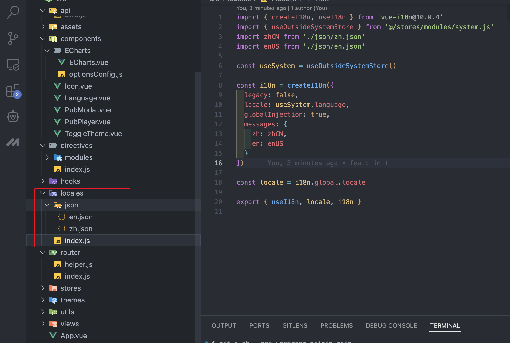

>**<font style="color:rgb(62, 175, 124);">什么是Vue I18n?</font>**<font style="color:rgb(123, 120, 120);"> Vue I18 n是Vue.js的国际化插件。它可以轻松地将一些本地化功能集成到Vue.js应用程序中。</font>

<font style="color:rgb(51, 51, 51);">官网： </font>[https://vue-i18n.intlify.dev/](https://vue-i18n.intlify.dev/)


## 1. 安装
```bash
npm add vue-i18n@latest
or
npm install vue-i18n@latest
```

## 2. 接入到Vue3中
**新建目录结构**



**json文件夹下**

```json
// zh.json 文件
{
  "hello": "你好 世界！",
  "demo": "演示"
}

// en.json 文件
{
  "hello": "Hello World!",
  "demo": "demo"
}
```

**index.js**

```javascript
import { createI18n, useI18n } from 'vue-i18n'
//状态管理 pinia
import { useOutsideSystemStore } from '@/stores/modules/system.js'
import zhCN from './json/zh.json'
import enUS from './json/en.json'

const useSystem = useOutsideSystemStore()

const i18n = createI18n({
  // 是否在vue应用程序上使用vue-i18n Legacy API（传统）模式
  legacy: false,
  // 默认当前语言
  locale: useSystem.language,
  // 是否为每个组件注入全局属性和函数（true 后 在template中可以直接使用$t('')）
  globalInjection: true,
  // 语言合集
  messages: {
    zh: zhCN,
    en: enUS
  }
})

const locale = i18n.global.locale

export { useI18n, locale, i18n }
```

**main.js**

```javascript
import App from './App.vue'
import { i18n } from '@/locales'

const app = createApp(App)
app.use(i18n)
app.mount('#app')
```

## 3. 使用
```html
<template>
  <!-- 因配置全局注入属性和方法，可以直接使用vue-i18n内置的$t方法 -->
  <div>{{ $t('hello') }}</div>
</template>
<script>
  import { useI18n } from "vue-i18n";
  // 在js中可以引入vue-i18提供的hook
  const { t } = useI18n();
</script>
```
