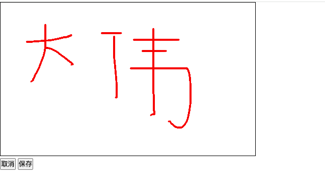

### 背景
>在现在的时代发展中，从以前的手写签名，逐渐衍生出了 <font color=red>电子签名</font>。电子签名和纸质手写签名一样具有法律效应。电子签名目前主要还是在需要个人确认的产品环节和司法类相关的产品上较多。<br>
举个常用的例子，大家都用过<font color=red> 钉钉</font>，钉钉上面就有电子签名，相信大家这肯定是知道的。<br>
那作为前端的我们如何实现电子签名呢？其实在html5中已经出现了一个重要级别的辅助标签，是啥呢？那就是<font color=red> canvas</font>。

### 效果图


代码

```html
<!doctype html>
<html lang="en">
    <head>
        <meta charset="UTF-8" />
        <meta http-equiv="X-UA-Compatible" content="IE=edge" />
        <meta name="viewport" content="width=device-width, initial-scale=1.0" />
        <title>Document</title>
        <style>
            * {
                margin: 0;
                padding: 0;
            }
        </style>
    </head>
    <body>
        <canvas></canvas>
        <div>
            <button onclick="cancel()">取消</button>
            <button onclick="save()">保存</button>
        </div>
    </body>
    <script>
        const canvas = document.querySelector('canvas');
        canvas.width = 500;
        canvas.height = 300;
        canvas.style.border = '1px solid #000';
        const ctx = canvas.getContext('2d');

        ctx.lineWidth = 3; //线宽
        ctx.strokeStyle = 'red'; //线颜色
        ctx.lineCap = 'round'; //线条的结束端点样式
        ctx.lineJoin = 'round'; //两条线相交时，所创建的拐角类型

        const mobileStatus = /Mobile|Android|iPhone/i.test(navigator.userAgent);

        const start = (event) => {
            const { offsetX, offsetY, pageX, pageY } = mobileStatus
                ? event.changedTouches[0]
                : event;
            ctx.beginPath(); //起始一条路径，或重置当前路径
            ctx.moveTo(pageX, pageY); //把路径移动到画布中的指定点，不创建线条
            window.addEventListener(mobileStatus ? 'touchmove' : 'mousemove', draw);
        };

        const draw = (event) => {
            const { pageX, pageY } = mobileStatus ? event.changedTouches[0] : event;
            ctx.lineTo(pageX, pageY); //添加一个新点，然后在画布中创建从该点到最后指定点的线条
            ctx.stroke(); //绘制已定义的路径
        };
        const cloaseDraw = () => {
            window.removeEventListener('mousemove', draw);
        };

        window.addEventListener(mobileStatus ? 'touchstart' : 'mousedown', start);
        window.addEventListener(mobileStatus ? 'touchend' : 'mouseup', cloaseDraw);

        const cancel = () => {
            ctx.clearRect(0, 0, 500, 300); //在给定的矩形内清除指定的像素
        };

        const save = () => {
            canvas.toBlob((blob) => {
                const date = Date.now().toString();
                const a = document.createElement('a');
                a.download = `${date}.png`;
                a.href = URL.createObjectURL(blob);
                a.click();
                a.remove();
            });
        };
    </script>
</html>

```

这段HTML代码配合JavaScript实现了一个简单的绘图功能，允许用户在网页上通过鼠标或触摸设备绘制线条。下面是代码的解释：

1. 初始化画布:  
  ○ 通过document.querySelector('canvas')获取到页面上的元素，并存储在变量canvas中。   ○ 设置画布的宽度为500像素，高度为300像素。   ○ 给画布添加一个1像素宽的黑色边框。   ○ 通过canvas.getContext('2d')获取2D绘图上下文，并存储在变量ctx中，用于后续的绘图操作。
1. 设置绘图参数:  
  ○ ctx.lineWidth = 3;设置线条的宽度为3像素。  
  ○ ctx.strokeStyle = 'red';设置线条的颜色为红色。  
  ○ ctx.lineCap = 'round';设置线条端点的样式为圆形。  
  ○ ctx.lineJoin = 'round';设置线条相交时拐角的样式为圆形。
1. 检测移动设备:  
  ○ 使用正则表达式/Mobile|Android|iPhone/i检测用户代理字符串，判断当前设备是否为移动设备。如果是，mobileStatus为true，否则为false。
1. 绘图逻辑:  
  ○ start函数：当用户开始触摸或按下鼠标按钮时触发。它记录触摸或鼠标按下的位置，并开始一个新的路径。  
  ○ draw函数：当用户移动触摸或鼠标时触发。它根据当前位置绘制一条线到上一个位置，然后重复这个过程直到用户停止移动。  
  ○ cloaseDraw函数（注意这里可能是closeDraw的拼写错误）：当用户结束触摸或释放鼠标按钮时触发。它停止绘制线条。
1. 事件监听:  
  ○ 根据mobileStatus的值，为window添加相应的事件监听器：如果是移动设备，监听touchstart和touchend事件；如果不是，监听mousedown和mouseup事件。这些事件分别触发start和cloaseDraw函数。
1. 清除和保存绘图:  
  ○ cancel函数：清除画布上的所有内容。  
  ○ save函数：将画布内容保存为一个PNG文件。它使用canvas.toBlob方法创建一个Blob对象，然后创建一个隐藏的链接(元素)，设置其下载属性为当前时间戳加上.png后缀，并将Blob对象的URL设置为链接的href属性。最后，自动触发点击事件以下载文件，并移除链接元素。 这段代码是一个简单的绘图应用的基础，展示了如何使用HTML5的元素和JavaScript来创建交互式绘图体验。

