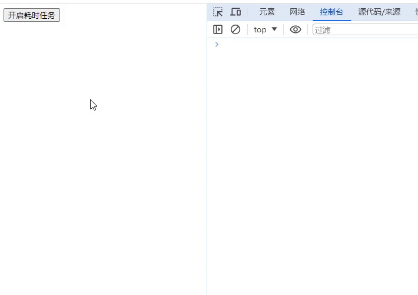

```html
<!DOCTYPE html>
<html lang="en">
  <head>
    <meta charset="UTF-8" />
    <meta name="viewport" content="width=device-width, initial-scale=1.0" />
    <title>Document</title>
  </head>
  <body>
    <button class="btn">开启耗时任务</button>
  </body>
  <script>
    const btn = document.querySelector('.btn')
    function delay(duration = 1000) {
      const start = Date.now()
      while (Date.now() - start < duration) {}
    }
    btn.addEventListener('click', function () {
      delay(500)
    })
    const observer = new PerformanceObserver(list => {
      for (const entry of list.getEntries()) {
        if (entry.duration > 100) {
          console.log('页面卡顿时间超过100ms')
        }
      }
    })

    observer.observe({
      entryTypes: ['longtask'],
    })
  </script>
</html>
```




> 代码说明：
>
> const observer = new PerformanceObserver(list => { ... }): 这里创建了一个性能观察器 PerformanceObserver，用于观察页面性能。当观察到 “longtask” 类型的性能条目时，会执行后续的回调函数。
>
> observer.observe({ entryTypes: ['longtask'] }): 这行代码启动了观察器，指定了要观察的性能条目类型为 “longtask”。长任务（long tasks）通常指在 JavaScript 主线程上执行时间较长的任务，可能会导致页面卡顿。通过监听长任务的发生，可以及时发现页面性能问题，并进行相应的优化
>
> for (const entry of list.getEntries()) { ... }: 这是一个循环，用于迭代性能观察器收集到的性能条目列表。在每次迭代中，检查条目的持续时间是否超过100毫秒。如果超过，则通过 console.log() 输出一条日志，指示页面卡顿时间超过100毫秒。
>


>除了观察 “longtask” 类型的任务外，PerformanceObserver 还可以观察其他类型的任务，例如：<br>
“frame”: 监听每个帧的时间信息，可用于测量动画的帧率和性能。<br>
“resource”: 监听资源加载情况，包括加载时间和大小等信息。<br>
“navigation”: 监听页面导航事件，如页面加载和重定向。<br>
“paint”: 监听绘制事件，如首次绘制时间和首次有效绘制时间。<br>
“mark”: 监听自定义标记事件，可以在代码中添加标记来跟踪特定操作的性能。
