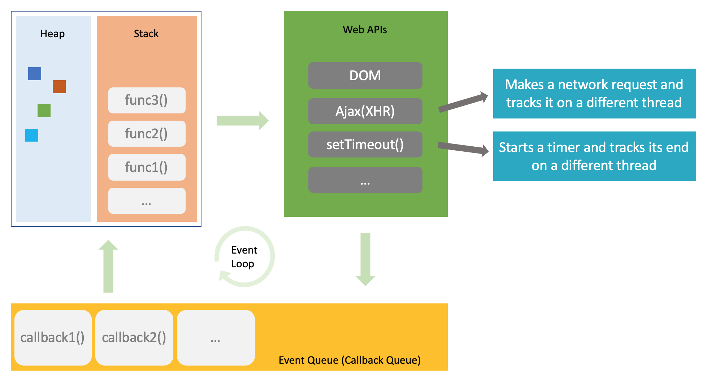
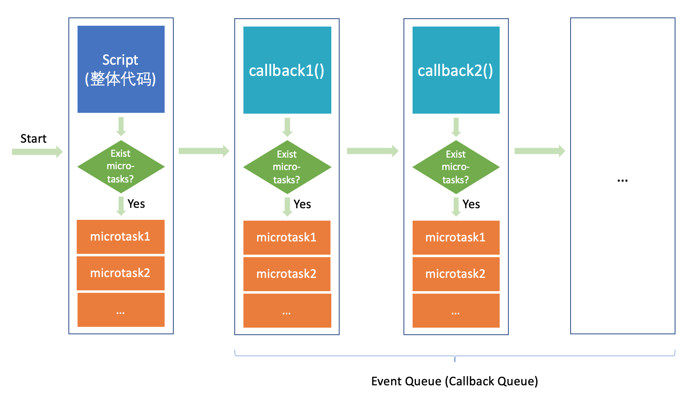
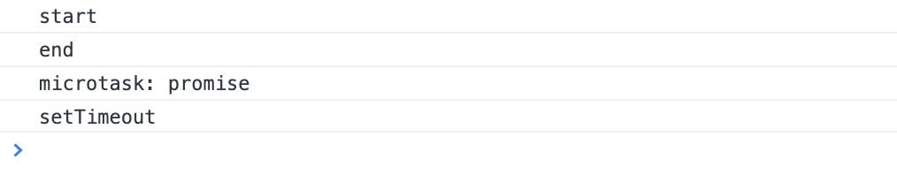
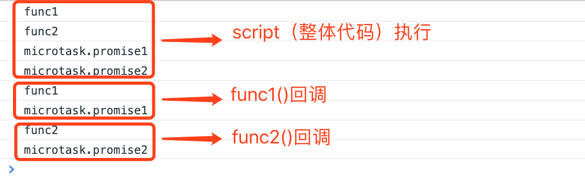

### 1.事件循环机制



浏览器执行JS代码大致可以分为三个步骤，而这三个步骤的往复构成了JS的事件循环机制（如图）。

>**第一步：主线程（JS引擎线程）中执行JS整体代码或回调函数（也就是宏任务），执行过程中会将对象存储到堆（heap）中，将函数的参数和局部变量加入到栈（stack）中，执行完毕后会释放堆或退出栈。执行完这个宏任务后，会判断微任务队列（microtask queue）是否为空，如果不为空，则会将所有的微任务依次取出并执行。如果在这个过程中触发了任何 Web APIs 将进行第二步操作。**<br>
**第二步：调用 Web API，并在合适的时候将回调函数加入到事件回调队列（event queue）中。比如执行了** <font style="color:rgb(192, 52, 29);">setTimeout(callback1, 1000)</font> **，会创建一个计时器，并且在另一个线程（浏览器定时触发线程）里面监听计时器是否过期，等到计时器过期后，会将对应回调** <font style="color:rgb(192, 52, 29);">callback1</font> **加入事件回调队列中。**<br>
**第三步：等到第一步中的微任务执行完毕之后，会判断事件回调队列（event queue）是否为空。如果不为空，则会取出并执行最先进入队列的回调函数，执行过程如同第一步。如果为空，则会视情况进行等待或挂起主线程。**<br>
**补充说明：浏览器的内核是多线程的，常驻线程有浏览器 GUI 渲染线程、JavaScript 引擎线程、浏览器定时触发器线程、浏览器事件触发线程、浏览器 http 异步请求线程。**

### 2.宏任务与微任务

**宏任务（macrotask）：script（整体代码）、setTimeout/setInterval、I/O、UI rendering等**
**微任务（microtask）：Promise、MutationObserver等**

JS代码执行过程——宏任务与微任务的执行示意图：



如图，可以看出JS执行过程中，是先执行一个宏任务，再执行这个宏任务产生的对应微任务，执行完毕后，再执行后面的宏任务，以此往复。

### 3.实例分析

**使用浏览器：Chrome Version 80.0.3987.163**

**第一组：**

**比较 setTimeout 与 Promise**

```javascript
console.log('start')

setTimeout(() => {
  console.log('setTimeout')
}, 0);

Promise.resolve().then(() => {
  console.log('microtask: promise')
})

console.log('end')
```

**结果：**



**分析：**

**以JS的事件循环机制来分析。首先，script（整体代码）算是一个宏任务，执行完毕，会先后输出"start"和"end"，然后执行这个过程中产生的微任务，即promis.then中的回调，输出"microtask: promise"；这个过程中也调用了 Web API 中的 setTimeout，会创建一个计时器，过期后将回调添加到事件回调队列中；然后再执行回调（第二个宏任务），输出"setTimeout"。与浏览器运行输出一致，符合预期。**

**第二组：**

**宏任务与微任务的执行顺序对比**

```javascript
function func1() {
  console.log('func1')
  Promise.resolve().then(() => {
    console.log('microtask.promise1')
  })
}

function func2() {
  console.log('func2')
  Promise.resolve().then(() => {
    console.log('microtask.promise2')
  })
}

function main() {
  func1()
  func2()
  setTimeout(func1, 0);
  setTimeout(func2, 0);
}

main()
```

**结果：**



**分析：**

**从输出结果可以看出，当一个宏任务执行完毕后，会接着执行相应的所有微任务，执行完毕后，再执行后续的宏任务，并以往复，与预期相符。**
