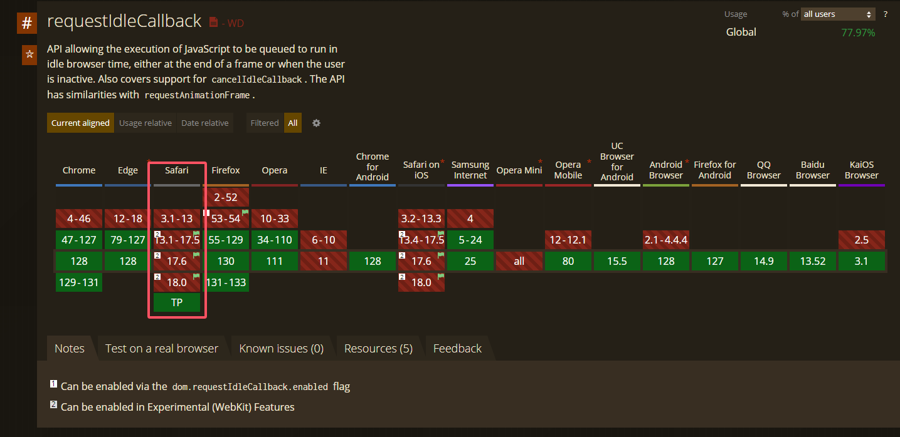
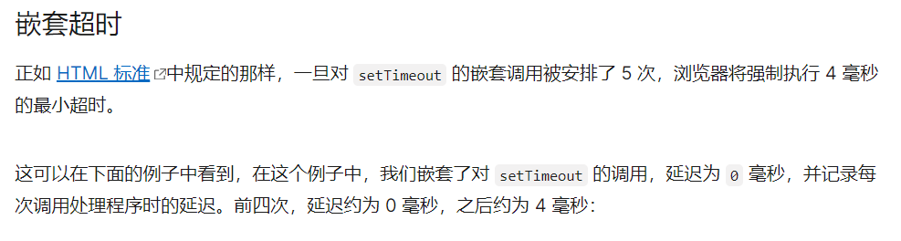

## requestidlecallback
它提供了一种机制，允许开发者在浏览器空闲时运行低优先级的任务，而不会影响关键任务和动画的性能。

### requestidlecallback 执行阶段

>浏览器一帧里面做的任务
>1. 处理事件的回调： 用户的点击 input 
>2. 处理计时器的回调，event loop 
>3. 开始渲染 begin帧
>4. 执行requestAnimationFrame 动画回调
>5. 计算机页面布局计算 合并到主线程
>6. 绘制 回流和重绘
>7. 如果此时还有空闲时间，执行requestIdleCallback （这个是有条件的！）

### requestidlecallback 基本用法
requestidlecallback 接受一个回调函数 `callback` 并且在回调函数中会注入参数 `deadline`

deadline有两个值:

+ `deadline.timeRemaining()` 返回是否还有空闲时间(毫秒)
+ `deadline.didTimeout` 返回是否因为超时被强制执行(布尔值)

options:

+ `{ timeout: 1000 }` 指定回调的最大等待时间（以毫秒为单位）。如果在指定的 timeout 时间内没有空闲时间，回调会强制执行，避免任务无限期推迟

这个案例模拟了在浏览器空闲时，渲染`1000`条dom元素，非常流畅

```tsx
const nums = 30000; // 定义需要生成的函数数量，即30000个任务
const arr = [];    // 存储任务函数的数组

// 生成1000个函数并将其添加到数组中
function generateDom() {
  for (let i = 0; i < nums; i++) {
    // 每个函数的作用是将一个 <div> 元素插入到页面的 body 中
    arr.push(function() {
      document.body.innerHTML += `<div>${i + 1}</div>`; // 将当前索引 + 1 作为内容
    });
  }
}
generateDom(); // 调用函数生成任务数组

// 用于调度和执行任务的函数
function workLoop(deadline) {
  // 检查当前空闲时间是否大于1毫秒，并且任务数组中还有任务未执行
  if (deadline.timeRemaining() > 1 && arr.length > 0) {
    const fn = arr.shift(); // 从任务数组中取出第一个函数
    fn(); // 执行该函数，即插入对应的 <div> 元素到页面中
  }
  // 再次使用 requestIdleCallback 调度下一个空闲时间执行任务
  requestIdleCallback(workLoop);
}

// 开始调度任务，在浏览器空闲时执行 workLoop
requestIdleCallback(workLoop,{ timeout: 1000});
```

 

## 常考的面试题
### 1. 为什么React不用原生requestIdleCallback实现？

>1. `兼容性差` `Safari` 并不支持 [https://caniuse.com](https://caniuse.com/?search=requestIdleCallback)
>2. `控制精细度` React 要根据组件优先级、更新的紧急程度等信息，更精确地安排渲染的工作
>3. `执行时机`requestIdleCallback(callback) 回调函数的执行间隔是 50ms（W3C规定），也就是 20FPS，1秒内执行20次，间隔较长。
>4. `差异性` 每个浏览器实现该API的方式不同，导致执行时机有差异有的快有的慢



### 2. requestIdleCallback的替代方案?
`MessageChannel`

选择 `MessageChannel` 的原因，是首先异步得是个宏任务，因为宏任务中会在下次事件循环中执行，不会阻塞当前页面的更新。`MessageChannel` 是一个宏任务。

没选常见的 `setTimeout`，是因为`MessageChannel` 能较快执行，在 0～1ms 内触发，像 setTimeout 即便设置 timeout 为 0 还是需要 4～5ms。相同时间下，MessageChannel 能够完成更多的任务。



MDN [https://developer.mozilla.org/zh-CN/docs/Web/API/setTimeout](https://developer.mozilla.org/zh-CN/docs/Web/API/setTimeout)

若浏览器不支持 `MessageChannel`，还是得降级为 setTimeout。

### 3. MessageChannel基本用法
>MessageChanne设计初衷是为了方便 我们在不同的上下文之间进行通讯，例如`web Worker`,`iframe` 它提供了两个端口（port1 和 port2），通过这些端口，消息可以在两个独立的线程之间双向传递

```tsx
// 创建 MessageChannel
const channel = new MessageChannel();
const port1 = channel.port1;
const port2 = channel.port2;

// 设置 port1 的消息处理函数
port1.onmessage = (event) => {
  console.log('Received by port1:', event.data);
  port1.postMessage('Reply from port1'); // 向 port2 发送回复消息
};

// 设置 port2 的消息处理函数
port2.onmessage = (event) => {
  console.log('Received by port2:', event.data);
};

// 通过 port2 发送消息给 port1
port2.postMessage('Message from port2');
```

### 4. 实现react简易版调度器
>React调度器给每一个任务分配了优先级
>1. ImmediatePriority : 立即执行的优先级，级别最高
>2. UserBlockingPriority : 用户阻塞级别的优先级
>3. NormalPriority : 正常的优先级
>4. LowPriority : 低优先级
>5. IdlePriority : 最低阶的优先级

`同时还给每个任务设置了过期时间，过期时间越短，优先级越高`

`taskQueue 为数组，存储每个任务的信息，包括优先级，过期时间，回调函数`

`isPerformingWork 为布尔值，表示当前是否在执行任务`

`port 为MessageChannel，用于发送和接收消息`

然后将任务添加到队列里面，并且添加进去的时候还需要根据优先级进行排序，然后调用workLoop 执行任务


对应的react源码地址：

在 <font style="color:rgb(38, 198, 218);">React</font> 源码中有目录 <font style="color:rgb(38, 198, 218);">packages/scheduler</font>，该目录就是 <font style="color:rgb(38, 198, 218);">React</font> 任务调度模块相关。  
该目录 <font style="color:rgb(38, 198, 218);">src</font> 下  
[Scheduler.js](https://github.com/facebook/react/blob/17.0.2/packages/scheduler/src/Scheduler.js) 实现了任务调度相关逻辑  
[SchedulerMinHeap.js](https://github.com/facebook/react/blob/17.0.2/packages/scheduler/src/SchedulerMinHeap.js) 实现了堆

> `React` 会有一系列规则定义每个任务的优先级，最后的表现就是 `React` 会将每个任务包装为一个任务对象 [newTask 319行](https://github.com/facebook/react/blob/17.0.2/packages/scheduler/src/Scheduler.js),该对象会存在两个属性 `id` 和 `sortIndex`，  
其中 `sortIndex` 标识当前任务的优先级， `id` 标识每个任务的先后顺序。
>
> `React` 中存放任务的数组 `taskQueue` 会被模拟为一个小顶堆，  
该小顶堆的 `compare` 逻辑是优先比较 `sortIndex`（即任务的优先级），  
如果 `sortIndex` 相同，则比较 `id`（即任务创建的先后顺序）。
>
> 因为堆的性质是维护一个最值在堆顶，所以每次堆顶任务（对应任务数组中的第一个元素）就是当前任务队列中优先级最高的任务，这样只需要每次获取堆顶任务执行即可。
>
> 堆顶任务取出之后，只需要对小顶堆进行弹堆操作后自上向下的平衡调整，则堆顶又维护了当前任务队列中优先级最高的任务。
>
> 这样通过堆维护任务队列，每次获取优先级最高的任务的时间复杂度是 `O(1)` 的，插入和弹出操作后的平衡调整时间复杂度是 `O(logn)`的，整体是非常高效的。
>


视频对应的源码

```tsx
const ImmediatePriority = 1; // 立即执行的优先级, 级别最高 [点击事件，输入框，]
const UserBlockingPriority = 2; // 用户阻塞级别的优先级, [滚动，拖拽这些]
const NormalPriority = 3; // 正常的优先级 [redner 列表 动画 网络请求]
const LowPriority = 4; // 低优先级  [分析统计]
const IdlePriority = 5;// 最低阶的优先级, 可以被闲置的那种 [console.log]

// 获取当前时间
function getCurrentTime() {
  return performance.now();
}

class SimpleScheduler {
  constructor() {
    this.taskQueue = []; // 任务队列
    this.isPerformingWork = false; // 当前是否在执行任务

    // 使用 MessageChannel 处理任务调度
    const channel = new MessageChannel();
    this.port = channel.port2;
    channel.port1.onmessage = this.performWorkUntilDeadline.bind(this);
  }

  // 调度任务
  scheduleCallback(priorityLevel, callback) {
    const curTime = getCurrentTime();
    let timeout;
    // 根据优先级设置超时时间
    switch (priorityLevel) {
      case ImmediatePriority:
        timeout = -1;
        break;
      case UserBlockingPriority:
        timeout = 250;
        break;
      case LowPriority:
        timeout = 10000;
        break;
      case IdlePriority:
        timeout = 1073741823;
        break;
      case NormalPriority:
      default:
        timeout = 5000;
        break;
    }

    const task = {
      callback,
      priorityLevel,
      expirationTime: curTime + timeout // 直接根据当前时间加上超时时间
    };

    this.push(this.taskQueue, task); // 将任务加入队列
    this.schedulePerformWorkUntilDeadline();
  }

  // 通过 MessageChannel 调度执行任务
  schedulePerformWorkUntilDeadline() {
    if (!this.isPerformingWork) {
      this.isPerformingWork = true;
      this.port.postMessage(null); // 触发 MessageChannel 调度
    }
  }

  // 执行任务
  performWorkUntilDeadline() {
    this.isPerformingWork = true;
    this.workLoop();
    this.isPerformingWork = false;
  }

  // 任务循环
  workLoop() {
    let curTask = this.peek(this.taskQueue);
    while (curTask) {
      const callback = curTask.callback;
      if (typeof callback === 'function') {
        callback(); // 执行任务
      }
      this.pop(this.taskQueue); // 移除已完成任务
      curTask = this.peek(this.taskQueue); // 获取下一个任务
    }
  }

  // 获取队列中的任务
  peek(queue) {
    return queue[0] || null;
  }

  // 向队列中添加任务
  push(queue, task) {
    queue.push(task);
    queue.sort((a, b) => a.expirationTime - b.expirationTime); // 根据优先级排序，优先级高的在前 从小到大
  }

  // 从队列中移除任务
  pop(queue) {
    return queue.shift();
  }
}

// 测试
const scheduler = new SimpleScheduler();

scheduler.scheduleCallback(LowPriority, () => {
  console.log('Task 1: Low Priority');
});

scheduler.scheduleCallback(ImmediatePriority, () => {
  console.log('Task 2: Immediate Priority');
});

scheduler.scheduleCallback(IdlePriority, () => {
  console.log('Task 3: Idle Priority');
});

scheduler.scheduleCallback(UserBlockingPriority, () => {
    console.log('Task 4: User Blocking Priority');
});

scheduler.scheduleCallback(NormalPriority, () => {
    console.log('Task 5: Normal Priority');
});
```

执行顺序为 `2 4 5 1 3`
