>目前在前端领域最流行的包管理工具包含了 npm、yarn、pnpm，其中 pnpm 的机制对 yarn 和 npm 堪称降维打击，它通过软硬链接依赖的方式实现了快速安装、去除幽灵依赖，当下各种类库、组件库的最佳实践方案也基本都是 pnpm + monorepo。由于我所在的团队也使用了 pnpm 作为包管理工具，因此想通过一篇分享将 pnpm 从头至尾了解清楚。

先来说说通过这篇文章能学到什么：

1. 包管理工具的发展历程与 pnpm 的脱颖而出
2. pnpm 的优势及核心实现原理——软硬链接
3. 产生幽灵依赖的根本原因探究
4. pnpm 项目的依赖治理方案

## 一、包管理工具的历史
### 1. npm 的诞生
随着 Node.js 的推出，开发者需要一种管理众多 JavaScript 库和模块的方法，npm（Node Package Manager）由此诞生。

npm 于2010年被引入，很快成为 Node.js 生态系统中分享和管理模块的标准方式。其中 node_modules 目录就是npm用来局部安装依赖的地方，使得不同的项目可以使用不同版本的包，而不会互相干扰。随着时间的推移，npm 还成为了一个庞大的开源库生态系统，目前已是世界上最大的软件注册机构。

然而，随着 npm 的快速成长，一些问题也随之而来，比如 node_modules 随着依赖的嵌套，体积越来越大。

### 2. npm 的嵌套依赖模型
在 npm2 及以前，每个包会将其依赖安装在自己的 node_modules 目录下，这意味着每个依赖也会带上自己的依赖，形成一个嵌套的结构，结构如下：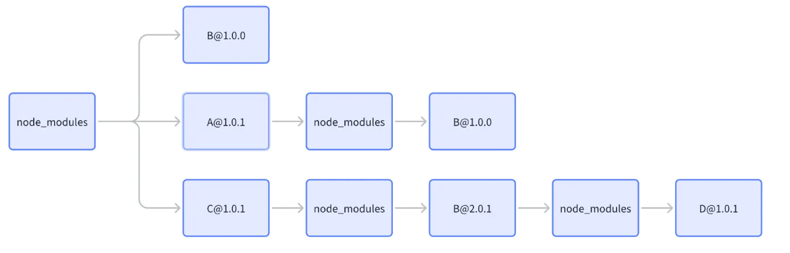

这样的结构虽然解决了版本冲突、依赖隔离等问题，但却有几个致命的缺点：

+ **磁盘空间占用**：每个依赖都会安装自己的依赖，导致了大量的重复，特别是在多个包共享同一依赖的场景下。
+ **深层嵌套问题**：这种嵌套结构在文件系统中造成了非常长的路径，然而大多数 Windows 工具、实用程序和 shell 最多只能处理长达 260 个字符的文件和文件夹路径。一旦超过，安装脚本就会开始出错，而且无法再使用常规方法删除 node_modules 文件夹。相关 issue：[github.com/nodejs/node…](https://github.com/nodejs/node-v0.x-archive/issues/6960)
+ **安装和更新缓慢**：每次安装或更新依赖时，npm 需要处理和解析整个依赖树，过程非常缓慢。

在此附上一张梗图🫰：

### 3. npm3 架构升级
为解决这些问题，npm 在第三个版本进行了重构：[github.com/npm/npm/rel…](https://github.com/npm/npm/releases/tag/v3.0.0)

通过将依赖扁平化，尽可能地减少了重复的包版本，有效减少了**项目的总体积**，同时也避免了 npm 早期的**深层嵌套**问题。

扁平化结构如下：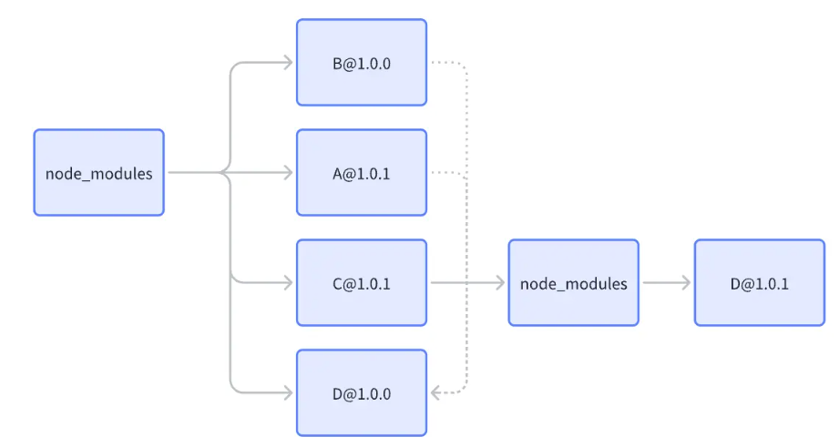

可以看到还是会有一定可能产生嵌套问题，因为根目录只能存放某个包的一个版本。

### 4. yarn 的出现
yarn 的出现是为了解决 npm 当时存在的一些问题，它由 Facebook、Google、Exponent 和 Tilde 共同开发，于2016年发布，旨在提供一个更快、更安全的 JavaScript 包管理工具。

yarn 的特点：

+ **性能提升**：yarn 在发布之初就强调了性能优势，特别是在安装依赖时。它通过并行安装依赖和缓存已下载的包来加速这一过程，减少了安装时间。
+ **更好的依赖管理**：yarn 引入了 yarn.lock 文件，这个锁文件确保了依赖的一致性。无论是在哪个环境下运行yarn install，都能确保安装相同版本的依赖，解决了因版本不匹配导致的问题。
+ **更好的安全性**：yarn 通过检查安装的每个包的许可证，并提供了一种机制来限制或拒绝具有不安全许可证的包的安装，增强了项目的安全性。

有趣的是，在 yarn 发布后，npm 官方博客于当天恭喜了 yarn 的开源：[Hello, Yarn!](https://blog.npmjs.org/post/151660845210/hello-yarn)。
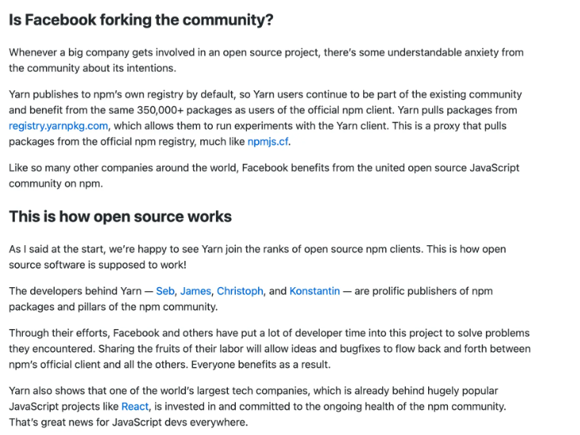

可以看到当大公司参与开源项目时，社区可能会对其意图表示焦虑，但是 yarn 选择了默认发布到 npm 的注册表，意味着 yarn 用户仍然是现有 npm 社区的一部分。这或许就是开源的魅力所在吧！🫡

### 5. 仍然存在的问题
其实扁平化的结构还是存在一些问题的，那就是幽灵依赖。

我们假设 B 并没有在 package.json 中注册，但由于 A 依赖 B，B会被提取到 node_moduls 顶层，那么在项目中就可以直接引用 B，这就是幽灵依赖，当 A 出现一些变动时（升级、删除），会导致出现几个问题：

+ **环境不一致**：由于该模块未在 package.json 文件中声明，当在其他环境（如测试、生产环境或者其他人的开发环境）中部署应用时将无法知道需要包含那些模块。这将导致环境之间存在不一致，可能会导致在其他环境中运行时出现错误。
+ **版本控制问题**：由于未明确声明依赖，可能会出现不同环境中使用的模块版本不一致的问题。这可能导致某些功能在某些环境中无法正常工作，或者出现不可预见的行为。
+ **代码可读性和可维护性降低**：开发人员无法清楚地了解应用程序的依赖项，导致代码理解困难。

而 pnpm 就是为了解决这个问题而出现的。

## 二、pnpm 横空出世
pnpm（performant npm）旨在解决 npm 和 yarn 在某些方面存在的效率和存储问题，同时通过引入一种独特的链接方式有效地解决了大部分幽灵依赖的问题。
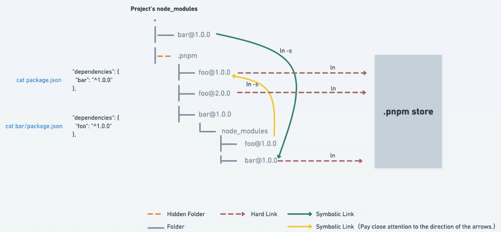

### 1. 硬链接和软链接（符号链接）
在了解 pnpm 具体机制之前，我们先了解一下硬链接和软链接（符号链接）的概念：

+ 硬链接（Hard Link）
    - 概念：硬链接是文件系统中的一个链接，它指向磁盘上的数据。当创建一个硬链接时，实际上是在创建一个和原始文件相同的入口点，但是不占用额外的磁盘空间。这个新的链接和原始文件共享相同的数据块，任何一个文件的修改都会反映在另一个上。
    - 特点：硬链接不能跨文件系统创建，也不能用于链接目录，但如果原始文件被删除，硬链接依然可以访问数据。
    - 使用场景：当你想要在不同位置访问同一个文件内容，而又不想占用额外磁盘空间时，可以使用硬链接。比如，在多个项目中共享相同的库文件，但不需要复制这个文件多份。
+ 软链接（符号链接，Symbolic Link）
    - 概念：软链接是一个特殊类型的文件，它包含了另一个文件的路径。类似于 Windows 系统中的快捷方式。与硬链接不同，软链接可以指向目录，也可以跨文件系统。
    - 特点：软链接指向文件或目录的路径，如果原始文件被删除，软链接就会失效，因为它的指向已经不存在了。
    - 使用场景：软链接适用于需要引用特定位置的文件或目录时，特别是当这些文件或目录可能会移动或变化时。它允许链接到另一个文件系统中的文件或目录。

### 2. pnpm 中的硬软链接应用
#### 硬链接
pnpm 通过使用全局的 .pnpm-store 来存储下载的包，使用硬链接来重用存储在全局存储中的包文件，这样不同项目中相同的包无需重复下载，节约磁盘空间。
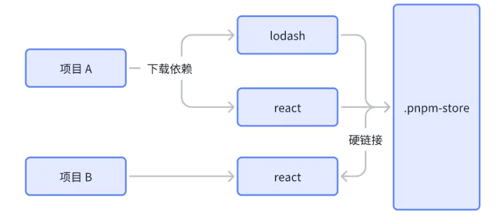

#### 软链接（符号链接）
pnpm 将各类包的不同版本平铺在 node_modules/.pnpm 下，对于那些需要构建的包，它使用符号链接连接到存储在项目中的实际位置。这种方式使得包的安装非常快速，并且节约磁盘空间。

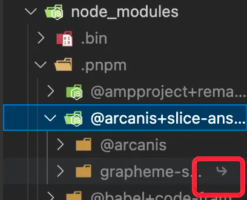
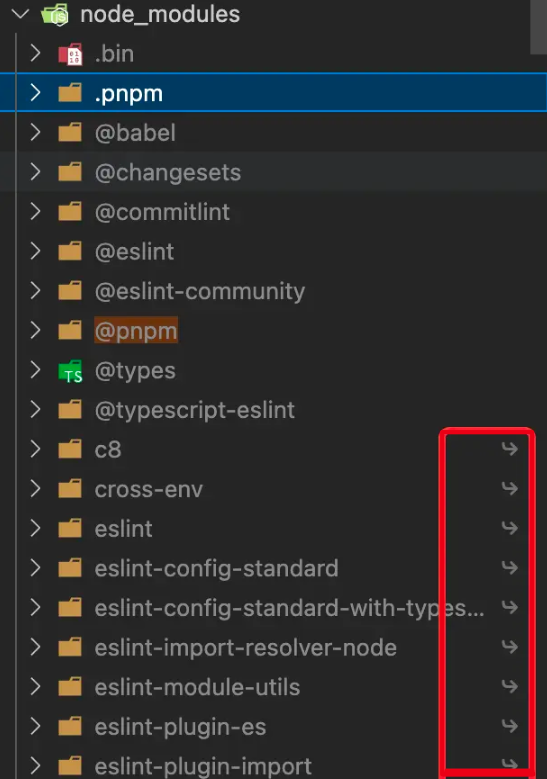

举个例子，项目中依赖了 A，这时候可以通过创建软链接，在 node_modules 根目录下创建 A 软链指向了 node_modules/.pnpm/A/node_modules/A。此时如果 A 依赖 B，pnpm 同样会把 B 放置在 .pnpm 中，A 同样可以通过 软链接依赖到 B，避免了嵌套过深的情况。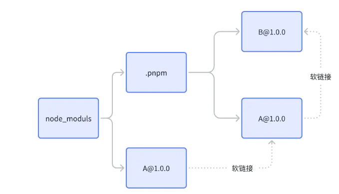

可以来看看依赖软链的体现：

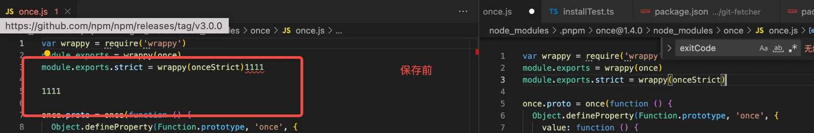
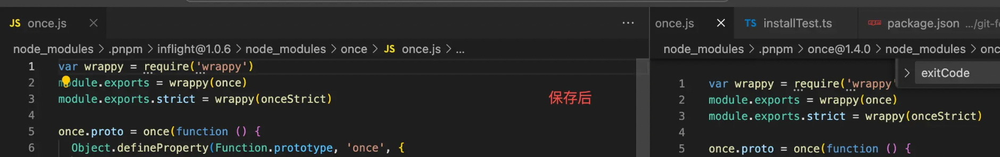

这个时候再回去看看官网提供的图片，应该就清晰很多了。

可以得知，这种巧妙的结构解决了很多问题：

1. 节省磁盘空间：由于使用硬链接，相同的包不需要被重复存储，大大减少了磁盘空间的需求。
2. 提高安装速度：安装包时，pnpm 通过创建链接而非复制文件，这使得安装过程非常快速。
3. 确保依赖隔离：通过软链接有效减少了幽灵依赖产生的可能，同时保证了依赖的隔离。

### 3. 依赖安装优化
与此同时，pnpm 在依赖安装的速度上也有显著的提升，这得益于 pnpm 将依赖的安装从串行改为了并行执行。

#### 传统安装
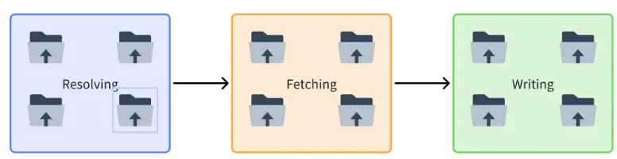
传统方法中，包的安装分为三个主要阶段，线性执行：

1. 解析（Resolving）：解析依赖树，确定需要安装哪些包和版本。
2. 获取（Fetching）：下载包的压缩文件（tar 格式），这个阶段支持并行下载。
3. 写入（Writing）：将包解压，构建依赖树，并放置在 node_modules 目录。

#### pnpm 安装
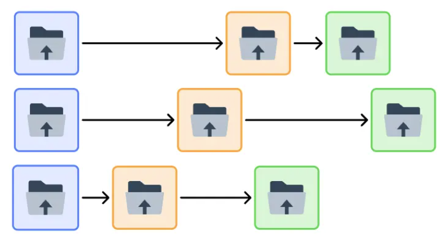

可以看到在 pnpm 中（第二幅图），这些阶段对于每个包是同时进行的。一旦一个包被解析，它就开始下载，下载完毕后就立即开始写入。这样的并行处理显著提高了效率。

此外，pnpm增加了一个额外的步骤：

+ 链接（Linking）：由于 pnpm 使用硬链接和符号链接来引用存储在全局 .pnpm-store 中的包，所以在写入阶段完成后，它还需要创建这些链接，以形成项目的 node_modules 目录结构。

这个链接过程很快，因为它避免了复制文件的开销。与传统方式相比，pnpm 通过这种方式有效地减少了文件的重复写入，并使得多个项目能够共享同一份物理拷贝的包，这在多个项目以及 Monorepo 环境下特别有利。

## 三、幽灵依赖产生的根本原因
然而就算使用 pnpm，幽灵依赖还是难以根除，我们不妨分析一下幽灵依赖产生的根本原因。

### 1. 包管理工具的依赖解析机制
这就是前面介绍的平铺式带来的问题，这边就不重复讲述了。

### 2.第三方库历史问题
由于历史原因或开发者的疏忽，有些项目可能没有正确地声明所有直接使用的依赖。对于三方依赖，幽灵依赖已经被当做了默认的一种功能来使用，提 issue 修复的话，周期很长，对此 pnpm 也没有任何办法，只能做出妥协。

下面是 pnpm 的处理方式：

+ **对直接依赖严格管理**：对于项目的直接依赖，pnpm 保持严格的依赖隔离，确保项目只能访问到它在package.json 中声明的依赖。
+ **对间接依赖妥协处理**：考虑到一些第三方库可能依赖于未直接声明的包（幽灵依赖），pnpm 默认启用了 hoist 配置。这个配置会将一些间接依赖提升（hoist）到一个特殊的目录 node_modules/.pnpm/node_modules中。这样做的目的是在保持依赖隔离的同时，允许某些特殊情况下的间接依赖被访问。
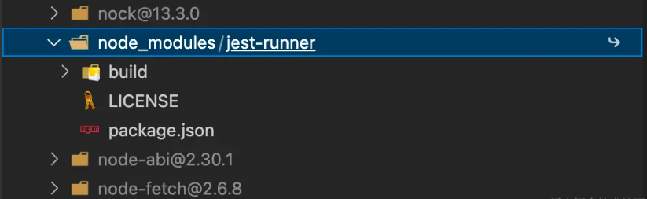

### 3. JavaScript 模块解析策略
Node.js 的模块解析策略允许从当前文件夹的 node_modules 开始，向上遍历文件系统，直到找到所需模块。

这种解析策略，虽然提供了灵活性，也使得幽灵依赖更容易产生，因为它允许模块加载那些未直接声明在项目package.json 中的依赖。

综合来看，幽灵依赖在目前是无法根除的，只能通过一些额外的处理进行管控，比如 eslint 对幽灵依赖的检查规则、pnpm 的 hoist 配置等。

## 四、pnpm 项目的依赖治理方案
对于依赖治理，大概涉及到以下几个部分：

+ 冗余依赖治理：某些包可能用不到，但还保留着，导致 package.json 愈发混乱。
+ 重叠依赖治理：monorepo 中 case 较多，比如根目录与子项目声明了相同的包，加大了 package.json 的管理成本，还有可能出现同一包多版本的问题。
+ 锁文件保护：要保证 package.json 与锁文件（pnpm-lock）的统一，防止其他开发者拉下代码后，因不统一造成一些功能差异。

### 1. 冗余依赖治理
对于冗余的情况，可以按照如下顺序检查：

1. 执行 pnpm why <package-name>，用来找出项目中一个特定的包被谁所依赖，给出包的依赖来源。
2. 全局搜索包名，检查是否有被引入。
3. 了解包的作用，判断项目中是否存在包的引用。
4. 删除包，执行 pnpm i 后，分别运行、打包项目，查看是否有明显问题。

按照顺序执行完毕后，仍然可能存在问题，这是没法完全避免的，可以进一步通过测试进行排查。

### 2. 重叠依赖治理
对于 monorepo 而言，依赖的管理就比较复杂了，这边可以通过人肉+脚本的方式进行治理。

为方便识别重叠依赖，我编写了一个脚本，遍历子项目中的 package.json 将与根目录重叠的依赖进行输出：

```javascript
import fs from 'fs';
import path from 'path';
import { fileURLToPath } from 'url';
import chalk from 'chalk'; // 引入 chalk

// 获取当前文件的目录路径，确保脚本可以在不同环境下正确执行
const __dirname = path.dirname(fileURLToPath(import.meta.url));

// 修改后的读取 package.json 文件函数保持不变
function readPackageJson(filePath) {
  try {
    const jsonData = fs.readFileSync(filePath, 'utf8');
    return JSON.parse(jsonData);
  } catch (error) {
    console.error(`读取文件失败: ${filePath}`, error);
    return null;
  }
}

// 修改后的比较依赖函数保持不变
function compareDependencies(rootDeps, childDeps, depType, childName) {
  const overlaps = [];
  for (const [dep, version] of Object.entries(childDeps)) {
    if (rootDeps[dep]) {
      const versionCompare = (rootDeps[dep] === version)
      // 如果子项目中的依赖在根目录中也存在，则记录下来
      overlaps.push(`${dep}: ${chalk.blueBright(version)} (在根目录中为: ${chalk.blueBright(rootDeps[dep])}) ${versionCompare ? chalk.green('✔') : chalk.red('✘')}`);
    }
  }
  return {
    overlaps: overlaps.length > 0 ? `${chalk.greenBright('- 重叠的',depType)}\n` + overlaps.join('\n') + '\n\n' : '',
  };
}

function main() {
  const rootPackageJsonPath = path.join(__dirname, 'package.json');
  const rootPackageJson = readPackageJson(rootPackageJsonPath);
  if (!rootPackageJson) {
    console.error('无法读取根目录的 package.json 文件');
    return;
  }

  // 修改输出为终端输出，使用 chalk 增加颜色
  console.log(chalk.bold('📖 依赖分析报告\n'));

  const packagesDir = path.join(__dirname, 'packages');
  const childDirs = fs.readdirSync(packagesDir).filter(child => fs.statSync(path.join(packagesDir, child)).isDirectory());

  for (const child of childDirs) {
    const childPackageJsonPath = path.join(packagesDir, child, 'package.json');
    const childPackageJson = readPackageJson(childPackageJsonPath);
    if (childPackageJson) {
      console.log(chalk.bold(`🟢 子项目 ${child}`));
      ['dependencies', 'devDependencies', 'peerDependencies'].forEach(depType => {
        const { overlaps } = compareDependencies(
          rootPackageJson[depType] || {},
          childPackageJson[depType] || {},
          depType,
          child
        );
        console.log(overlaps);
      });
    }
  }
}

main();
```

执行效果如下：

```javascript
📖 依赖分析报告

🟢 子项目 A
  - 重叠的 dependencies
@babel/runtime-corejs3: ^7.14.0 (在根目录中为: ^7.14.0) ✔
……

  - 重叠的 devDependencies
@commitlint/cli: ^13.1.0 (在根目录中为: ^13.1.0) ✔
@commitlint/config-conventional: ^13.1.0 (在根目录中为: ^13.1.0) ✔
……

🟢 子项目 B

  - 重叠的 devDependencies
typescript: ^4.4.0 (在根目录中为: ^4.3.5) ✘
zx: ^4.2.0 (在根目录中为: ^4.2.0) ✔
chalk: ^4.1.0 (在根目录中为: ^4.1.0) ✔
```

通过这种方式我们就可以有目的性的去逐个检查依赖，依据一种合理的 monorepo 依赖管理模式进行处理，下面是一种合适的处理规则：

+ 将共享的**开发时**依赖移至根目录的 package.json，如 jest、eslint、lint-stage。
+ 对于需要特定版本以保证兼容性的依赖，考虑使用 resolutions 字段强制解析为特定版本。
+ 为需要发包的工具、类库提供 peerDependencies 字段。
+ 对于运行时依赖，如果所有子项目都有依赖，将删除子项目中的声明，提升至根目录，同时在需要发包的工具、类库的 peerDependencies 中声明相关的依赖。
+ 发包时，通过调用脚本将目标子项目中的 peerDependencies 内容转移至 dependicies 中。

### 3. 锁文件保护
核心目的：保证任何开发者在拉取代码后，执行 pnpm i 不会导致 pnpm-lock 发生更新。

#### 初步方案
1. 限制 pnpm、node 版本
2. 本地在 lint-stage 中新增脚本检查是否存在意外更新
3. CI 流水线上检查是否存在意外更新

#### 具体实现
核心思路：检测 pacakge.json 和 pnpm-lock 的依赖是否对等。

我们可以先观察一下 pnpm i 的 options：

```shell
Version 7.26.3
Usage: pnpm install [options]

Options:
      --[no-]color                      Controls colors in the output. By default, output is always colored when
                                        it goes directly to a terminal
      --[no-]frozen-lockfile            Don't generate a lockfile and fail if an update is needed. This setting
                                        is on by default in CI environments, so use --no-frozen-lockfile if you
                                        need to disable it for some reason
      --[no-]verify-store-integrity     If false, doesn't check whether packages in the store were mutated
      --aggregate-output                Aggregate output from child processes that are run in parallel, and only
                                        print output when child process is finished. It makes reading large logs
                                        after running `pnpm recursive` with `--parallel` or with
                                        `--workspace-concurrency` much easier (especially on CI). Only
                                        `--reporter=append-only` is supported.
      --child-concurrency <number>      Controls the number of child processes run parallelly to build node
                                        modules
  -D, --dev                             Only `devDependencies` are installed regardless of the `NODE_ENV`
  -C, --dir <dir>                       Change to directory <dir> (default:
                                        /Users/bytedance/Desktop/项目/byteview-mm-we
      --fix-lockfile                    Fix broken lockfile entries automatically
      ……
      --lockfile-dir <dir>              The directory in which the pnpm-lock.yaml of the package will be created.
                                        Several projects may share a single lockfile.
      --lockfile-only                   Dependencies are not downloaded. Only `pnpm-lock.yaml` is updated
      ……
Visit https://pnpm.io/7.x/cli/install for documentation about this command.
```

从中可以提取出一些可能有用的 option:

+ [-- frozen-lockfile](https://link.juejin.cn?target=https%3A%2F%2Fpnpm.io%2Fzh%2Fcli%2Finstall%23--frozen-lockfile)：检查 package.json 和 pnpm-lock.yaml 文件是否一致（即如果**依赖项更新是必要的**），命令会直接失败。
+ [--fix-lockfile](https://link.juejin.cn?target=https%3A%2F%2Fpnpm.io%2Fzh%2Fcli%2Finstall%23--fix-lockfile)：检查当前项目的依赖关系，并更新 pnpm-lock.yaml 以确保其中记录的包版本与 package.json 中的声明一致。
+ --lockfile-dir ：网上找不到相关的文档，根据说明可以判断是控制 pnpm-lock.yaml 的生成路径。
+ [--lockfile-only](https://link.juejin.cn?target=https%3A%2F%2Fpnpm.io%2Fzh%2Fcli%2Finstall%23--lockfile-only)：只更新 pnpm-lock.yaml 和 package.json。 不写入 node_modules 目录。

首先我们可以排除 --lockfile-dir <dir>，由于我们只需要检查问题而不用修复问题，剩余的 option 中 -- frozen-lockfile 是最符合预期的，在 github 上也有[相关需求的讨论](https://link.juejin.cn?target=https%3A%2F%2Fgithub.com%2Forgs%2Fpnpm%2Fdiscussions%2F3202)，基于这个 option，我实现了一个基础脚本：

```javascript
import { execSync } from 'child_process';
import { chalk } from 'zx';

try {
  // 尝试使用 --frozen-lockfile 选项来更新依赖
  execSync('pnpm install --frozen-lockfile', { stdio: 'inherit' });
  console.log(
    chalk.green('✅ The pnpm-lock.yaml is up-to-date. No updates are needed.')
  );
} catch (error) {
  // 如果命令失败，则可能是因为需要更新 lockfile
  console.error(
    chalk.red(
      '🚨 Detected that pnpm-lock.yaml needs an update. Please run pnpm install and commit the updated lockfile.'
    )
  );
  process.exit(1);
}
```

基于这个脚本，我们还可以加入一些额外的判断工作，如：pnpm、node 版本不一致判断。
