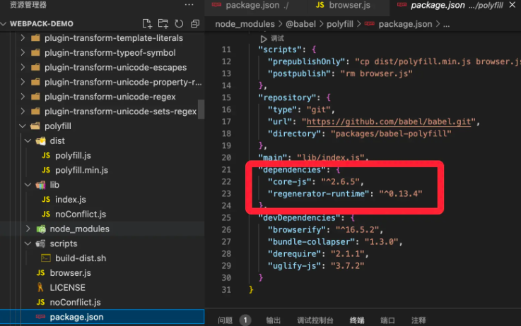
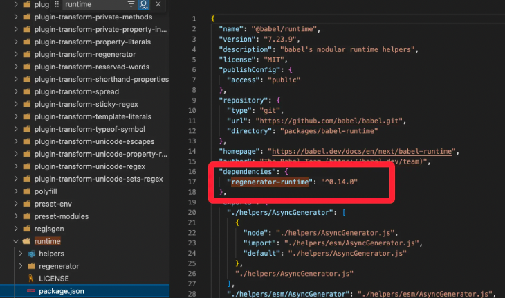

在前端工程化领域，**包体积优化**一直是一个备受关注的话题。随着项目规模扩大和功能迭代，打包后的文件体积逐渐膨胀。而对于网页加载速度和性能优化来说，减小打包体积是至关重要的一环。

为此，在这篇文章中，我们将探讨如何利用 babel-runtime 这一工具来帮助我们将重复的定义通过模块导入的方式引入，缩减打包体积以提升项目性能。

 Babel 是一个被广泛使用的 JS 编译器，用于将新语法转换为向后兼容的 JS 代码。一般情况下，我们可以通过安装**预设**和**插件**控制 **Babel** 的代码转译，比如：

**预设（Presets 一组预定义的转换规则的集合）**

1. **@babel/preset-env**：这是 Babel 官方推荐的预设之一，用于根据目标环境自动确定所需的转换和 polyfill。
2. **@babel/preset-react**：用于支持 React 项目中的 JSX 和其他相关特性的预设。·
3. **@babel/preset-typescript**：用于支持 TS 项目中的预设，能够将 TS 代码转换为 JS 代码。

**插件（Plugins 单个转换规则的集合）**

1. **@babel/plugin-proposal-class-properties**：用于支持 JS 类的属性初始化器，包括静态属性和实例属性。
2. **@babel/plugin-transform-arrow-functions**：将箭头函数转换为普通函数表达式，以提供更广泛的兼容性。
3. **@babel/plugin-transform-runtime**：将 Babel 编译时注入的辅助函数转换为引用运行时公共函数的方式，以减小输出文件的体积。

此处我们先对 @babel/preset-env 做重点介绍

## **@babel/preset-env**
@babel/preset-env 的主要功能包括：

+ **自动 polyfill**：根据目标环境自动导入所需的 polyfill，从而实现对新特性的兼容性支持。
+ **智能转换**：基于目标环境的浏览器或 Node 版本来自动转换 ES6+ 语法或 API。
+ **模块转换**：支持将模块转换为不同类型（CommonJS、AMD、UMD 等）的模块系统。
+ **按需加载**：支持根据需要选择和加载特定的转换规则或插件。

使用 @babel/preset-env 的方式也非常简单，只需要在 .babelrc 或 babel.config.js 中配置该预设即可，下面是一个综合案例：

```json
{
  "presets": [
    [
      "@babel/preset-env",
      {
        // 目标环境设置为最近的两个浏览器版本以及 Safari 7 及以上版本
        "targets": {
          "browsers": ["last 2 versions", "safari >= 7"]
        },
        // 将 ES6 模块转换为 CommonJS 模块
        "modules": "commonjs",
        // 启用按需加载 polyfill 的功能
        "useBuiltIns": "usage",
        // 使用 core-js 3 版本的 polyfill
        "corejs": 3,
        // 打印详细的调试信息
        "debug": true
      }
    ]
  ]
}
```

注意：useBuiltIns 控制了 polyfill 的导入方式，用来配合 @babel/polyfill 使用，值得注意的是，官方不再推荐 Babel > 7.4.0 时使用 @babel/polyfill，可以选择使用 core-js。

更多配置规则请参考：[babeljs.io/docs/babel-…](https://babeljs.io/docs/babel-preset-env)

## @babel/polyfill
从 Babel 7.4.0 开始，这个包已经被弃用，取而代之的是直接包含 core-js/stable

在本地 node_module 中，可以看到 @babel/polyfill 的依赖包含了 core-js 和 regenerator-runtime，可以认为 polyfill 本身就是 core-js + regenerator-runtime。




从 Babel 7.4.0 开始，我们需要用 core-js 替代 babel-polyfill,而 regenerator-runtime 会在安装 @babel/runtime 时被依赖安装，因此不用额外安装。

## babel-runtime
[babel-runtime](https://babel.dev/docs/babel-runtime) 是一个由 Babel 提供的运行时库，它包括了一些在编译过程中需要用到的辅助函数和类，例如 ES6/ES7 语法的 polyfill、generator 函数的处理、Promise 的实现等。

### 主要功能
babel-runtime 的实现主要功能有两点：

1. **将转译中需要的 helper 函数从一个模块中引入，避免重复定义、减小打包体积**

下面是一些常见的辅助函数和类的实现：

+ **classCallCheck**：用于实现 ES6 类的构造函数中的类检查。它会检查是否使用 new 关键字来调用类，并在没有正确调用的情况下抛出错误。
+ **defineEnumerableProperties**：用于定义对象的可枚举属性。它接受一个对象和一组属性描述符，并将这些属性添加到对象中，并确保它们是可枚举的。
+ **extends**：用于实现 ES6 类继承的辅助函数。它会创建一个新的子类，并确保正确设置原型链和构造函数。
+ **asyncToGenerator**：用于将 generator 函数转换为基于 Promise 的异步函数的辅助函数。它接受一个 generator 函数并返回一个新的函数，该函数可以像普通的异步函数一样被调用。
+ **regeneratorRuntime**：用于支持 generator 函数的运行时库。它提供了 generator 函数所需的运行时环境，包括状态机、迭代器和 Promise 的支持。
1. **开发类库/工具时，避免生产污染全局空间的方法。**

我们举个例子：

在一个项目中，我们定义了一个 Array 原型链上的方法（比如 Array.includes())，项目依赖 babel-polyfill 实现转译。此时，项目引入一个依赖，调用的方法需要使用 Array.includes()，那么在打包时，由于 polyfill 导入于全局环境，就会出现冲突，导致出错。

解决方案就是用 babel-runtime 处理全局内置对象，将其模块化，并通过模块导入的方式引入。

### 补充
然而 @babel/runtime 没有支持实例方法，只能通过配置 corejs ，使用 babel/runtime-corejs@x

控制相关 polyfill 的引入，然而 core-js2 的 polyfill 覆盖范围相对较小，以下陈列了相关包的区别：

+ **@babel/polyfill**：core-js + regenerator-runtime，Babel 7.4.0后弃用。
+ **@babel/runtime**：Babel 默认的运行时依赖模块，提供相关 helpers 函数和regenerator-runtime，不包含任何 polyfill 功能。
+ **@babel/runtime-corejs2**：基于 @babel/runtime ，提供了 core-js2 支持部分 polyfill。
+ **@babel/runtime-corejs3**：基于 @babel/runtime ，提供了 core-js3 支持更广泛的 polyfill。

## babel-plugin-transform-runtime
需要注意的是，babel-runtime 只是一个工具库，需要和 [babel-plugin-transform-runtime](https://link.juejin.cn?target=https%3A%2F%2Fbabeljs.io%2Fdocs%2Fbabel-plugin-transform-runtime) 配合使用。

babel-plugin-transform-runtime 可以让 Babel 在编译过程中， 引用模块 @babel/runtime提供一些辅助函数和类 ，从而避免在编译后的代码中重复出现相同的代码。

### 配置
首先，安装相关包。

```bash
npm install --save-dev @babel-plugin-transform-runtime
npm install --save @babel-runtime
```

其次在 .babelrc 或 babel.config.js 中配置 @babel/plugin-transform-runtime ****插件，corejs 配置项控制是否引入 core-js 或 core-js 的版本。

```json
{
  "presets": [
    [
      "@babel/preset-env"
    ],
  ],
  "plugins": [
    ["@babel/plugin-transform-runtime", {
      "corejs": false // 可选 false | 2 | 3
    }]
  ]
}
```

接下来我们可以通过**观察不同 corejs 配置和是否引入 babel-runtime 打包**的结果理解一下作用。

## Demo 演示
### 控制引入 babel-runtime
转译代码：

```javascript
class Animal {}
```

接下来我们通过修改是否启用 babel-plugin-transform-runtime 控制 babel-runtime 的引入：

```javascript
// 不引入 babel-runtime
function _classCallCheck(instance, Constructor) { if (!(instance instanceof Constructor)) { throw new TypeError("Cannot call a class as a function"); } }
var Animal = /*#__PURE__*/_createClass(function Animal() {
  _classCallCheck(this, Animal);
});

// 引入 babel-runtime，corejs:false
/* harmony import */ var _babel_runtime_helpers_createClass__WEBPACK_IMPORTED_MODULE_0__ = __webpack_require__(/*! @babel/runtime/helpers/createClass */ "./node_modules/.pnpm/@babel+runtime@7.23.9/node_modules/@babel/runtime/helpers/esm/createClass.js");
/* harmony import */ var _babel_runtime_helpers_classCallCheck__WEBPACK_IMPORTED_MODULE_1__ = __webpack_require__(/*! @babel/runtime/helpers/classCallCheck */ "./node_modules/.pnpm/@babel+runtime@7.23.9/node_modules/@babel/runtime/helpers/esm/classCallCheck.js");

var Animal = /*#__PURE__*/(0,_babel_runtime_helpers_createClass__WEBPACK_IMPORTED_MODULE_0__["default"])(function Animal() {
  (0,_babel_runtime_helpers_classCallCheck__WEBPACK_IMPORTED_MODULE_1__["default"])(this, Animal);
});
```

可以看到 babel-runtime 是通过引入模块实现 class 的，避免了多文件时定义了多个工具函数，有效减少了打包体积。

### 控制 corejs 配置
转译代码：

```javascript
new Promise();
string.trimStart()
```

为体现 corejs 的差异，我们使用两种实例方法 Promise、String.trimStart() 进行对比。

```javascript
// corejs:false
new Promise();
string.trimStart();

// corejs:2
/* harmony import */ var _babel_runtime_corejs2_core_js_promise__WEBPACK_IMPORTED_MODULE_0__ = __webpack_require__(/*! @babel/runtime-corejs2/core-js/promise */ "./node_modules/.pnpm/@babel+runtime-corejs2@7.23.9/node_modules/@babel/runtime-corejs2/core-js/promise.js");
/* harmony import */ var _babel_runtime_corejs2_core_js_promise__WEBPACK_IMPORTED_MODULE_0___default = /*#__PURE__*/__webpack_require__.n(_babel_runtime_corejs2_core_js_promise__WEBPACK_IMPORTED_MODULE_0__);

new (_babel_runtime_corejs2_core_js_promise__WEBPACK_IMPORTED_MODULE_0___default())();
string.trimStart();

// corejs:3
/* harmony import */ var _babel_runtime_corejs3_core_js_stable_promise__WEBPACK_IMPORTED_MODULE_0__ = __webpack_require__(/*! @babel/runtime-corejs3/core-js-stable/promise */ "./node_modules/.pnpm/@babel+runtime-corejs3@7.23.9/node_modules/@babel/runtime-corejs3/core-js-stable/promise.js");
/* harmony import */ var _babel_runtime_corejs3_core_js_stable_promise__WEBPACK_IMPORTED_MODULE_0___default = /*#__PURE__*/__webpack_require__.n(_babel_runtime_corejs3_core_js_stable_promise__WEBPACK_IMPORTED_MODULE_0__);
/* harmony import */ var _babel_runtime_corejs3_core_js_stable_instance_trim_start__WEBPACK_IMPORTED_MODULE_1__ = __webpack_require__(/*! @babel/runtime-corejs3/core-js-stable/instance/trim-start */ "./node_modules/.pnpm/@babel+runtime-corejs3@7.23.9/node_modules/@babel/runtime-corejs3/core-js-stable/instance/trim-start.js");
/* harmony import */ var _babel_runtime_corejs3_core_js_stable_instance_trim_start__WEBPACK_IMPORTED_MODULE_1___default = /*#__PURE__*/__webpack_require__.n(_babel_runtime_corejs3_core_js_stable_instance_trim_start__WEBPACK_IMPORTED_MODULE_1__);

new (_babel_runtime_corejs3_core_js_stable_promise__WEBPACK_IMPORTED_MODULE_0___default())();
_babel_runtime_corejs3_core_js_stable_instance_trim_start__WEBPACK_IMPORTED_MODULE_1___default()(string).call(string);
```

依据结果可以看出，corejs: false 只对ES语法进行了转换。corejs：2 为我们的代码创建了一个沙盒环境，避免了全局空间污染。corejs: 3 在 corejs: 2的基础上加入了新的 polyfill 以处理更多的实例方法。

由此总结，对于 Babel < 7.4.0 时，类库/工具项目应选择 @babel/runtime，其他项目选择 @babel/polyfill，当 Babel >= 7.4.0 时，一律使用 @babel/runtime。
