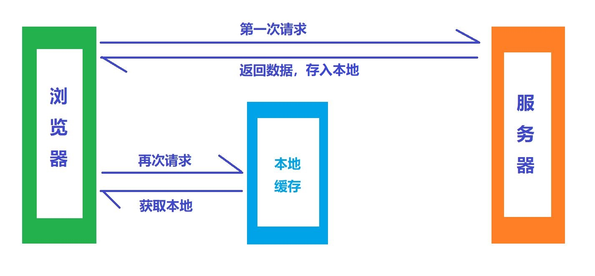
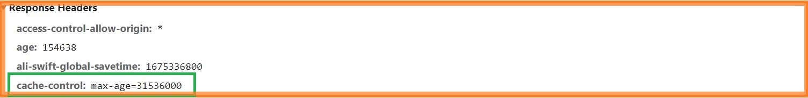
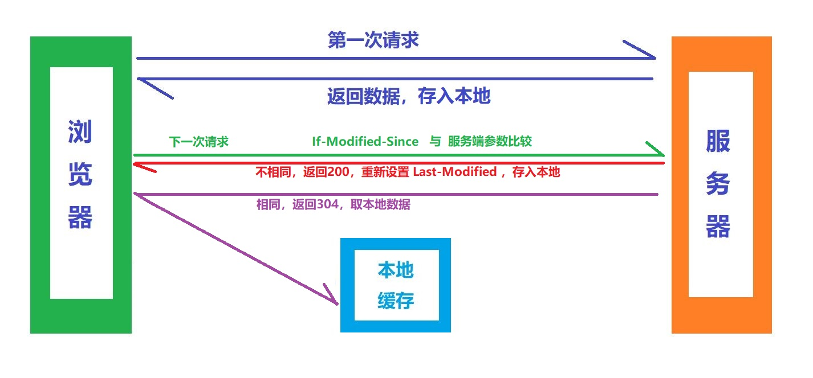
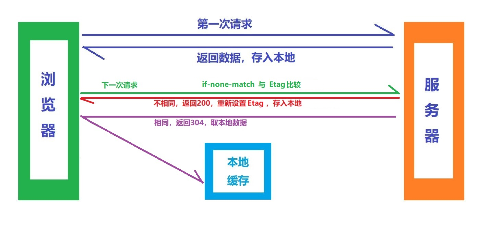

## 一、http缓存

+ `HTTP` 缓存策略分为: `强制缓存` 和 `协商缓存`
+ 为什么需要 `HTTP` 缓存 呢 ? 👇
+ 直接使用缓存速度 `>>` 远比重新请求快
+ 缓存对象有那些呢 ？👇
+ `图片` `JS文件` `CSS文件` 等等

## 二、强缓存

+ 强制缓存 依赖于 `Response Header` 中的`Cache-Control`属性
+ `Cache-Control` 属性值有两种 ：「`no-cache`」 和 「`max-age= xxx`」

>① 属性为「`no-cache`」 时 👉 表示不需要 `强制缓存` , 每次需要重新调接口 ；
---
>② 属性为「`max-age= xxx`」 时 👉 表示需要 `强制缓存` , 缓存时长为 `xxx` 秒，超过时长需要重新请求 ；

## 三、协商缓存
+ 协商缓存，则需要判断再次请求以后，数据是否更新？👇

>「数据发生更新」：返回 状态码 `200`，返回最新数据，`取最新数据`； 
「数据未发生更新」：返回 状态码 `304`，`取缓存数据`；

+ 协商缓存 ，存在 `2` 中形式

### 第Ⅰ种形式 ，涉及参数 👇

+ ① `Last-Modified` ：资源最后更新时间；
+ ② `If-Modified-Since` ： 传递给服务端的参数 ，判断与最新资源更新时间比较 👇

>「相等」 => 返回 `304` ； 「不相等」 => 重新设置 `Last-Modified` ，返回 `200` 获取最新数据；

### 第Ⅱ种形式 ，涉及参数 👇

+ ① `Etag` ：内容唯一标识符
+ ② `if-none-match` ：用来判断与服务端的 `Etag` 是否相同

### 两种形式的区别 👇

+ 判断过程 两种是 相同的，
+ 不同点在于 `Etag` 可以精确到 毫秒 ， 而 `Last-Modified` 只能判断秒级别的
+ **更推荐 第二种形式**