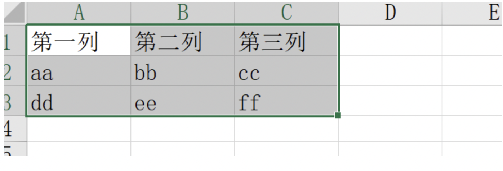

### 一、场景

导出 excel，原本是让后端处理好，前端调接口，然后导出的，就很快。但出于种种原因，现在要完全靠前端处理，想都不用想，前端处理绝对卡爆！但非得前端处理（说我是大佬，肯定有办法 😛）。

也就是，现在的需求是：**前端在无后端协助下，导出 excel 表。**

### 二、传统玩法

#### 1. 通过 blob 文件流导出（需要后端配合）

后端给前端 `blob` 数据，前端转换表格导出

> excel 表格文件都是后端生成的

```javascript
xxxApi(params).then((res) => {
  if (res) {
    const blob = new Blob([res], { type: "application/  ms-excel" });
    const a = document.createElement("a");
    a.download = "表格.xlsx";
    a.href = window.URL.createObjectURL(blob);
    a.click();
    console.log("导出成功");
  } else {
    console.log("导出失败");
  }
});
```

#### 2. 前端生成（不需要后端配合）

① 安装 `xlsx`

```javascript
pnpm install xlsx
```

② 新建 `excelConfig.js` 文件

```javascript
import * as XLSX from "xlsx";
export function exportExcel(filename, data) {
  let exc = XLSX.utils.book_new();
  let exc_data = XLSX.utils.aoa_to_sheet(data);
  XLSX.utils.book_append_sheet(exc, exc_data, filename);
  XLSX.writeFile(exc, filename + "xlsx");
}
```

③ `Vue3` 中使用
```javascript
<template>
  <button @click="download">下载表格</button>
</template>
<script  setup>
  import { exportExcel } from "./excelConfig"
  const exc_data = [
    ['第一列', '第二列' ,'第三列'],
    ['aa', 'bb' ,'cc'],
    ['dd', 'ee' ,'ff']
  ];
  function download() {  exportExcel('vue3导出的表格',this.exc_data)  }
</script>
```
④ `React` 中使用
```jsx
import React from "react";
import {exportExcel } from './excelConfig'
const exc_data = [
  ['第一列', '第二列' ,'第三列'],
  ['aa', 'bb' ,'cc'],
  ['dd', 'ee' ,'ff']
];
function Index() {
  return (
    <div className="box">
      <button onClick={()=>{ exportExcel('react导出表格',exc_data) }}>下载</button>
    </div>
  );
}
export default Index;
```

**效果**


>**<font style="color:#DF2A3F;">数据量小可以，但我们是 10 万条数据，这种方法太卡了</font>**
纯前端加工成表格太卡，又不能后端参与，只能前端，那前端要是能新开个线程就好，恰好前端新方法WebWorker，可以开启子线程

### 三、使用 Web Worker
#### 1. Web Worker介绍
1. <font style="color:rgb(0, 127, 255);">Web Worker 允许在主线程之外再创建一个 worker 线程，</font>**在主线程执行任务的同时，worker 线程也可以在后台执行它自己的任务，互不干扰。**
2. <font style="color:rgb(0, 127, 255);">主线程：调用 new Worker()构造函数，新建一个 worker 线程，构造函数的参数是一个 url，生成这个 url 的方法有两种：1 脚本文件（会有两个限制）；2 字符串形式（需要</font>**new Blob([data])**<font style="color:rgb(0, 127, 255);"> 将数据转成</font>**二进制**<font style="color:rgb(0, 127, 255);">，）。</font>
3. <font style="color:rgb(0, 127, 255);">子线程：</font>**self.onmessage 监听**<font style="color:rgb(0, 127, 255);">主线程传过来的信息，</font>**self.postMessage 发送**<font style="color:rgb(0, 127, 255);">信息给主线程，self.close()worker 线程关闭自身。</font>**worker 线程**<font style="color:rgb(0, 127, 255);">能够访问一个</font>**全局函数 importScripts()**<font style="color:rgb(0, 127, 255);"> 来引入脚本，该函数接受 0 个或者多个 URL 作为参数。</font>
4. <font style="color:rgb(0, 127, 255);">因为 worker 创造了另外一个线程，不在主线程上，浏览器给设定了一些</font>**限制**<font style="color:rgb(0, 127, 255);">（无法使用：window 对象、document 对象、</font>**DOM 对象**<font style="color:rgb(0, 127, 255);">、parent 对象；可以使用：浏览器：navigator 对象、URL：location 对象 只读、发送请求：XMLHttpRequest 对象、定时器：setTimeout/setInterva、应用缓存：Application Cache）</font>
5. <font style="color:rgb(0, 127, 255);">因为主线程与 worker 线程之间的通信是</font>**拷贝关系**<font style="color:rgb(0, 127, 255);">，当需要传递一个</font>**巨大**<font style="color:rgb(0, 127, 255);">的二进制文件给 worker 线程处理时，这时候使用拷贝的方式来传递数据，无疑会造成</font>**性能**<font style="color:rgb(0, 127, 255);">问题。（幸好Web Worker 在线程之间的通信支持以二进制形式数据进行通信。）</font>

#### 2. 在 主线程 还是 子线程 加工成表格好？
##### 2.1 在主线程加工成表格
10万数据8秒多，20万32秒。这还没对数据加工，实际数据是需要处理的。比如修改日期格式、给收益率这种加上百分号、再比如吧某些正负数值转换成盈/亏。数据量大 ，还放在主线程循环，恭喜你，可以收获一个几十秒，啥也干不了的页面。
>主线程加工成表格，等于没做优化

##### 2.2 那在子线程中加工成表格
子线程中加工成表格，会出现新的问题，他们的源码里面用到了 `dom`，而子线程里获取不到 `dom`。

#### 3. 在主线程还是子线程 导出好？
如果在子线程处理数据 ，处理后传递给主线程。那就会出现，
<font style="color:#DF2A3F;">子线程传递主线程的开销（序列化 json 开销大）， 大于你直接放在主线程处理的开销，属于是负优化了</font>

>**Web Worker 提供了一种转移数据的方式，允许主线程把二进制数据直接转移给子线程**<font style="color:rgb(0, 127, 255);">。这种方式比原先拷贝的方式，有巨大的性能提升。只是要</font>**注意**<font style="color:rgb(0, 127, 255);">，</font>一旦数据转移到其他线程，原先线程就无法再使用这些二进制数据了<font style="color:rgb(0, 127, 255);">，这是为了防止出现多个线程同时修改数据的麻烦局面</font>

#### 4. 最终解决方案

>在子线程中，获取源数据、处理要导出的数据，处理完传递给主线程，主线程接收后保存为excel文件。

1. **在子线程（worker）中，获取源数据（worker 接收 init 初始化信号并且利用 XMLHttpRequest 发送请求获取数据）**
2. **子线程处理组装要导出的数据**（[使用exceljs导出excel表格](https://blog.csdn.net/qq_43717065/article/details/119830413?fromshare=blogdetail&sharetype=blogdetail&sharerId=119830413&sharerefer=PC&sharesource=weixin_41387351&sharefrom=from_link)）
3. **子线程把数据传递给主线程（使用二进制数据形式【`原因看上述Web Worker介绍第5点`】，在 `worker` 线程与主线程之间进行传输 经过 excel.js 转换后的数据）**
```javascript
self.postMessage({
  type: 'success',
  data: {
    // 转二进制
    xlsxBlob: new Blob([wbout], {
      type: 'application/octet-stream'
    }),
  }
});
```
1.  **主线程接收 worker 线程数据，保存为excel文件（使用 file-saver 保存文件）**

项目当中使用的为 new Blob([string])来对导出的数据进行二进制形式转换，

恰巧 **file-saver** 也可以使用 **Blob** 二进制数据形式，进行对文件的导出

```jsx
import FileSaver from 'file-saver'

worker.onmessage = (event) => {
  const msgType = event.data.type

  switch (msgType) {
    case 'success':
      FileSaver.saveAs(event.data.data.xlsxBlob, `${fileName}.xlsx`)
      resolve()
      break

      // ...
     
    default: break
  }
}
```
