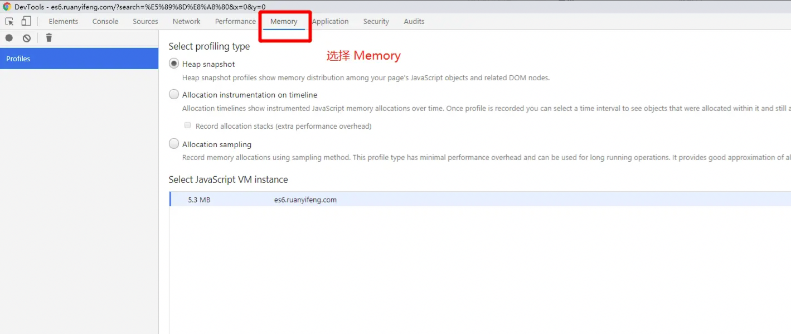
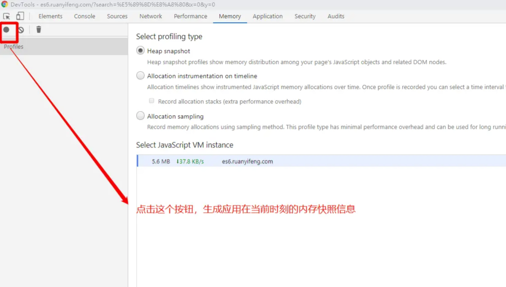
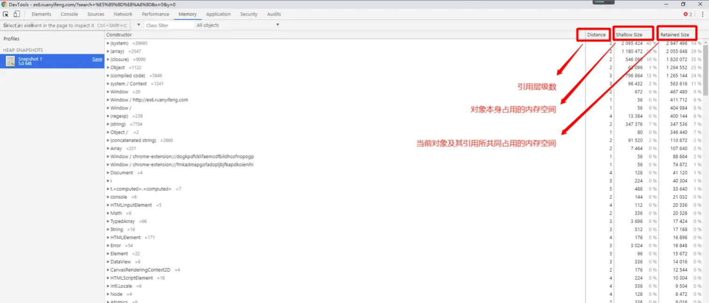
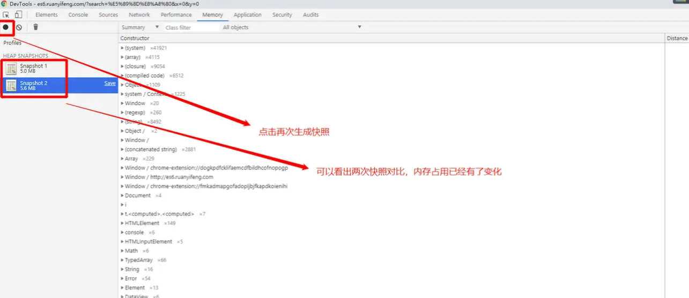
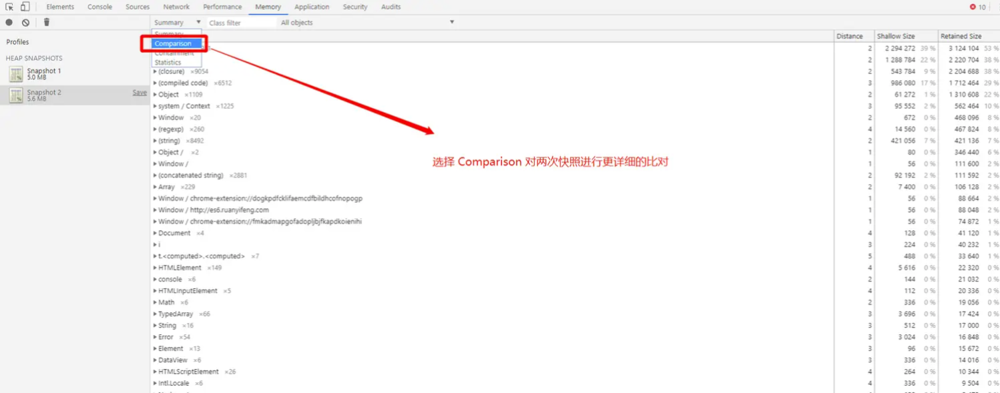
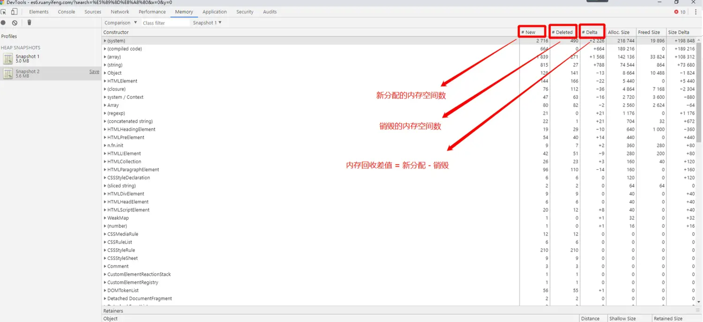
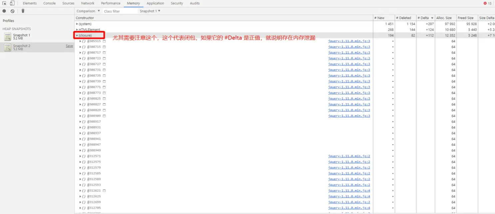
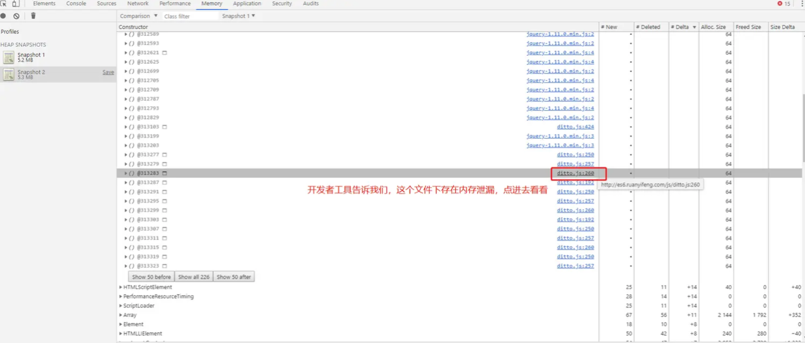
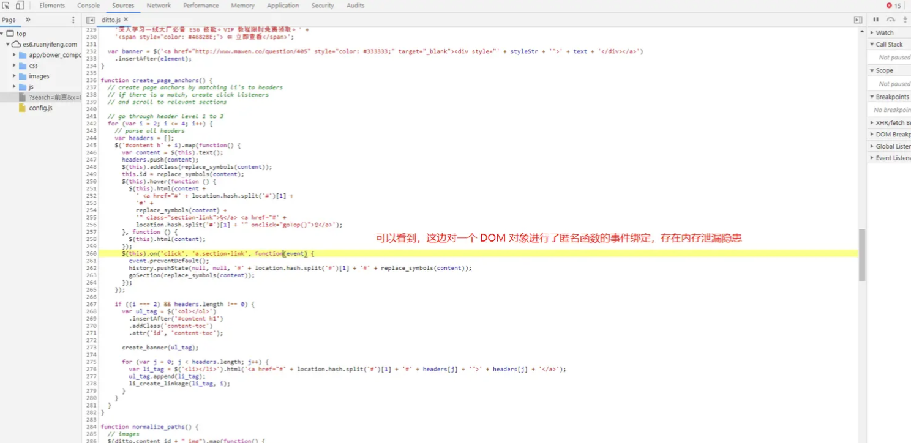

分配给前端页面或应用程序的内存无法被 **<font style="color:#DF2A3F;">垃圾回收器</font>** 回收。这会导致内存使用量不断增加，最后可能导致应用程序崩溃或者变得超级缓慢

### 一、原因
>js 对未声明变量的处理方式是在全局对象上创建该变量的引用<br>
使用 this 创建的变量（全局作用域下的 this 的指向 window）<br>
对于必须要使用的全局变量，在使用完将其置为 <font style="color:rgb(255, 80, 44);">null</font> ，从而触发 GC 垃圾回收

```javascript
function fn() {
  a = new Array(10000).fill('小林犟')
}
fn()
// 或者
function fn2() {
  this.a = new Array(10000).fill('小林犟')
}
fn2()
```

#### 1. 闭包
>一个函数能够访问并使用其定义时所在的词法作用域（即函数定义时的作用域），即使这个函数在定义时所在的作用域已经被销毁了，这个函数仍然可以访问到它定义时所访问的变量、函数和参数。

```javascript
function generateClosure() {
  let x = new Array(10000).fill('大伟');
  function innerFn() {
    console.log(x);
  }
  return innerFn;
}

var closure = generateClosure();
closure(); 
```

> **在执行** **<font style="color:#DF2A3F;">closure</font>** **函数时，闭包中存储了** **<font style="color:#DF2A3F;">generateClosure</font>** **的词法作用域，因此** **<font style="color:#DF2A3F;">innerFn</font>** **能够访问和使用** **<font style="color:#DF2A3F;">generateClosure</font>** **的变量** **<font style="color:#DF2A3F;">x</font>** **。注意，当** **<font style="color:#DF2A3F;">generateClosure</font>** **函数完成执行并返回** **<font style="color:#DF2A3F;">innerFn</font>** **时，** **<font style="color:#DF2A3F;">generateClosure</font>** **的词法作用域并没有被销毁，因为** **<font style="color:#DF2A3F;">innerFn</font>** **持有了对它的引用。**
>

#### 2. 游离的 DOM引用
>在应用程序中频繁地创建和销毁DOM对象，就容易导致内存泄漏<br>
游离的DOM引用 指已经不在文档中的DOM节点的引用，但是这些引用仍然被保存在JavaScript的变量、数组和对象中，因此这些DOM节点无法被垃圾回收器回收，从而导致内存泄漏

```javascript
function test() {
  let el = document.createElement("div");
  document.body.appendChild(el);
  let child = document.createElement("div");
  el.appendChild(child);
  
  document.body.removeChild(el) // 由于 el 变量存在，el及其子元素都不能被GC
  el = null;   // 虽置空了 el 变量，但由于 child 变量引用 el 的子节点，所以 el 元素依然不能被GC
  child = null; // 已无变量引用，此时el可以GC 
}
test();
```

#### 3. 事件监听器未移除
```javascript
<template>
  <div></div>
</template>
<script>
export default {
  created() {
    window.addEventListener("mouseup", this.doSomething)
  },
  beforeDestroy(){
    window.removeEventListener("mouseup", this.doSomething)
  },
  methods: {
    doSomething() {
      // do something
    }
  }
}
</script>
```

#### 4. 定时器未清理

```javascript
function test() {
  var count = 0;
  var timer = setInterval(function() {
    console.log(++count);
    if (count === 10) {
      clearInterval(timer);
    }
  }, 1000);   // 每1秒输出一个数字，共输出10次
}
test();
```

### 二、怎么排查内存




>字段解释：
>+ `Constructor` — 占用内存的资源类型
>+ `Distance` — 当前对象到根的引用层级距离
>+ `Shallow Size` — 对象所占内存（不包含内部引用的其它对象所占的内存）(单位：字节)
>+ `Retained Size` — 对象所占总内存（包含内部引用的其它对象所占的内存）(单位：字节)

**<font style="color:#DF2A3F;">再次切回网页，继续操作几次，然后再次生成一个快照</font>**





**<font style="color:#DF2A3F;">下面我们到代码里找一个内存泄漏的问题</font>**

